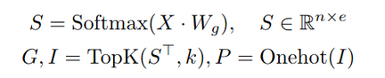

# Mixture of Experts.
Выполнили:
* Максим Романов
* Владислав Понизяйкин
* Глеб Дьяконов
* Александра Павлова
* Георгий Гензе

# Содержание
* Введение в MoE
* Оптимизации MoE
* Оценка: почему MoE - это победа
* пункт 4
* Прикладное применение Mixture of Experts в реальной истории.

# Introduction to Mixture of Experts

В текущем разделе будут представлены представлены общие концепции моделей Mixture of Experts и их отличия от ансамблевых методов.


### Воспоминание: ансамбли

Ансамблем называется алгоритм, предсказанием которого является агрегация предсказаний нескольких базовых алгоритмов машинного обучения..

Простейший пример ансамбля в регрессии – усреднение предсказаний нескольких алгоритмов:
```math
\begin{equation*}
    a(x) = \frac{1}{n} (b_1(x) + ... + b_n(x)).
\end{equation*}
```


### Mixture of Experts

Впервые модель смеси экспертов была предложена в [статье](https://www.cs.toronto.edu/~hinton/absps/jjnh91.pdf) 1991-го года и нашла свое применение в задачах регрессии, классификации с использованием классических алгоритмов машинного обучения.

Изначально Mixture of Experts (MoE) определялся как метод машинного обучения, который объединяет прогнозы нескольких подмоделей, называемых экспертами, для принятия коллективного решения. В настоящее время MoE чаще используется как слой нейронной сети. 

**Основная идея**, лежащая в основе MoE, заключается в разделении входного пространства на различные подпространства и назначении каждого подпространства конкретному эксперту. Другими словами, каждый эксперт специализируется на определенном контексте и отвечает за прогнозы на нем. Главное преимущество этой модели заключается в том, что она позволяет отдельным экспертам специализироваться на меньших частях большой задачи.


Архитектура модели представлена ниже и представляет собой древовидную структуру, состоящую из трех основных компонент:
1. Нескольких экспертов (эксперты в рамках смеси экспертов обучаются одновременно и могут различаться по своей архитектуре, гиперпараметрам или обучающим данным);
2. Gate model – модель, которая определяет какие веса назначить предсказанию каждого эксперта (другими словами, на сколько можно доверять каждому эксперту при текущих входных данных). Output - вектор вероятностей. 
3. Selector – возвращает средневзвешенную сумму.


Причем авторы предложили использовать вместо $E^c = ||d^c - \sum_i p_i^c o_i^c||^2$ следующую функцию потерь:
```math
\begin{equation*}
    E^c = <||d^c - o_i^c||^2> =\sum_i p_i^c ||d^c - o_i^c||^2,
\end{equation*}
```
где $o_i^c$ - output-вектор $i$-го эксперта в случае входа $c$; $p_i^c$ - вес $i$-го эксперта в текущем предсказании; $d^c$ - ожидаемый результат.

Заметим, что в результате выбора такой функции потерь на конкретного эксперта больше не влияют напрямую веса других экспертов.

Авторы указывают, что на практике предпочтительнее использовать модифицированный вариант функции потерь:
```math
\begin{equation*}
    E^c = -log\sum_i p_i^c e^{-\frac{1}{2}||d^c-o_i^c||^2}
\end{equation*}
```

Простым выбором Gating-модели является:
```math
\begin{equation*}
    G(x) = Softmax(x\cdot W_g),
\end{equation*}
```
где $x$ - вектор-строка на входе; $W_g$ - матрица весов.

Упрощенный пример использования представленной модели в задаче нелинейной бинарной классификации представлен на рисунке ниже.
Gate создает разделение области, в которых мнения отдельных экспертов заслуживают доверия, таким образом, что справа от линии разделения принимает решение первый эксперт, а слева – второй. Благодаря такому подходу задача нелинейной классификации была упрощена до двух задач линейной классификации.


Немногим позднее ([1993 г.](https://www.cs.toronto.edu/~hinton/absps/jjnh91.pdf)) те же авторы представили обобщение описанной модели - иерархическую модель Mixture of Experts.
Ее идея заключается в том, чтобы разделить модель на несколько уровней экспертов. Каждый уровень состоит из нескольких экспертов, которые специализируются на различных аспектах данных. На верхнем уровне находится глобальный эксперт, который комбинирует выходы экспертов нижнего уровня для получения финального решения.


Основные проблемы представленный заключаются в их долгом и сложном обучении (т.к. дополнительно приходится обучать Gate), для некоторого упрощения предполагают, что выход компоненты Gate представляет собой разреженный вектор (что облегчает обучении), это подводит нас к модели: Sparsely-Gated Mixture-of-Experts.


### Источники:

1. [Robert A. Jacobs, Michael I. Jordan, et al., "Adaptive Mixtures of Local Experts", 1991](https://www.cs.toronto.edu/~hinton/absps/jjnh91.pdf)
2. [Michael I. Jordan, Robert A. Jacobs, "Hierarchical mixtures of experts and the EM algorithm", 1993](https://www.cs.toronto.edu/~hinton/absps/hme.pdf)
3. [Seniha Yuksel, et al., "Twenty Years of Mixture of Experts", 2012](https://www.researchgate.net/publication/260707711_Twenty_Years_of_Mixture_of_Experts )


# Оптимизации MoE (Павлова Александра)
### Mixture of Experts

Mixture of Experts объединяет результаты нескольких сетей-экспертов, каждая из которых специализируется на разных частях пространства входных данных. Это достигается путем обучения gating сети, которая отображает каждый вход на распределение по экспертам.


Однако, классическая модель MoE использует всех экспертов для вычисления окончательного результата для каждого входа. Что очевидно требует большого количества вычислений для огромных нейронных сетей с миллионами параметров.

Основной целью проектирования MoE в глубоком обучении является снижение вычислительных затрат. Следовательно, для каждого запроса следует использовать только небольшой набор экспертов.

Подобная идея выглядит многообещающе для построения более крупных сетей, которые по-прежнему дешевы в вычислительном отношении во время тестирования и более параллелизуемы во время обучения.

### Sparsely-Gated MoE

В традиционной модели MoE gating сеть присваивает ненулевые веса большинству экспертов для каждого входа. Для достижения разреженных весов мы мотивируем управляющую сеть присваивать ненулевые веса только небольшому набору доступных экспертов.

Будем давать ненулевые веса только тем экспертам, которые попадают в top-k для конкретного токена. То есть ранжируем экспертов по token-to-expert affinity и берём k лучших. Другими словами это называется **Token-Choice Routing**.

$G(x) = Softmax(KeepTopK(H(x), k)$

$H(x)_i = (x \cdot W_g)_i + StandardNormal() \cdot Softplus((x \cdot W_{noise})_i)$

$KeepTopK(v, k)_i = v_i \cdot [v_i \in top\ k\ elements\ of\ v] - \infty \cdot [v_i \notin top\ k\ elements\ of\ v]$

При обучении добавляем шум, чтобы избежать проблемы "многоруких бандитов", когда мы никогда не трогаем какого-то из экспертов. И убираем его при инференсе.

Однако, у этого подхода есть несколько проблем.

Сеть управления (gating network) имеет тенденцию сходиться к состоянию, в котором она всегда присваивает большие веса одним и тем же нескольким экспертам.
Чтобы исправить это, мы вводим дополнительную функцию потерь:

$Importance(X) = \sum_{x \in X} G(X)$

$L_{importance} (X) = w_{importance} \cdot CV(Importance(X))$

К сожалению, эксперты все еще могут получать очень разное количество данных. Например, один эксперт может получить немного данных с большими весами, а другой может получить много данных с маленькими весами.

Для того, чтобы это исправить строится еще одна функция потерь для балансировки загрузки экспертов
(Где $P(x, i)$ определяет вероятность того, что $G(x)_i$ не равно нулю):

$Load(X)_i = \sum_{x \in X} P(x, i)$

$L_{load} (X) = w_{load} \cdot CV(Load(X))$

## Expert Choice Routing

Как мы видим, плохая стратегия маршрутизации экспертов может привести к тому, что некоторые эксперты будут недообучены, что приведет к недостаточной или избыточной специализации эксперта.

Добавление вспомогательной функции потерь для важности или нагрузки не гарантирует сбалансированную нагрузку, которая особенно важна в ранних стадиях обучения. На практике мы наблюдаем, что коэффициент избыточной загрузки может достигать 20%–40% для некоторых экспертов при выборе маршрута для токенов, что указывает на то, что значительная часть токенов, направленных на этих экспертов, будет отброшена.

Наконец, каждый токен получает ровно k экспертов и, следовательно, занимает одинаковое количество вычислений. Вместо этого модель MoE должна гибко распределять свои вычислительные ресурсы в зависимости от сложности входных данных, акцентируя внимание на важных токенах.

Таким образом мы подходим к новой идее - зайти с противоположной стороны. Чтобы гарантировать, что каждый эксперт получает фиксированное количество входных токенов, вместо того чтобы позволять токенам выбирать лучших k экспертов, давайте позволим экспертам выбирать лучшие k токенов.


Слева старая архитектура, справа новая.

Вот новая функция управления (gating function):



$S$ обозначает оценки token-to-expert affinity, $W_g \in R^{d×e}$ обозначает вложения экспертов, а $TopK()$ выбирает k наибольших значений для каждой строки $S^T$ (транспонированной матрицы $S$).

Как видно, увеличение числа экспертов эффективно увеличивает мощность модели без увеличения размера модели при инференсе.


Как можно видеть из графика ниже, наша модель EC-CF2 сходится более чем в 2 раза быстрее в процессе обучения, а увеличение числа экспертов последовательно улучшает перплексию обучения.


Необходимо проверить, переводится ли улучшенние перплексии непосредственно в улучшение производительности в последующих задачах. Авторы провели донастройку на 11 выбранных задачах из GLUE и SuperGLUE.

Как мы видим, метод C-CF2 стабильно превосходит аналогичные методы и дает более чем 2-процентный прирост средней точности.


# Оценка: почему MoE - это победа

> За основу взята статья [Efficient Large Scale Language Modeling with Mixtures of Experts](https://arxiv.org/pdf/2112.10684.pdf)

В этом разделе мы постараемся понять, почему MoE - это хорошо, и почему ему действительно можно найти достойное применение в LLM.

## Напоминание
Для начала, давайте повторим некоторые термины, которые будут важны нам дальше:

* **zero-shot learning** – обучение такой модели, которая сможет корректно работать с задачами, которые раньше не видела
* **few-shot learning** – задача машинного обучения, в которой модель надо преднастроить на тренировочном датасете так, чтобы она хорошо обучалась на ограниченном количестве новых размеченных примеров.
* **dense model** – полносвязная нейронная сеть (будем использовать такие в качестве baseline’а)
* **sparse model** – модель, в которой лишь небольшая часть параметров отличны от нуля. Вообще говоря, именно благодаря таким моделям MoE вообще и существует.
* **Perplexity** - метрика оценки качества моделей, показывающая насколько хорошо модель предсказывает детали тестовой коллекции. Выглядит она так:

$$
  PPL(X) = exp(-\frac{1}{t} \sum_i^t \log p_{\theta}(x_i|x_{0,...,i-1}))
$$

По предыдущей главе мы помним, что существует **Sparsely-gated MoE**, которая умеет для каждой задачи выбирать "исполнителей" и тем самым, за счет общего увеличения количества параметров, она дает существенный прирост в производительности - просто потому что на каждой "подзадаче" она использует лишь малую часть всех параметров. Но вопрос - действительно ли прирост такой большой? 

## Оценка эффективности MoE

Давайте построим структуру экспериментов:

## Модели

Мы будем обучать `decoder-only` трансформеры с таким же количеством параметров и архитектурой, как указано в [статье](https://proceedings.neurips.cc/paper/2020/file/1457c0d6bfcb4967418bfb8ac142f64a-Paper.pdf). Также, для корректного сравнения, мы создадим и обучим MoE аналоги наших моделей. Мы будем использовать в них 512 экспертов, а также на каждой итерации будем использовать "топ-2 эксперта" - то есть отдавать задачу двум экспертам, и после конкатенировать их выходы. Подробнее про архитектуру MoE моделей можно почитать [тут](https://openreview.net/pdf?id=qrwe7XHTmYb).

Ниже вы можете увидеть сводную таблицу с используемыми моделями.


## Данные для предобучения

Тут будут использоваться 6 датасетов, общим объемом _453 gb_, содержащие более _100 миллиардов_ токенов:

* **BookCorpus**: Содержит более 10000 неопубликованных книг (4GB)
* **English Wikipedia**: (12GB)
* **CC-News**: Содержит 63 миллиона вырезок из новостей. Данные принадлежат отрезку "сентябрь 2016 - февраль 2019" (76GB)
* **OpenWebText**: (38GB);
* **CC-Stories**: Cодержит подмножество _СommonCrawl_ данных, которое соответсвует story-like стиль _Winograd schemas_ (31GB);
* **English CC100**: Содержит информацию из _CommonCrawl_ в промежутке "Январь 2018 - Декарь 2018", которая соответствует стилю Википедии (292GB).

## Описание методов

Для начала, мы будем стараться предсказать следующий токен, и оценивать это с помощью _перплексии_. Помимо этого, мы оценим модели как **in-domain**, так и **out-of-domain**:

* **in-domain**: Мы будем использовать данные из верхних датасетов, которые не участвовали в обучении.
* **out-of-domain**: Мы будем использовать данные из _The Pile_

После этого, мы оценим модели на следующих задачах:

* **Zero-shot**: проверим, насколько хорошо модели справляются с задачами, которые раньше вообще не видели
* **Few-shot**: посмотрим, как хорошо они справляются с новыми (незнакомыми) задачами, если им удалось дообучиться лишь на очень ограниченном наборе таких задач
* **Baseline and Benchmarks**: в качестве бейзлайна возьмем числа, которые показала GPT-3 в [более ранней статье](https://proceedings.neurips.cc/paper/2020/file/1457c0d6bfcb4967418bfb8ac142f64a-Paper.pdf), а в качестве набора задач возьмем те, на которых GPT-3 показала положительный прирост в качестве при масштабировании, либо при переходе от _zero-shot_ к _few-shot_.
* **Подходы**:
  * **Priming** - будем подавать модели на вход определенного вида текст (для каждого датасета свой), чтобы она лучше поняла, что мы от нее ждем.
  * **Fine-tuning** - мы дообучим нашу модель на всех данных. Помимо этого, добавим дополнительный линейный слой (особый для каждой задачи) для каждого исполнителя, после чего добавим функцию активации _softmax_.

## Оценка

Наш следующий шаг - провести эксперимент и оценить его результаты.

Сделаем это в формате «график-пояснение».

Как и планировали, сначала оценим на _in-domain_ и _out-of-domain_ задачах, а потом посмотрим сравним полученные модели с бейзлайном.


Графики следует читать примерно так: «для того, чтобы получить перплексию 12 на in-domain задаче, для модели MoE потребовалось меньше 0.5 ZFLOPs, в то время как dense модель нуждалась в 4 ZFLOPs». В то же время можем заметить, что сама модель стала значительно больше - только для достижения упомянутого качества нам пришлось увеличить количество параметров модели в 11 раз! Но и вычислительных мощностей она начала требовать в среднем в 8-14 раз меньше (4 ZFLOPs / 0.5 ZFLOPs).

Для out-of-domain ситуация так же в пользу MoE-модели, но теперь уже выигрыш по мощностям — 2-4.


Этот график уже значительно проще - тут мы можем увидеть конкретно, во сколько раз меньше мощностей потребовала MoE, чтобы получить ту же точность что и соответствующая ей dense-модель. Ниже можно ознакомиться с более точечным сравнением упомянутых моделей с нашим бейзлайном.


Ну и конечно график с улучшением:


И наш последний шаг - проверить, одинаково ли наши модели склонны к дообучению. Для этого мы посмотрим, что происходим с качеством на разных датасетах при переходе от zero-shot к fine-tune, а также что происходит с общим качеством при переходе от zero-shot к few-shot. В последнем случае, нам куда более важно увидеть общий прирост (потому что точечно он, скорее всего, будет не большой из-за используемого прайминга).


Впрочем, наверное это не удивительно - GPT-3 все еще лучше, а fine-tuning влияет на MoE модель куда меньше, чем на Dense-модель.


Результаты получились ровно такие же.

Итого: MoE действительно способно оптимизировать ресурсы, затрачиваемые на обучение и инференс модели, но за это придется платить куда большим размером самой модели. Ресурсов требуется в среднем в 4-6 раз меньше, в то время как размер модели может увеличиваться в десятки и сотни раз. Пожалуй, стоит дважды подумать прежде чем сделать выбор… 

# Прикладное применение Mixture of Experts в реальной истории.
Говоря о преимуществах и прочих аспектах, стоит также упомянуть и использование Mixture of Experts в вопросах из реального мира.

В 2022 году в американском штате Мэриленд была проведена Всемирная Конференция по машинному обучению, на которой группа программистов и аналитиков внедрили Mixture of Experts в так называемый GLaM.

## Что такое GLaM?
GLaM (Generalist Language Model) - это обучающая языковая модель, которая имеет способность вырабатывать последовательные тексты на основе заданного контекста. 

Технически GLaM - это продукт OpenAI, созданный на основе GPT (Generative Pre-trained Transformer), и использует большие объемы данных для обучения модели на различных задачах обработки естественного языка. Она может генерировать тексты на основе заданных вводных данных и может быть настроена на разные стили и темы.

## Где применяется GLaM?
GLaM может применяться во многих областях, включая:

1. **Генерация контента**: GLaM может быть использован для автоматического создания статей, новостей, рецензий, контента для блогов и других текстов на основе заданных параметров и тематики.

2. **Чат-боты и виртуальные помощники**: GLaM может быть обучена на исторических беседах или диалогах и использоваться для создания чат-ботов, которые могут эмулировать естественный язык и отвечать на вопросы и комментарии пользователей.

3. **Автоматический перевод**: GLaM может быть использована как базовая модель для систем автоматического перевода и помочь в генерации высококачественных переводов.

4. **Редактирование и корректировка текстов**: GLaM может использоваться для проверки грамматики, стилистики и синтаксических ошибок в текстах, а также предлагать варианты редактирования.

5. **Создание игр**: GLaM может использоваться для создания генеративных текстовых игр, где игроки взаимодействуют с экраном, задавая вопросы или принимая решения, а GLaM генерирует ответы и результаты в соответствии с действиями игрока.

6. **Генерация кода**: GLaM может использоваться для помощи в разработке программного обеспечения, предоставляя синтаксически правильные фрагменты кода в ответ на заданный контекст или запрос.

Однако важно отметить, что использование GLaM может иметь свои ограничения и вызывать опасения о создании неправильной или неэтичной информации. Такие модели должны использоваться с осторожностью и соответствовать установленным правилам и нормам.

## В чём преимущества (показанные в исследованиях 2022 года) GLaM?
Масштабирование языковых моделей с использованием большего количества данных, вычислений и параметров привело к значительному прогрессу в обработке естественного языка.

Таким образом, благодаря масштабированию **GPT-3** смог добиться хороших результатов при выполнении задач контекстного обучения. Однако обучение этих больших плотных моделей требует значительных вычислительных ресурсов.

В проведённых исследованиях 2022 года были предложены и разработаны семейство языковых моделей под названием GLaM, которое использует редко активируемую архитектуру смешанных экспертов для масштабирования емкости модели, а также требует существенно меньших затрат на обучение по сравнению с плотными вариантами. Самый большой GLaM имеет 1,2 триллиона параметров, что примерно в 7 раз больше, чем GPT-3. Он потребляет только 1/3 энергии, используемой для обучения GPT-3, и требует половину вычислительных циклов для вывода, при этом обеспечивая при этом лучшую общую производительность с нулевым, однократным и малократным выполнением 29 задач NLP.

Ниже более детально представлены результаты замеров по применению GPT-3 и GLaM.


Говоря более простыми словами, GLaM превосходит GPT-3 по 21 тесту понимания естественного языка (NLU) и 8 тестам генерации естественного языка (NLG) в среднем, используя при этом около половины FLOP на токен во время вывода и потребляя около трети энергии для обучения.

Дополнительно ниже представлен обзор процентного изменения в эффективности прогнозирования (чем выше, тем лучше) GLaM (64B/64E) по сравнению с GPT-3 (175B) при (а) Zero-Shot, (б) One-Shot и (в) Few-Shot по 7 категориям тестов с 29 общедоступными задачами:


Каждая полоса на изображениях (a), (b) и (c) представляет одну контрольную категорию. Изображение (d) сравнивает количество FLOP, необходимое для прогнозирования токена и энергопотребления при обучении.

## Как работает GLaM?
Ниже представлена архитектура GLaM:


Каждый слой Mixture of Experts (нижний блок) чередуется со слоем Transformer (верхний блок). Для каждого входного токена, например «roses», модуль Gating динамически выбирает двух наиболее релевантных экспертов из 64, которые представлены синей сеткой на слое Mixture of Experts. Средневзвешенное значение результатов этих двух экспертов затем будет передано на верхний уровень преобразователя. Для следующего токена во входной последовательности будут выбраны два разных эксперта.

## Как происходило обучение GLaM?
Для обучения данной модели был создан высококачественный набор данных из 1,6 триллионов токенов, которые представляют широкий спектр вариантов использования естественного языка. Веб-страницы составляют огромное количество данных в данном неразмеченном наборе данных. Однако их качество варьируется от профессионального письма до некачественных комментариев и страниц форума. Также в данных исследованиях был разработан собственный классификатор качества текста для создания высококачественного веб-корпуса из исходного большего необработанного корпуса. Был использован линейный классификатор на основе хеш-функций для скорости вывода. Этот классификатор обучен классифицировать набор тщательно подобранного текста (Википедия, книги и несколько избранных веб-сайтов) и других веб-страниц. Этот классификатор был применён для оценки качества контента веб-страницы. Затем применили этот классификатор, используя распределение Парето, для выборки веб-страниц в соответствии с их оценкой. Это позволяет включать некоторые веб-страницы более низкого качества, чтобы предотвратить систематические ошибки в классификаторе.

Ниже представлен более детально описанный датасет для GLaM:


