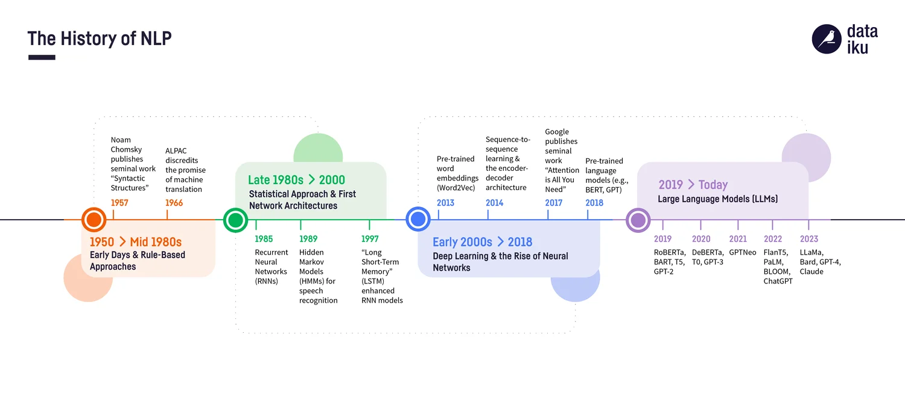
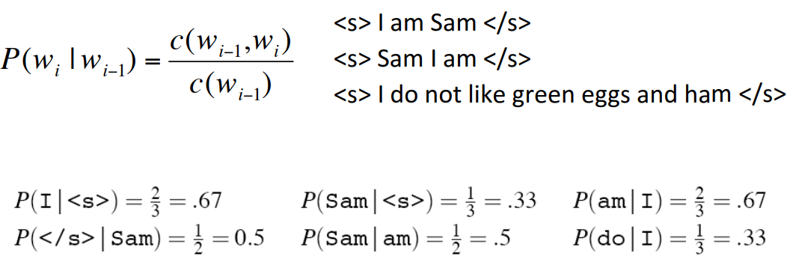
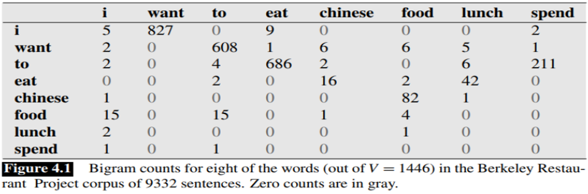
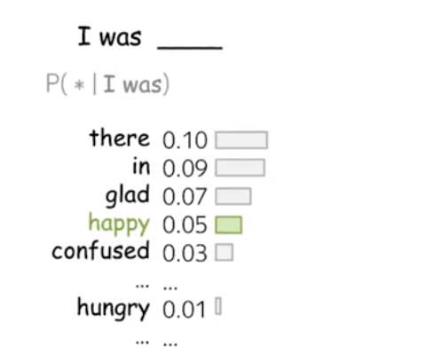

# Вероятностная модель языка

С помощью языковых моделей оценивают вероятность различных языковых единиц: символов, токенов, последовательностей токенов.
Если у нас получится оценить такие вероятности, то это нам поможет в различных задачах:

1. Машинного перевода:
    + `P(высокий человек) > P(длинный человек)`.
2. Распознавания речи:
    + `P(I saw a van) > P(eyes awe of an)`.
3. Автокоррекции текста:
	+ `P(about fifteen minutes ago) > P(about fifteen minuets ago)`. 

Таким образом, наша задача заключается в оценке вероятности:
```math
\begin{equation*}
    P(W)=P(w_1, w_2, …, w_t),
\end{equation*}
```
где $(w_1, w_2, …, w_t)$ – последовательность слов (токенов); $P(W)$ – вероятность увидеть эту последовательность слов (токенов).

chain-rule:
```math
\begin{equation*}
    P(W) = P(w_1)\cdot P(w_2│w_1)\cdot P(w_3│w_1, w_2)\cdot ... \cdot P(w_t│w_1, ..., w_{t-1}).
\end{equation*}
```

Другими словами, мы разложили вероятность встретить последовательность токенов на условные вероятности каждого токена с учетом предыдущего контекста. Оценить условные вероятности можно следующими способами:
+ использовать n-граммные модели;
+ нейронные модели (в следующих разделах).

Краткая история используемых в NLP моделей:



Воспользуемся определение классической вероятности для вычисления условной вероятности:
```math
\begin{equation*}
    P(w_t│w_1, ..., w_{t-1}) = \frac{Count(w_1,…,w_{t-1}, w_t)}{Count(w_1, ..., w_{t-1})},
\end{equation*}
```
где $Count(w_1,…,w_{t-1}, w_t)$ – количество раз, когда в корпусе встречается последовательность токенов $(w_1,…,w_{t-1}, w_t)$.

Ясно, что при довольно больших значения $t$ часто будут возникать ситуации, когда числитель обращается в ноль (когда такая последовательность токенов ни разу не встречалась в корпусе), в таком случае обнуляется вся вероятность предложения. Для избежания вышеуказанной проблемы предполагают выполнение свойства Маркова: появления очередного слова зависит только от фиксированного $n$ количества предыдущих слов. Формально в n-граммных моделях подразумевается, что
```math
\begin{equation*}
    P(w_t│w_1, ..., w_{t-1}) = P(w_t│w_{t-n+1}, ..., w_{t-1}).
\end{equation*}
```

Примеры.
+ n=1 (униграмма): $P(w_1, w_2, ..., w_t) = P(w_1)\cdot P(w_2)\cdot ... \cdot P(w_t)$;
+ n=2 (биграмма): $P(w_1, w_2, ..., w_t) = P(w_1)\cdot P(w_2|w_1)\cdot P(w_3│w_2)\cdot ... \cdot P(w_t|w_{t-1})$.

Пример биграммы:



Для нее необходимо хранить следующую таблицу для хранения количества встречающихся вместе слов:



Пример генерации текста на основе биграммной модели. Следующее слово может быть выбрано одним из следующих способов:
+ Семплировать из распределения;
+ Брать максимум по вероятности (в таком случае при одинаковом контексте каждый раз будем получать одно и то же предсказание).



Какие проблемы остались:
1. Нули в числителе по-прежнему могут встречаться;
2. Практически можно использовать лишь модели с n<5 ввиду ограничения по памяти (необходимо хранить всевозможные n-граммы токенов).
3. Проблема забывания текста:
    + The `computer` which I had just put into the machine room on the fifth floor is `crashing` (для предсказания последнего слова необходимо n=16).

Первый недостаток решается использованием различных методов сглаживания. Например, Лапласа:
```math
\begin{equation*}
    P(w_t│w_{t-2}, w_{t-1}) = \frac{\delta + Count(w_{t-2}, w_{t-1}, w_t)}{\delta \cdot |V| + Count(w_{t-2}, w_{t-1})},
\end{equation*}
```
$|V|$ - размер корпуса.

Более «умный» метод сглаживания - сглаживание [Кнессета-Нея](https://ieeexplore.ieee.org/document/479394).
