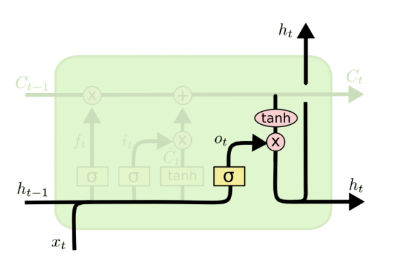

# Первые нейронные сети в LLM
## Intro в нейронные сети
Первая идея, задуманная специально как метод, позволяющий заставить машины учиться имеет некоторое сходство с линейной регрессией $-$ **Frank Rosenblatt’s Perceptron**.

Психолог Розенблатт задумал Перцетрон как упрощенную математическую модель того, как работают нейроны в нашем мозге: он принимает набор двоичных входных данных (близлежащие нейроны), умножает каждый входной сигнал на непрерывный вес (мощность синапсов для каждого ближайшего нейрона) и устанавливает пороговое значение суммы этих взвешенных входных данных для получения 1, если сумма достаточно велика, и в противном случае 0 (таким же образом нейроны либо срабатывают, либо нет). Большинство входных данных для персептрона - это либо некоторые данные, либо выходные данные другого персептрона, но дополнительная деталь заключается в том, что персептроны также имеют один специальный входной сигнал ‘смещения’, который просто имеет значение 1 и в основном гарантирует, что большее количество функций можно вычислить с помощью одного и того же входного сигнала за счет возможности смещения суммированного значения. Эта модель нейрона построена на работах Уоррена Маккалоха и Уолтера Питтса, которые показали, что модель нейрона, которая суммирует двоичные входные данные и выдает 1, если сумма превышает определенное пороговое значение, и в противном случае выдает 0, может моделировать базовые функции **OR / AND / NOT**. На заре развития искусственного интеллекта это имело большое значение - преобладающей мыслью в то время было, что создание компьютеров, способных выполнять формальные логические рассуждения, по сути, решит проблему искусственного интеллекта.

Однако в модели Маккалоха-Питтса отсутствовал механизм обучения, что было крайне важно для того, чтобы ее можно было использовать для искусственного интеллекта. Именно в этом преуспел персептрон - Розенблатт придумал способ заставить такие искусственные нейроны обучаться, вдохновленный основополагающей работой Дональда Хебба. Хебб выдвинул неожиданную и чрезвычайно влиятельную идею о том, что знания и научение происходят в мозге главным образом через формирование и изменение синапсов между нейронами $-$ кратко, правило Хебба: *Когда аксон клетки А находится достаточно близко, чтобы возбудить клетку В, и неоднократно или настойчиво участвует в ее возбуждении, в одной или обеих клетках происходит некоторый процесс роста или метаболические изменения, так что эффективность A, как одной из клеток, запускающих B, повышается*.

Персептрон не совсем следовал этой идее, но наличие весов на входных данных позволило создать очень простую и интуитивно понятную схему обучения: учитывая обучающий набор примеров ввода-вывода, Персептрон должен "выучить" функцию, для каждого примера увеличивать веса, если выходные данные персептрона для входных данных этого примера слишком малы по сравнению с примером, и иным образом уменьшать веса, если выходные данные слишком высоки. Если сформулировать чуть более формально, алгоритм выглядит следующим образом:
1. Начните с персептрона, имеющего случайные веса и обучающий набор
2. Для ввода примера в обучающем наборе вычислите выходные данные персептрона
3. Если выходные данные персептрона не совпадают с выводами, которые, как известно, верны для примера:
  * Если результат должен был быть равен 0, а был равен 1, уменьшите веса, которые были введены равными 1.
  * Если результат должен был быть равен 1, но был равен 0, увеличьте веса, которые были введены равными 1.
4. Перейдите к следующему примеру в обучающем наборе и повторяйте шаги 2-4 до тех пор, пока Персептрон не перестанет совершать ошибки

Эта процедура проста и дает простой результат: входная линейная функция (взвешенная сумма), как и в случае линейной регрессии, "раздавлена" нелинейной функцией активации (пороговое значение суммы). Можно установить пороговое значение суммы, когда функция может иметь только конечный набор выходных значений (как в случае с логическими функциями, в этом случае их всего два - True / 1 и False / 0), и поэтому проблема заключается не столько в том, чтобы сгенерировать выходные данные с непрерывной нумерацией для любого набора входных данных, сколько в том, чтобы классифицировать входные данные с правильной меткой.

Но подождите, пока мы видели только, как один персептрон способен научиться выводить единицу или ноль - как это можно расширить, чтобы работать с задачами классификации со многими категориями, такими как человеческий почерк (в котором в качестве категорий используется много букв и цифр)? Это невозможно для одного перцептрона, так как она имеет только один выход, но функции с несколькими выходами можно узнать, имея несколько перцептронов в **слой** таким образом, что все эти персептроны получают один и тот же входной сигнал, и каждый из них отвечает за один выходной сигнал функции. Действительно, нейронные сети (или, формально, "Искусственные нейронные сети" - ANNS) представляют собой не что иное, как слои персептронов или нейронов, или единиц, как их обычно называют сегодня, и на этом этапе существовал только один слой $-$ **уровень вывода**. Итак, прототипным примером использования нейронной сети является классификация изображения написанной от руки цифры. Входными данными являются пиксели изображения, а на выходе имеется 10 нейронов, каждый из которых соответствует одному из 10 возможных цифровых значений. В этом случае только один из 10 нейронов выдает 1, за правильный вывод принимается наибольшая взвешенная сумма, а остальные выводят 0.

Итак, с нейронными сетями было не очень хорошо. Но почему? В конце концов, идея заключалась в том, чтобы объединить кучу простых математических нейронов для выполнения сложных задач, а не использовать один. Другими словами, вместо того, чтобы иметь только один **выходной слой**, отправлять входные данные произвольному количеству нейронов, которые называются **скрытым слоем**, потому что их выходные данные действуют как входные данные для другого скрытого слоя или выходного слоя нейронов. "Видны" только выходные данные выходного слоя - это ответ нейронной сети, - но все промежуточные вычисления, выполняемые скрытым слоем(ями), могут решать значительно более сложные задачи, чем просто один слой.

Причина, по которой скрытые слои хороши, в общих чертах, заключается в том, что скрытые слои могут находить **функции** в данных и позволяют следующим слоям оперировать этими функциями, а не зашумленными и большими необработанными данными. Например, в очень распространенной задаче нейронных сетей по поиску человеческих лиц на изображении первый скрытый слой может принимать необработанные значения пикселей и находить линии, круги, овалы и так Далее Внутри изображения. Следующий слой получал бы положение этих линий, кругов, овалов и так Далее на изображении и использовал бы их для определения местоположения человеческих лиц - намного проще! И люди, в основном, понимали это. Фактически, до недавнего времени методы машинного обучения обычно не применялись непосредственно к исходным данным, таким как изображения или аудио. Вместо этого машинное обучение проводилось на данных после того, как они прошли процедуру **извлечения признаков**, то есть для упрощения обучения машинное обучение проводилось на предварительно обработанных данных, из которых уже были извлечены более полезные признаки, такие как углы или формы.

## RNN -- рекурентные нейронные сети
Люди не начинают думать с чистого листа каждую секунду. Читая этот пост, вы понимаете каждое слово, основываясь на понимании предыдущего слова. Мы не выбрасываем из головы все и не начинаем думать с нуля. Наши мысли обладают постоянством.

Традиционные нейронные сети не обладают этим свойством, и в этом их главный недостаток. Представим, например, что мы хотим классифицировать события, происходящие в фильме. Непонятно, как традиционная нейронная сеть могла бы использовать рассуждения о предыдущих событиях фильма, чтобы получить информацию о последующих.

Решить эту проблемы помогают рекуррентые нейронные сети (Recurrent Neural Networks, RNN). Это сети, содержащие обратные связи и позволяющие сохранять информацию.

Обратные связи придают рекуррентным нейронным сетям некую загадочность. Тем не менее, если подумать, они не так уж сильно отличаются от обычных нейронных сетей. Рекуррентную сеть можно рассматривать, как несколько копий одной и той же сети, каждая из которых передает информацию последующей копии. То, что RNN напоминают цепочку, говорит о том, что они тесно связаны с последовательностями и списками. RNN – самая естественная архитектура нейронных сетей для работы с данными такого типа.

И конечно, их используют для подобных задач. За последние несколько лет RNN с невероятным успехом применили к целому ряду задач: распознавание речи, языковое моделирование, перевод, распознавание изображений… Список можно продолжать. О том, чего можно достичь с помощью RNN, рассказывает отличный блог-пост Андрея Карпатого (Andrej Karpathy) [The Unreasonable Effectiveness of Recurrent Neural Networks](http://karpathy.github.io/2015/05/21/rnn-effectiveness/).

Одна из привлекательных идей RNN состоит в том, что они потенциально умеют связывать предыдущую информацию с текущей задачей, так, например, знания о предыдущем кадре видео могут помочь в понимании текущего кадра. Если бы RNN обладали такой способностью, они были бы чрезвычайно полезны. Но действительно ли RNN предоставляют нам такую возможность? Это зависит от некоторых обстоятельств.

Иногда для выполнения текущей задачи нам необходима только недавняя информация. Рассмотрим, например, языковую модель, пытающуюся предсказать следующее слово на основании предыдущих. Если мы хотим предсказать последнее слово в предложении “облака плывут по небу”, нам не нужен более широкий контекст; в этом случае довольно очевидно, что последним словом будет “небу”. В этом случае, когда дистанция между актуальной информацией и местом, где она понадобилась, невелика, RNN могут обучиться использованию информации из прошлого. Но бывают случаи, когда нам необходимо больше контекста. Допустим, мы хотим предсказать последнее слово в тексте “Я вырос во Франции… Я бегло говорю по-французски”. Ближайший контекст предполагает, что последним словом будет называние языка, но чтобы установить, какого именно языка, нам нужен контекст Франции из более отдаленного прошлого. Таким образом, разрыв между актуальной информацией и точкой ее применения может стать очень большим.

К сожалению, по мере роста этого расстояния, RNN теряют способность связывать информацию. К счастью, эту проблему решает **LSTM**.

### LSTM
Долгая краткосрочная память (Long short-term memory; LSTM) – особая разновидность архитектуры рекуррентных нейронных сетей, способная к обучению долговременным зависимостям. Они были представлены Зеппом Хохрайтер и Юргеном Шмидхубером (Jürgen Schmidhuber) в 1997 году, а затем усовершенствованы и популярно изложены в работах многих других исследователей. Они прекрасно решают целый ряд разнообразных задач и в настоящее время широко используются, как пример LSTM используются в [робототехнике](https://www.researchgate.net/publication/220671100_A_System_for_Robotic_Heart_Surgery_that_Learns_to_Tie_Knots_Using_Recurrent_Neural_Networks), для [анализа временных рядов](https://www.researchgate.net/publication/220814875_Evolino_Hybrid_NeuroevolutionOptimal_Linear_Search_for_Sequence_Learning), для [распознавания речи](https://www.sciencedirect.com/science/article/abs/pii/S0893608005001206?via%3Dihub).

LSTM разработаны специально, чтобы избежать проблемы долговременной зависимости. Запоминание информации на долгие периоды времени – это их обычное поведение, а не что-то, чему они с трудом пытаются обучиться.

Любая рекуррентная нейронная сеть имеет форму цепочки повторяющихся модулей нейронной сети. В обычной RNN структура одного такого модуля очень проста, например, он может представлять собой один слой с функцией активации tanh (гиперболический тангенс).

Структура LSTM также напоминает цепочку, но модули выглядят иначе. Вместо одного слоя нейронной сети они содержат целых четыре, и эти слои взаимодействуют особенным образом.

На схеме выше каждая линия переносит целый вектор от выхода одного узла ко входу другого. Розовыми кружочками обозначены поточечные операции, такие, как сложение векторов, а желтые прямоугольники – это обученные слои нейронной сети. Сливающиеся линии означают объединение, а разветвляющиеся стрелки говорят о том, что данные копируются и копии уходят в разные компоненты сети.

Ключевой компонент LSTM – это состояние ячейки (cell state) – горизонтальная линия, проходящая по верхней части схемы.

Состояние ячейки напоминает конвейерную ленту. Она проходит напрямую через всю цепочку, участвуя лишь в нескольких линейных преобразованиях. Информация может легко течь по ней, не подвергаясь изменениям.

Тем не менее, LSTM может удалять информацию из состояния ячейки; этот процесс регулируется структурами, называемыми фильтрами (gates).

Фильтры позволяют пропускать информацию на основании некоторых условий. Они состоят из слоя сигмоидальной нейронной сети и операции поточечного умножения.

Сигмоидальный слой возвращает числа от нуля до единицы, которые обозначают, какую долю каждого блока информации следует пропустить дальше по сети. Ноль в данном случае означает “не пропускать ничего”, единица – “пропустить все”.

В LSTM три таких фильтра, позволяющих защищать и контролировать состояние ячейки.

**Пошаговый разбор LSTM:**

Первый шаг в LSTM – определить, какую информацию можно выбросить из состояния ячейки. Это решение принимает сигмоидальный слой, называемый “слоем фильтра забывания” (forget gate layer). Он смотрит на $h_{t-1}$ и $x_t$ и возвращает число от 0 до 1 для каждого числа из состояния ячейки $C_{t-1}$. 1 означает “полностью сохранить”, а 0 – “полностью выбросить”.

Вернемся к нашему примеру – языковой модели, предсказывающей следующее слово на основании всех предыдущих. В этом случае состояние ячейки должно сохранить существительного, чтобы затем использовать местоимения соответствующего рода. Когда мы видим новое существительное, мы можем забыть род старого.

Следующий шаг – решить, какая новая информация будет храниться в состоянии ячейки. Этот этап состоит из двух частей. Сначала сигмоидальный слой под названием “слой входного фильтра” (input layer gate) определяет, какие значения следует обновить. Затем tanh-слой строит вектор новых значений-кандидатов $\tilde{C}_t$, которые можно добавить в состояние ячейки.

В нашем примере с языковой моделью на этом шаге мы хотим добавить род нового существительного, заменив при этом старый.

Настало время заменить старое состояние ячейки $C_{t-1}$ на новое состояние $C_t$. Что нам нужно делать — мы уже решили на предыдущих шагах, остается только выполнить это.

Мы умножаем старое состояние на $f_t$, забывая то, что мы решили забыть. Затем прибавляем $i_t*\tilde{C}_t$. Это новые значения-кандидаты, умноженные на $t$ – на сколько мы хотим обновить каждое из значений состояния.

В случае нашей языковой модели это тот момент, когда мы выбрасываем информацию о роде старого существительного и добавляем новую информацию.

Наконец, нужно решить, какую информацию мы хотим получать на выходе. Выходные данные будут основаны на нашем состоянии ячейки, к ним будут применены некоторые фильтры. Сначала мы применяем сигмоидальный слой, который решает, какую информацию из состояния ячейки мы будем выводить. Затем значения состояния ячейки проходят через tanh-слой, чтобы получить на выходе значения из диапазона от -1 до 1, и перемножаются с выходными значениями сигмоидального слоя, что позволяет выводить только требуемую информацию.

Мы, возможно, захотим, чтобы наша языковая модель, обнаружив существительное, выводила информацию, важную для идущего после него глагола. Например, она может выводить, находится существительное в единственном или множественном числе, чтобы правильно определить форму последующего глагола.

