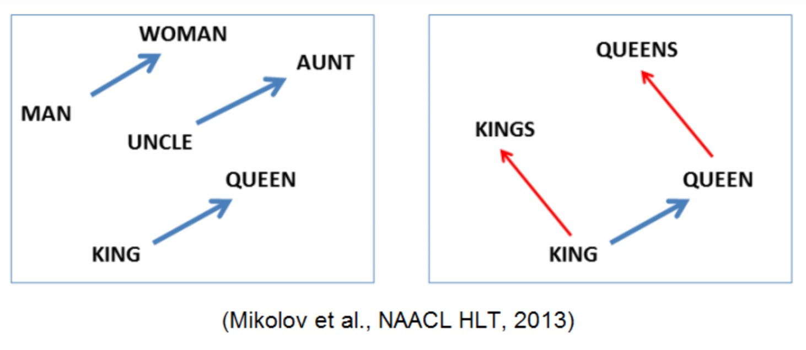

# Эмбеддинги
В постоянном потоке текстовых данных, с которыми сталкиваются системы обработки естественного языка и языковые модели, возникает важный вопрос: как эффективно представить слова и фразы так, чтобы алгоритмы могли понимать их смысл и контекст? Эмбеддинги, или встроенные представления, вступают в игру как ключевой инструмент в решении этой задачи.

Эмбеддинги представляют собой механизм, позволяющий преобразовать слова в векторы чисел, сохраняя при этом их семантические отношения и контекстуальные особенности. На практике это означает, что слова, близкие по смыслу, имеют близкие векторные представления.

В этой части будет рассмотрено несколько вариантов того, как можно строить эти представления.

## One-hot encoding
One-Hot Encoding предоставляет уникальный способ представления категориальных данных в виде бинарных векторов. При использовании этого метода каждое слово или фраза превращаются в вектор с единственным взведенным битом, соответствующем своей категории, а все остальные биты устанавливаются в ноль. В случае работы с естественным языком `i`-тому слову в словаре соответствует вектор с взведенным битом на `i`-той позиции.

Подход довольно прост в использовании, но крайне неэффективен: 

1. Из-за своего устройства у эмбеддингов слишком большая размерность, которая ведет к закономерным последствиям, ухудшающим производительность (повышается использование памяти и накладные расходы на вычисления)

2. Данный подход не сохраняет никакую информацию об использовании слов в тексте: статистику их позиций, статистику их использований и т.д.

## Частотный эмбеддинг
Предположим, что у нас есть набор документов $D$. Для того чтобы начать учитывать важность слова основываясь на его статистике вхождения в текст можно воспользоваться метрикой TF-IDF. Она состоит из двух частей: TF и IDF -- двух чисел, которые затем перемножаются.

**TF** (term frequency) -- частота слова $t$ в рамках одного документа $d$.
$$TF(t, d) = \frac{n_t}{\sum_k n_k}$$

**IDF** (inverse document frequency) -- обратная частота, с которой некоторое слово встречается в документах коллекции.
$$IDF(t, D) = \log \frac{|D|}{|\{d_i \in D | t \in d_i|\}}$$

Таким образом большой вес получают слова с высокой частотой в пределах данного документа $d$, но менее распространенные в рамках все корпуса.

При этом TF-IDF обладает определенными недостатками: никак не учитывается порядок и семантика слова, что может внести определенный шум.

## Представление слов в векторном пространстве
В статье [Efficient estimation of word representations in vector space, 2013](https://dscomp2019.github.io/papers/Mikolov_et_al-2013-Efficient.pdf) были представлены модели Continuous Bag-of-Words (CBoW) и Skip-gram.
CBoW по окружающим словам предсказывает недостающее слово. А skip-gram наоборот по слову предсказывает контекст. 

На основе предложенных работ появилась возможность построить пространство отражающее реальные связи между словами в привычном нам смысле. А именно, что геометрически более близкие слова близки и в естественном языке. Также такая конструкция должна сохранять все операции привычного нам векторного пространства.

Посмотриим на это на примере: $WOMAN - MAN \sim AUNT - UNCLE \sim QUEEN - KING$ и $QUEEN - KING \sim QUEENS - KINGS$.

 

## Токенизация
**Токенизация** — разбиение данных на элементарные части (слова, предложения или символы).

Токены могут варьироваться в зависимости от используемой техники токенизации и уровня лингвистической абстракции, необходимого для выполнения поставленной задачи.

1. Токенизация слов: При токенизации слов текст разбивается на отдельные слова. Каждое слово в предложении становится отдельным токеном. Например, введите текст "The quick brown fox jumps over the lazy dog.". Токены ["The", "quick", "brown", "fox", "jumps", "over", "the", "lazy", "dog", "."]
2. Токенизация предложений: Токенизация предложений относится к процессу разделения текста на отдельные предложения. Это обычный этап предварительной обработки в задачах обработки естественного языка, когда вводимый текст необходимо разделить на значимые единицы на уровне предложения. Например, вводимый текст "Unsupervised learning is fascinating. It is a part of Machine learning.". Токены ["Unsupervised learning is fascinating.", "It is a part of Machine learning."]
3. Символьная токенизация: При символьной токенизации каждый символ в тексте становится символом. Этот уровень детализации полезен для моделирования языка на уровне символов или генерации текста. Например, введите текст "Hello, World!". Токены ["H", "e", "l", "l", "o"", ",", " ", " W", "o", "r", "l", "d", "!"]

Части, как мы видим бывают разные, но, например, использование слова в качестве частицы дает недостаточно хорошие результаты.  Например, коты, котовый, котики могут иметь близкий смысл в тексте, но являются разными. 
Эта проблема обычно решалась с помощью стемминга (удаление суффикса, приставки, окончания) или лемматизации (приведение слова к канонической форме). Но эти способы не решают проблему словообразования (сохранения смысла для сложных слов) и отсутствия слова в словаре.

### Subword Tokenization
Токенизация на подслова помогает справится с вышеописанными проблемами. Она подразумевает разбиение слова на части, выбранные на основе всего документа, т.е. концепция, заключается в том, что часто встречающиеся слова должны быть в словаре, тогда как редкие слова разделяются на часто встречающиеся подслова. Например, слово "unwanted" может быть разделено на "un", "want" и "ed". Слово "football" может быть разделено на "foot" и "ball". Этот метод используется во многих NLP задачах, где модели необходимо поддерживать большой словарный запас и сложные словосочетания.

### Byte Pair Encoding
Рассмотрим алгоритм токенизации BPE.
Byte pair encoding (BPE) - это алгоритм кодирования и сжатия данных, используемый для сокращения размера текста или уменьшения словарного запаса в моделях обработки естественного языка.
Алгоритм начинается с разделения текста на самые мелкие единицы, такие как буквы или символы, и затем с помощью итерационного процесса объединяет наиболее часто встречающиеся пары байтов (byte pairs), создавая новые символы или “subwords”.

Алгоритм работы BPE следующий:
1. Разделение текста: исходный текст разделяется на самые маленькие единицы, такие как буквы или символы.
2. Подсчет частоты: для каждой пары байтов (byte pairs) или субслова (составленного из последовательности байтов) подсчитывается их частота в тексте. 
3. Объединение: самые частые пары объединяются в один целый символ. Новый символ может быть добавлен в словарь.
4. Обновление корпуса и словаря: текст обновляется путем замены самых частых пар субслов на соответствующие им новые.
5. Повторение: шаги 2-4 повторяются до тех пор, пока не будет достигнуто заданное условие остановки, такое как достижение определенного размера словаря или достижение определенного уровня сжатия.

Следующий пример [позаимствован](https://huggingface.co/learn/nlp-course/chapter6/5?fw=pt).

Предположим, что у нас есть корпус по заданному тексту (слова и частоты):
`("hug", 10), ("pug", 5), ("pun", 12), ("bun", 4), ("hugs", 5)`

1. Разделение текста:
`("h" "u" "g", 10), ("p" "u" "g", 5), ("p" "u" "n", 12), ("b" "u" "n", 4), ("h" "u" "g" "s", 5)`
2. Подсчет частоты:
`("hu", 2), ("ug", 3), ("pu", 2), ("un", 2), ("bu", 1), ("gs", 1)`
3. Объединение:
Корпус: `("h" "ug", 10), ("p" "ug", 5), ("p" "u" "n", 12), ("b" "u" "n", 4), ("h" "ug" "s", 5)`
Словарь: `["b", "g", "h", "n", "p", "s", "u", "ug"]`

И т. д.

Одним из главных преимуществ BPE является то, что токенизатор может быть адаптирован для любого интересующего корпуса и даже языков при условии, что наименьшая единица корпуса может быть закодирована в байтах

### Word Piece
#### Общие сведения

**WordPiece** - это метод сегментации слов, используемый в обработке естественного языка (NLP). Он представляет собой метод разбиения слов на подслова или части, что позволяет модели обрабатывать неизвестные или редкие слова путем их составления из более простых элементов.

Этот метод позволяет снизить сложность словаря, улучшить обработку неизвестных слов и уменьшить размер модели. WordPiece-модели широко используются в различных NLP-задачах, таких как машинный перевод, обработка естественного языка и другие.

#### Описание метода

Идея **WordPiece** состоит в том, чтобы разбить сложные или редкие слова на более простые составляющие, чтобы улучшить обработку и покрытие словаря. Например, слово "unhappiness" может быть разбито на два подслова "un" и "happiness". Таким образом, сложные слова разбиваются на более простые составляющие, что позволяет модели лучше улавливать семантические и контекстуальные особенности текста.

Процесс разбиения слова на подслова с помощью метода **WordPiece** может быть проиллюстрирован на примере. Рассмотрим следующий текст: "I love playing soccer". Предположим, что модель использует словарь, который содержит следующие токены: ["I", "love", "play", "##ing", "soccer"].

1) Сначала текст токенизируется на уровне слов, и мы получаем следующие токены: ["I", "love", "playing", "soccer"].
2) Затем каждое слово разбивается на подслова. Например, слово "playing" может быть разбито на ["play", "##ing"].
3) Все полученные подслова объединяются с оригинальными словами. Таким образом, окончательные токены будут: ["I", "love", "play", "##ing", "soccer"].

Преимущества использования метода WordPiece включают:
1) Улучшение обработки сложных или редких слов: **WordPiece** позволяет разбивать сложные слова на более простые составляющие. Это особенно полезно для слов, которые не встречаются часто в обучающем наборе данных или являются редкими. Разбиение слов на подслова позволяет модели лучше улавливать семантические и контекстуальные особенности текста, даже если она не была обучена на конкретном слове.

2) Увеличение покрытия словаря: **WordPiece** позволяет модели обрабатывать слова, которые не входят в исходный словарь. Поскольку слова разбиваются на подслова, модель может обрабатывать неизвестные слова, разбивая их на более простые составляющие, которые уже присутствуют в словаре. Это увеличивает покрытие словаря и позволяет модели лучше обрабатывать разнообразные тексты.

3) Более эффективное использование ресурсов модели: Разбиение слов на подслова позволяет сократить количество уникальных токенов, требуемых для представления текста. Это может быть особенно полезно в моделях глубокого обучения, где большое количество уникальных токенов может привести к увеличению размера модели и требованиям к памяти. С использованием **WordPiece** можно сократить количество уникальных токенов, уменьшив размер модели и улучшив ее эффективность.

4) Обработка нестандартных словоформ и орфографических вариантов: WordPiece позволяет модели эффективно обрабатывать различные варианты словоформ и орфографические варианты. Например, слово "run" может быть разбито на подслова "run" и "##ning", что позволяет модели улавливать различные формы глагола ("run", "running", "ran") и представлять их в виде общих подслов.

5) Адаптивность к различным языкам и задачам: WordPiece является гибким методом, который может быть применен к различным языкам и задачам в NLP. Словарь и правила разбиения могут быть настроены под конкретный язык или задачу, что позволяет лучше адаптировать модель к специфическим особенностям языка и улучшить ее производительность.

В целом, использование метода WordPiece в NLP позволяет моделям более эффективно обрабатывать тексты, улучшать покрытие словаря, адаптироваться к различным языкам и задачам, а также улучшать эффективность использования ресурсов модели. Этот метод широко применяется в современных моделях глубокого обучения, таких как BERT, и играет важную роль в достижении высокой производительности в задачах обработки естественного языка.

Однако, при использовании **WordPiece** может возникнуть некоторая сложность в интерпретации результатов, поскольку токены могут быть разделены на подслова. Также важно отметить, что разбиение на подслова может быть специфичным для каждого языка или модели, поэтому словарь и правила разбиения могут различаться

### Unigram Language Model
ULM подход позволяет сократить размер словаря и учесть разные возможные разбиения на токены.

Предположим есть заранее заданный словарь $V$ (при этом содержащий также все однобуквенные токены, чтобы избежать out of vocabulary) и набор документов $D$. Также делается предположение, что все слова независимо появляются в тексте, т.е. для входной последовательности $x = (x_1, ..., x_n)$
верно, что
$$ P(x) = \prod p(x_i) \\ \sum_{x \in V} p(x) = 1 $$

При этом для входной последовательности $x$ определяется наиболее вероятное разбиение $x^*$ как 
$$ x^* = argmax_{x' \in S(x)} P(x') $$

где $S(x)$ это всевозможные разбиения $x$. Это можно сделать с помощью [алгоритма Витерби](https://ieeexplore.ieee.org/document/1054010).

Мы хотим проредить наш словарь, оставив только действительно нужные токены. Для этого введем функцию правдоподобия для нашего $D$

$$ \sum_{d \in D} \log P(d) = \sum_{d \in D} \log \big( \sum_{x \in S(d)} P(x) \big) $$

Таким образом строится следующий алгоритм:
1. С помощью EM-алгоритма предподсчитывается $p(x)$
2. Для каждого токена считается его $loss$ -- значения правдоподобия, если бы его удалили из словаря
3. Сортируем токены по $loss$ и оставляем топ-$y$ (например 80%)

При этом важно оставлять односимвольные токены, чтобы избегать OOV.
