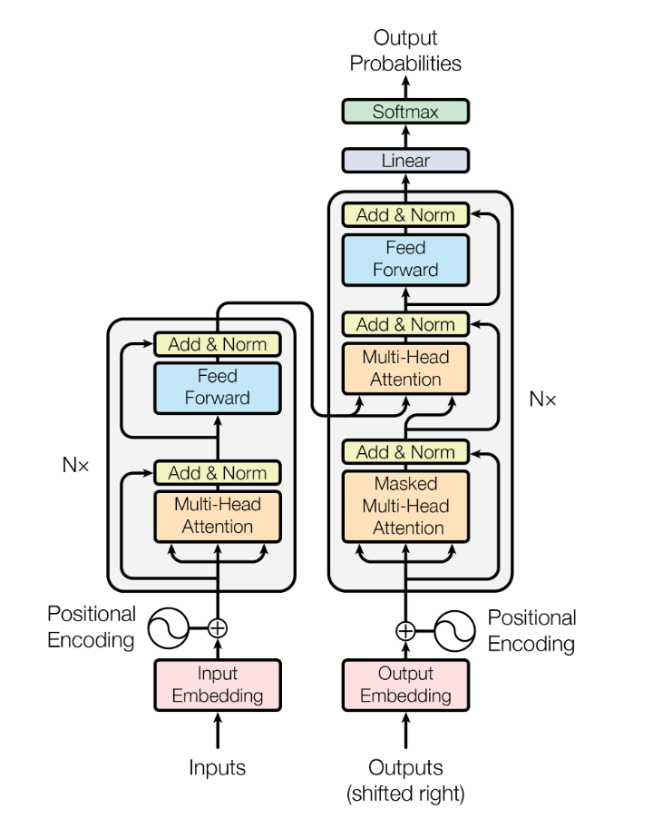
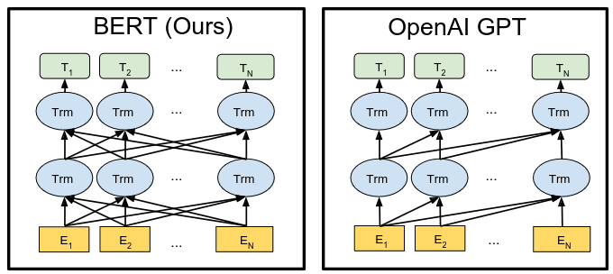

# Трансформеры и их производные
До трансформеров основные state-of-the-art подходы были основаны на рекуррентных нейронных сетях, обсужденных выше. Из их архитектуры можно выделить
основные минусы:

1. Архитектура RNN не позволяет использовать параллелизм на уровне обучаемых данных. Несмотря на то, что были проведены определенные работы
по ускорению рекуррентных сетей [1, 2], природа сети остается такой же и проблема не устранена полностью.

2. Обучение таких сетей -- это back propagation, который может плохо работать и контекст имеет проблемы с затуханием.

3. В классическом подходе контекст односторонний: мы читаем последовательность токенов слева-направо, при этом не учитывая связи слов с правой частью.

Последняя проблема потенциально может быть решена засчет двунаправленных рекуррентных нейронных сетей, однако совокупность 1 и 2 пунктов все еще дает о себе знать.

Таким образом архитектура трансформеров призвана решать данные проблемы.

## Трансформеры

Трансформер представляет собой модель с encoder-decoder архитектурой. Encoder часть модели переводит входной текст $(x_1,...,x_n)$ во внутреннее представление $(h_1,...,h_n)$, а затем decoder часть модели генерирует выходные данные $(y_1,...,y_m)$, основываясь на $h_i$.

### Encoder
Энкодер представляет собой последовательность следующих блоков:

+ Self attention блок -- блок отвечающий за механизм внимания и учета контекста в нашей модели 
+ Residual блок с нормализацией
+ Fully connected feed-forward

Таким образом мы применяем преобразования вида $LayerNorm(x + Layer(x))$, где $Layer$ это либо Self-attention блок, либо Fully-connected feed-forward блок.

При этом были проведены [исследования](https://aclanthology.org/2020.emnlp-main.463/), в которых изучалось расположение $LayerNorm$ в рамках residual-ветки. Результаты показывают, что классическое расположение в оригинальном трансформере может приводить к нестабильности в процессе обучения; рекомендуется использовать нормализацию ко входу residual блока (соответствует пункту `b)` на картинке).

#### Self attention block
Суть блока состоит в том, чтобы моделировать внимание, учитывая те нюансы, которые мы обозначили выше. Мы заводим промежуточные вектора $query$, $key$ и $value$, которые мы получаем из эмбединга слова путем его умножения на матрицы, которые мы обучаем. В статье они имеют размерность, меньшую, чем эмбеддинг слова $w$, однако это не правило, а просто архитектурное решение.

$query$ подразумевает, что мы "смотрим" из нашего слова $w$ на остальные слова. $key$ подразумевает ситуацию, когда на наше слово $w$ "смотрят" другие слова. Таким образом мы хотим вычислить $score$ для слова $w$: посчитаем скалярное произведение $\langle query_w,\, key_u \rangle$ (в том числе с самим собой, то есть когда $u = w$). Мы получили $score_{w, u}$ для каждой пары слов с $w$. Теперь, если мы считаем, что вектора имеют размерность $d$, то мы хотим разделить наши $score_{w, u}$ на $\sqrt(d)$ (в случае статьи это равно 8). Интуиция -- мы хотим отнормировать вектор, поделив на дисперсию, как если бы мы делали при скалярном произведении двух нормально распределенных векторов. Затем мы нормализируем результаты с $Softmax$.

После этого мы хотим домножить число $score_{w, u}$ на $value_u$. Интуиция -- мы хотим учитывать $value$ тех слов, которые для нас важны (именно это олицетворяет $score_{w, u}$ -- важность слова).

После этого мы суммируем получившиеся взвешенные вектора и получаем выход нашего слоя -- вектор $z$.

##### Матричное представление блока
Заметим, что все операции хорошо кодируются матричными умножениями. Посчитать все $query$, $value$, $key$ вектора можно, сконкатенировав эмбеддинги в матрицу $X$ и домножив ее на соответствующие матрицы для построения векторов. Так мы получим матрицы $Q$, $V$ и $K$, в которых лежат все соответствующие вектора. Последующие шаги тоже легко кодируются: посчитать скоры можно как $Q * K^T$, нормализацию с делением и Softmax можно провести на матрице, а затем результат можно домножить на $V$. Вот мы и получили матричное представление нашего блока, у которого выход -- матрица $Z$.

Такой подход важен, так как это одна из ключевых вещей для ускорения обучения нашей модели.

##### Multi-head attention
Можно шагнуть дальше и в рамках одного блока проводить этот процесс несколько раз, получив несколько результативных матриц $Z_i$. После этого их можно сконкатенировать, домножить на обучаемую матрицу $W0$ и получить результативные представления в матрице $Z = [Z1,...,Zh] * W0$.

Это дает некоторые преимущества:
1. Это позволяет фокусироваться на каких-либо позициях. Например каждая голова attention-а может сконцентрировать внимание на определенных словах в предложении.
2. Так как у нас теперь несколько наборов обучаемых матриц, мы можем "проецироваться на разные подпространства". Иными словами каждая голова может отвечать за разные смысловые связи в предложении.

### Decoder

Устройство decoder части схоже с устройством encoder части. Наш блок тоже состоит из multi-head attention и fully-connected блока с промежуточными residual блоками. Изменения следующие:

1. Добавляется промежуточный multi-head attention слой, у которого матрицы $K$ и $V$ берутся из последнего encoder слоя, чтобы помочь decoder блоку сосредоточить внимание на нужных частях.

2. Multi-head attention слой в decoder части добавляет маскирование слов в генерируемой помследовательности, чтобы учитывать лишь те слова, которые мы уже сгенерировали.

### Positional encoding
До сих пор в наших эмбеддингах была информация лишь про сами слова. Однако часто для понимания текста важно знать не только смысл самого слова, но и его позицию в предложении. Для этого предлагается создать positional encoding, который будет содержать в себе эту информацию, и добавить его у эмбеддингам слов. 

Подход, предложенный в статье, заключается в том, чтобы строить positional encoding-и следующим образом:

$$
    PE_{(pos, 2i)} = sin(\frac{pos}{10000^{2i / d}}) \\
    PE_{(pos, 2i + 1)} = cos(\frac{pos}{10000^{2i / d}})
$$

Здесь $PE_{pos}$ -- это вектор positional ecoding-а для слова на позиции $pos$. $i$ в данном случае описывает $i$-тое значение вектора. Такой выбор был осуществлен из-за гипотезы авторов, что для любого фиксированного отступа $k$, $PE_{pos + k}$ может быть описано линейной функцией от $PE_{pos}$. Таким образом такой подход должен положительно влиять на процесс обучения и качество результативной модели.

Также данный подход хорош тем, что он создает ограничения на значения в векторе positional encoding-а. То есть например у нас нет ситуации, когда более далекие в предложении слова имеют меньшие значения в конечных эмбеддингах из-за того что они находятся дальше.

При этом данный подход не лишен проблем. Например, из за сложения эмбеддингов с PE создаются ненужные корреляции слов, которые мешают Self-attention блокам и создают ненужный шум. Или так же стоит под сомнением учет служебных символов в PE. Например [здесь](https://arxiv.org/pdf/2006.15595.pdf) авторы рассматривают эти проблемы и пытаются их решить новым подходом.

Также существуют исследования предлагающие свести PE не просто к сложению, но к матричному умножению. в [RoFormer](https://arxiv.org/pdf/2104.09864v4.pdf) авторы предлагают сохранять информацию о позиции путем вращения векторов эмбеддингов так, чтобы скалярное произведение несло полезную информацию на этот счет.

Дополнительно присутствуют разные другие исследования на счет PE, проведенные еще до выхода статьи с трансформерами. Например [здесь](https://arxiv.org/abs/1705.03122) описываются разные подходы, как обучаемые так и фиксированные.

Более того, в последнее время появляются статьи, которые ставят под сомнение использование PE как такового. Например [здесь](https://arxiv.org/pdf/2203.16634.pdf) и [здесь](https://arxiv.org/pdf/2305.19466.pdf) NoPE (no positional encoding) подход сравнивают с существующими популярными и получают интересные результаты, демонстрирующие, что в некоторых случаях NoPE может показывать себя как наилучший подход.

### Overview работы трансформера
Теперь можно посмотреть на общую архитектуру трансформера. У нас две части: encoder и decoder. Сначала мы обсчитываем encoder часть, получаем наши представления `Z` и матрицы `K` и `V`. Затем вся эта информация подается на вход deocder части с символом начала предложения. Этот этап повторяется и каждый раз на вход deocder подается текущая сгенерированная фраза. Когда мы сгенерировали символ конца предложения, мы останавливаемся.

## Производные архитектуры
### BERT

Одним из главных применений трансформера является языковое моделирование -- обобщение задач, возникающих в NLP. Хочется создать некий basic-block, позволяющий понимать входной текст и выделять его смысл в каком-нибудь скрытом состоянии. Примерно такие же вещи происходят в компьютерном зрении: можно взять несколько первых слоев обученного ResNet и использовать их как feature extractor для картинок. Похожие вещи хочется иметь и в обработке естественных языков. Эту задачу решает BERT -- модель состоящая из encoder части трансформера. 

#### Обучение
Важной частью понимания BERT является процесс его обучения. Для языкового моделирования необходимо научить модель понимать язык. Чтобы достичь этого, нужно правильно поставить задачу (или задачи) в процессе обучения. В случае BERT ставят следующие:

1. **Угадывание спрятанных токенов**. Во входном предложении случайным образом какая то доля токенов удаляется и задача BERT -- восстановить эти токены. При этом важным замечанием является то что удаление токенов с помощью служебного токена `MASK` может плохо сказаться на Fine-Tuning-е, так как с ним токен `MASK` уже вряд ли будет использоваться. Таким образом в статье предлагают случайным образом выбирать 15% токенов, а затем с 80% шансом заменять токен на `MASK`, с 10% шансом заменять на другой токен и в оставшемся случае оставлять его как есть. Затем на соответствующем выходном эмбеддинге модель будет восстанавливать токен.
2. **Задача классификации**. Во многих связанных с NLP задачах возникает необходимость понимать связи между предложениями. Чтобы модель имела возможность это сделать, авторы предлагают добавить задачу классификации "является ли предложение `B` смысловым продолжением предложения `A`". Входные данные были разделены по парам -- 50% были смысловым продолжением, 50% не были связаны.

#### Входные данные модели
Входные данные имеют следующий формат:

На первом месте стоит служебный токен `CLS`. Соответствующий ему выходной токен представляет собой агрегационную информацию о предложении, необходимую для задачи классификации (в нашем случае предсказании следующего предложения). Предложения разделены служебным токеном `SEP`.

При этом важно то, как строятся эмбеддинги токенов. Помимо positional encoding добавляется обучаемый segment embedding, необходимый для указания принадлежности предложению.

#### Fine-tuning
Как было упомянуто в начале, задача BERT -- быть базовым блоком для решения широкого спектра задач в NLP. В изначальной статье демонстрируются способности BERT к fine-tuning. 

Благодаря постановке задач во время обучения, множество задач легко положить на BERT -- например в задаче перефразирования пара предложений это предложения `A` и `B`, а в задаче схожести двух текстов выходной эмбединг токена `CLS` может быть использован для ответа на этот вопрос.

Ниже можно увидеть результаты BERT на бенчмарке GLUE.

### GPT
В отличие от BERT модель GPT состоит из модифицированных decoder блоков. Из изменений: убран self-attention слой, который использовал матрицы из encoder части модели.

Основное отличие GPT от BERT в том, что он генерирует токены последовательно. Затем сгенерированный токен добавляется на вход и генерация продолжается. Эта идея называется "auto-regression" и она коррелирует с тем, как работают RNN. Но в то же время мы лишаемся двунаправленности контекста, которая была в BERT. Чтобы получить больше интуиции можно посмотреть на визуализацию этой разницы:

Соответственно pre-train этап GPT заключается в том, чтобы учить модель восстанавливать следующий токен.

#### Fine-tuning
GPT тоже подразумевается pre-trained моделью, которую можно дообучить на определенные задачи.

Один из примеров -- машинный перевод. Можно достичь решения этой задачи путем построения последовательности токенов вида `A + <en-fr> + B`, где `A`
 -- предложение на английском, `B` -- его перевод на французский, а `<en-fr>` -- служебный токен, чтобы обозначить, что с этого момента мы хотим переводить предложение `A`. Таким подходом можно решить многие задачи: question answering (с токеном, что надо начать отвечать), summarization (с токеном начала суммаризации) и т.д.

1 -- https://arxiv.org/abs/1703.10722

2 -- https://arxiv.org/abs/1701.06538