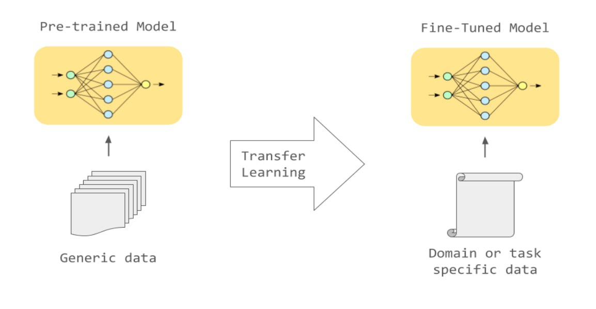

# Fine tuning

Fine tuning представляет собой метод в рамках Transfer Learning, где веса предварительно обученной модели донастраиваются на новых данных. Этот процесс может быть выполнен либо на всей нейронной сети, либо на определенных ее слоях, оставляя остальные слои без изменений, то есть "замораживая" их состояние.

"Замораживание" слоев является ключевым аспектом процесса fine tuning. Это позволяет сохранить знания, полученные предварительным обучением, в частности, если они уже демонстрируют высокую эффективность на исходных данных. Таким образом, модель приспосабливается к новым данным, не теряя ценные шаблоны и признаки, изученные на предыдущих этапах.

Fine tuning широко используется в области Language Model (LLM), где этот подход часто применяется для повышения точности предсказаний. Он позволяет модели обновляться и приспосабливаться к новым данным, сохраняя при этом ценные знания, полученные из предварительного обучения. Это полезно в контексте быстро меняющихся данных, таких как новости или разговорные тексты, где модель может быстро и эффективно обучаться на свежей информации.

## Fine tuning для LLM

Методы fine-tuning глобально делятся на следующие типы:

|**Техника**|**Описание**|**Computational Cost**|**Performance**||
| - | - | - | - | - |
|Repurposing|Использование LLM для задачи из другой области|Less|Less|
Выделить фичи 

Подключить Embedding layer LLM к модели классификатора
|
|Full Fine-tuning|Тренировка модели на данных из представленного датасета|More|More||

При использовании Language Model (LLM), начальный запрос, известный как prompt, подается на вход модели. LLM генерирует последовательность текста в ответ на этот запрос, после чего происходит оценка полученного ответа человеком.

Оценка качества сгенерированной последовательности играет ключевую роль. Человек анализирует ответ на предмет связности, информативности и соответствия исходному запросу. На основе этой оценки назначается рейтинг, который отражает степень удовлетворения запроса и качество сгенерированного ответа.

Этот процесс позволяет оценить точность и релевантность ответа модели на входной запрос, предоставляя обратную связь для дальнейшего улучшения качества работы LLM. Такая оценка играет важную роль в совершенствовании модели и ее способности генерировать информативные и точные ответы на запросы пользователей.

|**Техника**|**Описание**|**Computational Cost**|**Performance**|
| - | - | - | - |
|Unsupervised Fine-tuning|Обучение на неразмеченном датасете|Less|Less|
|Supervised Fine-tuning|Обучение на размеченном датасете|More|More|

## PEFT (Parameter-Efficient Fine-Tuning)
**PEFT** -- это набор методов для уменьшения параметров, требуемых при fine-tuning. Включает:

1. Уменьшение датасета.
2. Использование простых моделей.
3. Технику low-rank adaptation (LoRA), аппроксимирующую параметры LLM матрицей низкого ранга. Это уменьшает число параметров, улучшая производительность LLM в fine-tuning.

## Примеры fine-tuning

- Финансовая сфера. 
  - FinGPT – LLM для анализа финансовых новостей. Анализируя ключевые источники помогает в прогнозировании изменения курсов акций и тд. 
- Ритейл. 
  - Custom Tone – методика, используемая для настройки чат-ботов для более высокого уровня обслуживания клиентов
- Перевод. 
  - Fine tuning языковых моделей может привести к более точному переводу, особенно сленговых или контекстно-зависимых фраз.
- Программирование.
  - Fine tuning LLM позволяет создавать фрагменты кода на различных языках программирования, сохраняя при этом конфиденциальность.