# Оптимизация инференса

## Введение

Большие языковые модели очень популярны в наши дни, они стали state-of-the-art подходом для многих задач. Однако данные модели очень требовательны к ресурсам во время обучения и использования. Чрезвычайно высокие затраты как по памяти, так и по времени во время инференса, является серьезным препятствием для внедрения трансформеров для решения реальных задач.

Почему инференс больших языковых моделей настолько ресурсозатратен? Помимо увеличения размера моделей SoTA, есть два основных фактора [Pope et al., 2022](https://arxiv.org/abs/2211.05102):

- *Большой расход памяти*. Как параметры модели, так и промежуточные состояния необходимы в памяти во время инференса. Например,
  - Кэш KV должен храниться в памяти во время стадии декодирования; например, для размера батча 512 и длины контекста 2048 общий объем кэша KV составляет 3 ТБ, что в 3 раза превышает размер модели (!).
  - Стоимость инференса из-за механизма attention квадратично зависит от длины входной последовательности.
- *Низкая распараллеливаемость*. Генерация выполняется авторегрессионным способом, что затрудняет распараллеливание процесса декодирования.

## Обзор методов

Цели оптимизации инференса модели:

- Сокращение объема памяти модели за счет использования меньшего количества устройств с GPU и меньшего объема памяти GPU;
- Снижение сложности вычислений за счет уменьшения FLOPs;
- Уменьшение inference latency и ускорение работы.

Можно использовать несколько методов, чтобы сделать инференс менее затратным по памяти и/или быстрее по времени.

- Применяйте параллелизм для масштабирования модели на большом количестве GPU. Умный параллелизм компонентов модели и данных позволяет запускать модель с триллионами параметров.
- Выгрузка временно неиспользуемых данных в CPU и последующее считывание их обратно при необходимости. Это помогает уменьшить использование памяти, но приводит к увеличению задержки.
- Особые стратегии пакетной обработки; Например, [EffectiveTransformer](https://github.com/bytedance/effective_transformer) объединяет последовательности входных данных, для того чтобы удалять паддинги в рамках одного батча.
- Методы сжатия сети, такие как прунинг, квантизация, дистилляция. Модель меньшего размера с точки зрения количества параметров или разрядности, должна требовать меньше памяти и работать быстрее.
- Улучшения, характерные для архитектуры целевой модели. Многие архитектурные изменения, особенно для слоёв внимания, помогают повысить скорость стадии декодирования трансформера.

## Инструменты для разработчиков

**TensorRT-LLM** предоставляет пользователям простой в использовании Python API для описания больших языковых моделей (LLM) и создания движков TensorRT, которые содержат самые современные оптимизации для эффективного выполнения инференса на графических процессорах NVIDIA. TensorRT-LLM также содержит компоненты для создания сред выполнения на Python и C++, которые выполняют эти движки TensorRT.

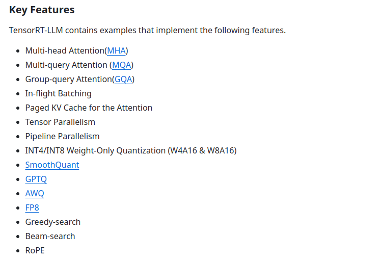

Далее мы подробнее рассмотрим некоторые методы оптимизации инференса, а также затронем инженерные подходы.


## Квантизация

Один из подходов - понижение битности вычислений. Если обычно веса и активации представлены простыми вещественными числами, то при переходе к int8 мы уменьшаем затрачиваемую память и сложность вычислений.


Итак, у нас есть значения с плавающей точкой, мы хотим перевести их в целочисленные значения в некотором диапазоне.

Как мы это будем делать?

Мы рассмотрим два вида квантизации: 

1) Асимметричная квантизация

Для этого нам нужны два параметра - scale (Δ) для масштаба и zero-point (z) для сдвига. Тогда квантизованное значение x<sub>Q</sub>  получается следующим образом:

$x_{int} = round(\dfrac{x}{Δ}) + z$

$x_Q = clamp(0, N_{levels} - 1, x_{int})$, где $N_{levels}$ - количество используемых значения (256 в случае int8)
То есть ограничиваем снизу 0, а сверху $N_{levels} - 1$

Деквантизация происходит очевидным образом:

$x_{float} = (x_Q - z)Δ$


2) Симметричная квантизация

В этом случае сдвига не происходит:

$x_{int} = round(\dfrac{x}{Δ})$

$x_Q = clamp(- N_{levels}/2, N_{levels}/2 - 1, x_{int})$, если нужна квантизация с разными знаками

$x_>Q = clamp(0, N_{levels} - 1, x_{int})$, иначе

Деквантизация в этом случае выглядит проще

$x_{float} = x_Q Δ$

Плюс симметричной квантизации в том, что она сохраняет 0 на месте (очевидно по построению). Это выгодно для паддинга (поскольку происходит заполнение 0). Однако, благодаря сдвигу, асимметричная квантизация позволяет лучше распределить значения на интервале, а потому добиться лучшей точности.


Встаёт вопрос, как нам подбирать параметры. При квантизации часть информации неизбежно теряется, поэтому мы хотим использовать весь диапазон доступных значений.


Для активаций мы можем выбрать минимум и максимум от входов (или некоторую их квантиль)

Для весов мы действуем аналогично. Мы можем взять квантили по всему слою или по батчам, в таком случае у нас получится более точные предсказания.

Также обратим внимание, что при квантизации матожидание выхода у нас изменится. 

$E[y_Q] =E[W_Qx] = E[(W + ΔW)x] = E[Wx] + E[ΔWx]$ 

Чтобы это исправить, мы можем посчитать эту ошибку на нескольких батчах и вычитать на выходе.

$E[y_{corr}] =E[W_Qx] - E[ΔWx]$ 

Таким образом, пайплайн выглядит следующим образом:

1) Обучение полновесной модели

2) Калибровка параметров квантизации

3) Инференс


Встаёт вопрос, можем ли мы ещё как-то улучшить квантизацию на компьютере

Для этого существует QAT (Quantization-Aware Training), где мы сначала обучаем модель и проводим PTQ(описанную выше), а затем передаём параметры квантизации и обучаем модель ещё несколько эпох.

Заметим, что при обратном проходе производная почти везде будет равна 0.

В квантизации используют такую хитрость: при обратном проходе мы считаем, что функция у нас линейная и производная берётся именно от этой линейной функции. То есть обратный проход выглядит следующим образом:

$\delta_{out} = \delta_{in}I$, где $\delta_{in} = \dfrac{\partial L}{\partial w_{out}}$

## Дистилляция знаний (Knowledge distillation)

Следующая техника оптимизации инференса, которую мы затронем в этом разделе, — это дистилляция знаний.

Все полезные модели, которые сейчас используются, сильно перепараметризованы — у них огромное количество "лишних" параметров. На самом деле эти параметры не совсем лишние, потому что на практике модели с большим числом параметров обучаются лучше обобщаться на данные, которых они раньше не видели. Проблема в том, что перепараметризация сильно поднимает затраты на инференс.

Дистилляция знаний предлагает подход к решению этой проблемы. Вместо обучения маленькой модели с нуля, можно "перенести" в нее знания из более крупной модели, чтобы сгладить потерю качества.

Мы разберем, что такое дистилляция знаний и какие есть подходы к ее реализации.

### Что такое дистилляция знаний?

<figure>
  
  <figcaption>Общая схема процесса переноса знаний</figcaption>
</figure>

Дистилляция знаний — это техника сжатия модели, в которой компактная модель-студент учится воспроизводить поведение большой модели-учителя. Концептуально на дистилляцию можно смотреть так: 

У нас есть обученная на каких-то данных модель. По сути это просто функция, которую мы можем аппроксимировать. Если мы сможем с достаточной точностью сделать это моделью, у которой число параметров поменьше, то мы как раз и получим нужный эффект.

**Важно!** Данные, которые используются для переноса знаний (transfer set), могут и не быть размеченными. При аппроксимации функции достаточно иметь лишь ее сигнал.

Впервые техники дистилляции знаний успешно применили в статье [Model compression (Buciluǎ et al., 2006)](https://dl.acm.org/doi/10.1145/1150402.1150464). Сам термин появился и закрепился после выхода статьи [Distilling the Knowledge in a Neural Network (Hinton et al., 2015)](https://arxiv.org/abs/1503.02531). На ее примере и рассмотрим, как в самом простом случае проводить дистилляцию.

### Distilling the Knowledge in a Neural Network

В статье рассматривали задачу классификации на датасете MNIST. С сильной регуляризацией обучили полносвязную сеть с двумя скрытыми слоями по 1200 нейронов в каждом. Далее обучали нейросеть меньшего размера (та же сеть, 800 нейронов в слоях), используя в качестве дополнительного обучающего сигнала логиты большей сети по следующей схеме:

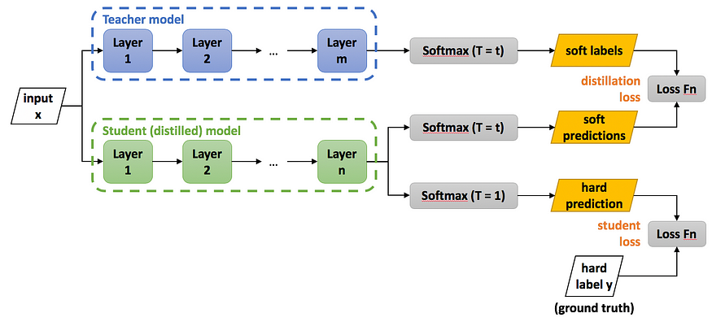

Здесь Loss Fn — это кросс-энтропия,

$Softmax(x, T)_i = \dfrac{\exp{\frac{x_i}{T}}}{\sum_j \exp{\frac{x_j}{T}}}$, где T — это температура.

Кодом с использованием PyTorch это выглядит так:

```python
x, gt_labels = batch

student_logits = student(x)
with torch.no_grad():
    teacher_logits = teacher(x)

loss = torch.nn.functional.cross_entropy(student_logits, gt_labels) \
       + distillation_loss_alpha * torch.nn.functional.cross_entropy(
           student_logits / T, 
           torch.nn.functional.softmax(teacher_logits / T),
       )
```

#### Технические детали

У этого подхода есть два гиперпараметра: \
`distillation_loss_alpha` — коэффициент, который отвечает за вес лосса дистилляции в смеси; \
`T` — температура, которая при малых значениях делает лосс менее восприимчивым к отклонениям маленьких логитов. При большой температуре такой лосс дистилляции будет равен обычному MSE на логитах. 

На практике обычно имеет смысл подобрать оптимальную температуру поиском по логарифмической шкале.

Стоит отметить, что использование температуры уменьшает градиенты, протекающие через лосс дистилляции в $T^2$ раз. Чтобы это компенсировать, `distillation_loss_alpha` должна быть порядка $T^2$. 

<figure>
  
  <figcaption>Визуализация изменения распределения при изменении температуры</figcaption>
</figure>

#### Что получилось

Модель-учитель на тестовом множестве совершила 67 ошибок. Модель-студент, будучи обученной с нуля без регуляризации, совершила 146 ошибок. Дистиллированная модель-студент совершила 74 ошибки.

### Подходы реализации дистилляции знаний

Описанный в предыдущем разделе подход — самый популярный в силу своей простоты. В этом разделе мы обсудим, как еще можно организовать дистилляцию знаний. Поскольку способов дистилляции очень много, в технические детали мы погружаться не будем, и этот раздел — скорее обзор и разминка для фантазии, а не руководство по реализации.

Способы дистилляции можно различать по типу обучающего сигнала (знаний) для модели-студента, по организации процесса обучения студента и по архитектурной связи между учителем и студентом.

#### Тип обучающего сигнала

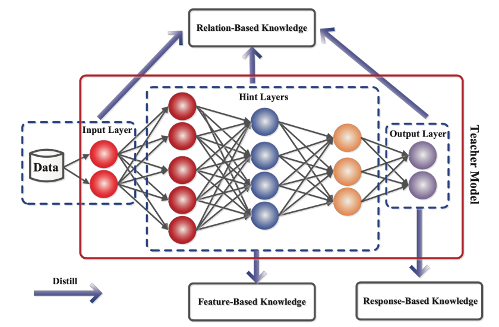

* **Response-based knowledge:** в качестве обучающего сигнала служат активации выходного слоя модели-учителя.
* **Feature-based knowledge:** в этом подходе дополнительно используются активации скрытых слоев учителя.
* **Relation-based knowledge:** здесь используются зависимости между активациями скрытых слоев учителя; это могут быть корреляции между активациями одного слоя, активаций с разных слоев.

#### Схема обучения

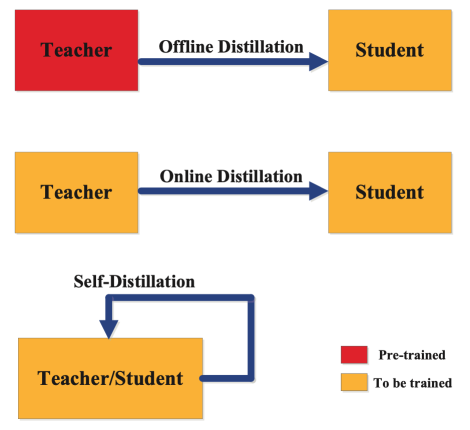

* **Offline distillation:** есть обученная модель-учитель, которая не меняется в процессе обучения студента.
* **Online distillation:** если у нас нет предобученной модели-учителя, можно все равно применять техники дистилляции - учитель и студент будут учиться одновременно, студент будет получать дополнительный обучающий сигнал от учителя; также в такой постановке могут фигурировать несколько моделей, каждая из которых одновременно является и учителем, и студентом — учатся они все вместе, а техниками дистилляции они регуляризуют друг друга.
* **Self-distillation:** в этом случае учитель и студент — одна и та же модель; например, можно использовать знания из более глубоких слоев модели для обучения более поверхностных слоев.

#### Архитектура учителя и студента

Удачно подобранная архитектура студента/учителя может положительно повлиять на успех дистилляции. Например, не всегда модель большего размера с лучшим качеством работы, будет лучшим учителем для фиксированного студента. Есть разные сочетания архитектур учителя и студента:

* Учитель и студент полностью одинаковые как в Online и Self-distillation подходах.
* Студент той же архитектуры, что и учитель, но меньше по размеру.
* Студент — это квантизированная версия учителя.
* Студент — это сеть с другой архитектурой меньшего размера.
* Учитель — ансамбль моделей, студент — одна модель.

Также при поиске удачного сочетания архитектур учителя и студента можно использовать методы автоматического поиска архитектуры (Neural Architecture Search). На практике зачастую архитектура учителя заранее определена и фиксирована, а студента подбирают под нее.

## Эффективная архитектура трансформера 
Эти варианты трансформеров представляют собой значительное развитие в области глубокого обучения, предлагая решения вычислительных проблем, связанных с длинными последовательностями и крупными моделями. Их уникальные подходы к оптимизации механизмов внимания и снижению вычислительной сложности делают их ценными инструментами в области обработки естественного языка и за её пределами. Далее будут приведены несколько известных дизайнов.

### Reformer


-   **Концепция**: Reformer, разработанный Китаевым и соавторами, использует метод локально-чувствительного хеширования (LSH) для уменьшения временной сложности традиционного механизма self attention с O(N²) до O(NlogN), где N - длина последовательности.
-   **Преимущества**: Эффективен с точки зрения задержки и использования памяти, использует обратимые остаточные слои, хорошо подходит для обработки длинных последовательностей【[source](https://arxiv.org/pdf/2001.04451.pdf)】.

### Linformer


-   **Концепция**: Linformer, созданный Вангом и коллегами, эффективно трансформирует механизм self attention, разбивая операцию скалярного произведения на меньшие части с помощью линейных проекций.
-   **Эффективность**: Уменьшает квадратичную сложность self attention до приближенно низкоранговой факторизации, делая его более эффективным для длинных последовательностей ввода.
-   **Преимущества**: Особенно полезен в сценариях, где часто встречаются длинные входные последовательности, поскольку предлагает значительное ускорение по сравнению с традиционными трансформерами【[source](https://arxiv.org/pdf/2006.04768.pdf)】.

### Performers


-   **Концепция**: Performers, с использованием подхода FAVOR+, оценивает softmax self attention для моделей с длинными последовательностями. Этот метод требует линейной сложности как по пространству, так и по времени.
-   **Особенности**: Использует положительные случайные признаки для оценки функции softmax, что важно для стабильного обучения. Кроме того, используется внимание ReLU для достижения лучших результатов при обучении с нуля.
-   **Преимущества**: По скорости, использованию памяти и общей производительности Performers превосходит другие модели, включая трансформеры с квадратичной сложностью O(N²) и O(NlogN)【[source](https://arxiv.org/pdf/2009.14794.pdf)】.

### CosFormer


-   **Концепция**: CosFormer, предложенный Цином и соавторами, заменяет квадратичное softmax внимание линейной функцией, улучшая локальные корреляции.
-   **Особенности**: Веса внимания в CosFormer перевешиваются с использованием косинусной функции, что обеспечивает эффективность при обработке задач обработки естественного языка.
-   **Преимущества**: Линейная сложность операций внимания делает CosFormer идеальным выбором для приложений, требующих эффективной обработки задач NLP【[source](https://arxiv.org/pdf/2202.08791.pdf)】.

### Flash Attention


-   **Концепция**:  Стандартный механизм внимания использует память с высокой пропускной способностью (HBM) для хранения, чтения и записи ключей, запросов и значений. HBM имеет большой объем памяти, но медленный в обработке, тогда как SRAM имеет меньший объем памяти, но быстрее в операциях. В стандартной реализации внимания стоимость загрузки и записи ключей, запросов и значений из HBM высока. Он загружает ключи, запросы и значения из HBM во встроенную SRAM графического процессора, выполняет один шаг механизма внимания, записывает его обратно в HBM и повторяет это для каждого отдельного шага внимания. Вместо этого Flash Attention загружает ключи, запросы и значения один раз, объединяет операции механизма внимания и записывает их обратно.
-   **Преимущества**: Flash Attention особенно полезен в сценариях, где требуется высокая вычислительная эффективность, например, в больших языковых моделях, задачах реального времени или на устройствах с ограниченными вычислительными ресурсами【[source](https://arxiv.org/pdf/2205.14135.pdf).

### Grouped query attention

Grouped Query Attention (GQA) [статья](https://arxiv.org/pdf/2305.13245.pdf) - это метод ускорения инференса трансформера засчёт изменения структуры его слоёв. Этот метод представляет собой нечто среднее между multi-query attention (MQA) и multi-head attention (MHA): он стремится приблизиться к качеству MHA, при этом сохраняя скорость MQA.
В MHA в self attention слое каждому query соотвествует отдельная пара key и value, а в MQA разные query разделяют один общий key и value. С другой стороны, в GQA, queries разбиваются на группы и для каждой группы key и value вычисляются отдельно, что позволяет с одной стороны уменьшить количество вычислений по сравнению с MHA, с другой стороны повысить качество по сравнению с MQA.

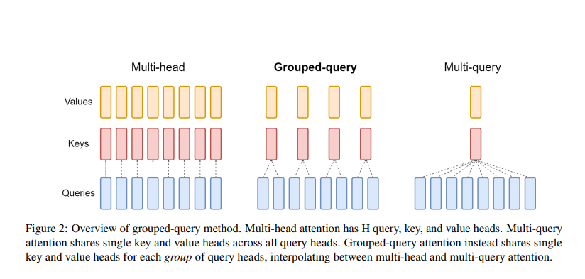

Теперь рассмотрим как происходит процесс изменения структуры модели (MHA в MQA или GQA). Первым шагом нужно конвертировать веса чекпоинта, вторым, провести дополнительное обучение, для того чтобы модель адаптировалась к новой структуре. Допустим, что изначально у нас есть несколько матриц (количество матриц равно количеству голов в случае MQA или количеству queries в одной группе в случае GQA) весов K(или V) и нам нужно из них сделать одну. Для этого можно использовать mean pool. Как было показано авторами статьи, это работает лучше, чем рандомный выбор головы, из которой будут браться K и V или рандомная инициализация.

*NB: GQA не применяется к self attention слоям энкодера; реппрезантации энкодера вычисляются параллельно, поэтому пропускная способность памяти обычно не является основным узким местом*

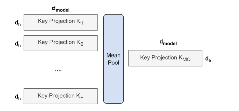

В итоге авторы статьи показали, что GQA показывает качество, близкое к MHA и скорость, сравнимую с MQA.

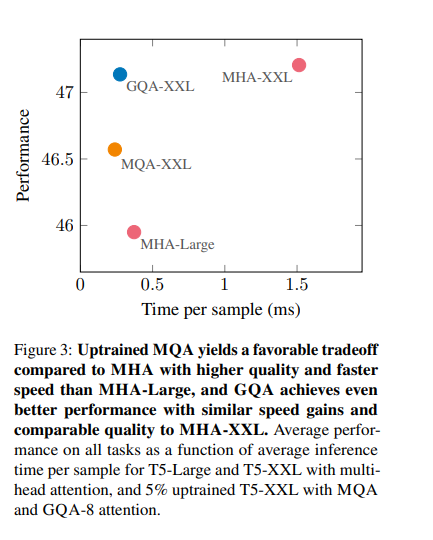

### Multi query attention

Multi query attention (MQA) — это метод внимания, который используется в трансформерах для
обработки нескольких запросов сразу. В обычном внимании, применяемом в трансформерах, происходит вычисление весовых
коэффициентов между запросами и ключами из одной матрицы. В MQA каждый запрос будет сопоставлен
со всеми ключами, что позволяет обрабатывать несколько запросов одновременно.

Этот подход находит широкое применение в трансформерах, поскольку позволяет работать с более сложными и разнообразными
запросами. В контексте машинного обучения и обработки языка, MQA позволяет модели обрабатывать
наборы запросов, что релевантно, например, в задачах многоклассовой классификации, где необходимо провести анализ
нескольких вопросов одновременно.

Сравнивая MQA и GQA можно сказать, что
MQA фокусируется на моделировании взаимосвязей между элементами входной последовательности без использования глобальных
запросов. Это позволяет MQA улавливать сложные зависимости в данных, что может привести к улучшению качества предсказаний в некоторых случаях.

С другой стороны, GQA фокусируется на моделировании глобальных зависимостей между входными данными, учитывая общую структуру
входной последовательности. Это может быть полезно для улавливания общих закономерностей и глобальных шаблонов в данных,
ведущих к улучшению качества предсказаний в свою очередь.

То есть, MQA фокусируется на сложных зависимостях, в то время как GQA улавливает общие черты в зависимостях.

Multi query attention отличается от, например, Multi head attention тем, что оно специализируется
на обработке нескольких запросов одновременно, в то время как Multi head attention фокусируется на разбиении и обработке
одного запроса с помощью нескольких параллельных механизмов внимания.

Multi-query attention позволяет модели обрабатывать несколько запросов одновременно,
учитывая их взаимодействие и важность в контексте. Это особенно полезно в случаях, когда требуется анализировать
связь и влияние нескольких запросов на одни и те же данные.

В [статье](https://arxiv.org/pdf/1911.02150.pdf) представлены замеры производительности использования MQA.

В таблице ниже представлены амортизированные затраты на обучение и инференс для задачи перевода WMT14 EN-DE с длиной последовательности 128. Значения указаны в TPUv2-микросекундах на выходной токен.

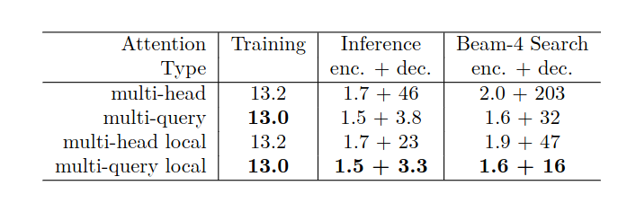

## Инженерные подходы

Инженерные подходы или же методы аппаратной оптимизации играют решающую роль в достижении эффективных и высокопроизводительных
вычислений. Эти методы предполагают улучшение дизайна и архитектуры аппаратных систем для эффективного вывода моделей
нейронных сетей с целью оптимизации производительности и энергоэффективности.

### Конвейерная обработка

Конвейеризация позволяет перекрывать вычисления с передачей данных и осуществлять различные дополнительные вычисления.
Это помогает достичь балансировки нагрузки и особенно полезно для глубоких сетей, таких как трансформаторы, которые
имеют несколько энкодеров и слои кодера. Одним из методов конвейерной обработки для ускорения модели BERT на больших
процессорах является [PipeBERT](https://link.springer.com/article/10.1007/s11265-022-01814-y). Этот процессор имеет два кластера: большой и маленький, каждый с четырьмя ядрами.
Они делят сеть BERT на два подграфа и отображают по одному подграфу для каждого кластера. Отображение реализуется с
использованием функциональности "affinity" CPU. Предлагается алгоритм бинарного поиска с учетом задержек для достижения
разделения подграфа с балансировкой нагрузки. Благодаря этой технике обеспечивается гораздо более высокая пропускная
способность, чем при выполнении на четырех больших ядрах, и значительно меньший "продукт с задержкой энергии",
чем при лучшем выполнении в одном кластере.

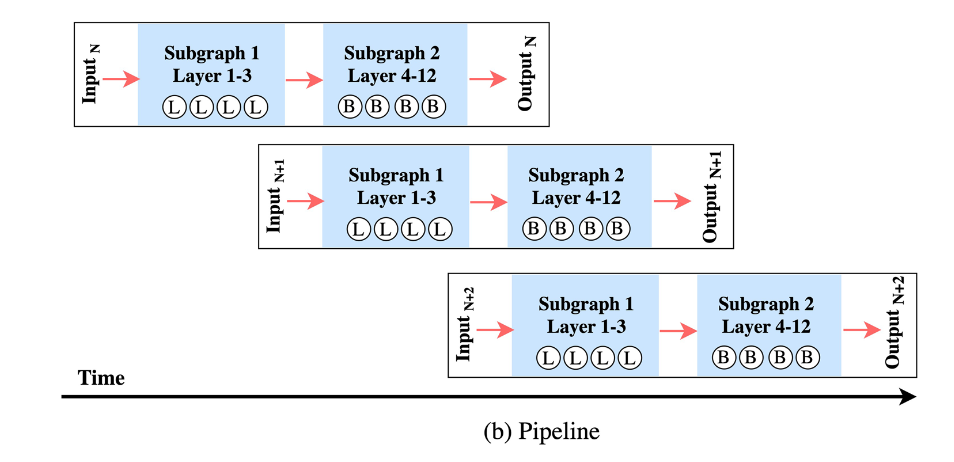

Рис. 5.1. Пример работы PipeBERT.


### Оптимизация умножения матриц

Вычисления трансформеров включают умножение  больших матриц, и, следовательно, оптимизация умножения матриц
может значительно повысить эффективность вычислений.

Вспомним устройство трансформера:

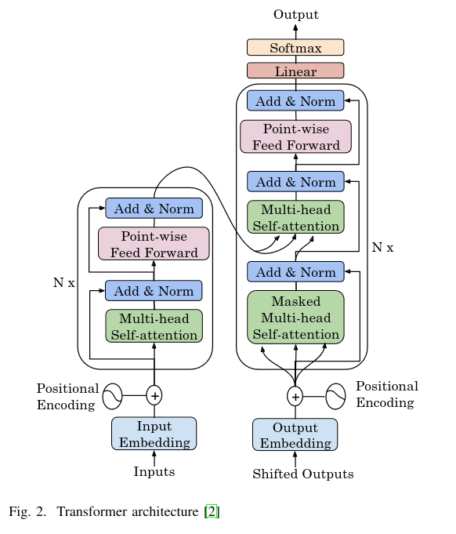

Рис. 5.2. Архитектура трансформера.

Можно заметить, что подавляющая часть вычислений - это блоки Multi-head Self-attention (MHA) и Feed Forward Network (FFN). Следовательно,
оптимизация их вычислений значительно ускорит работу модели.

Вычисления как MHA, так и FFN состоят из матричных умножений, значит для ускорения работы модели нужно оптимизовать умножение матриц.

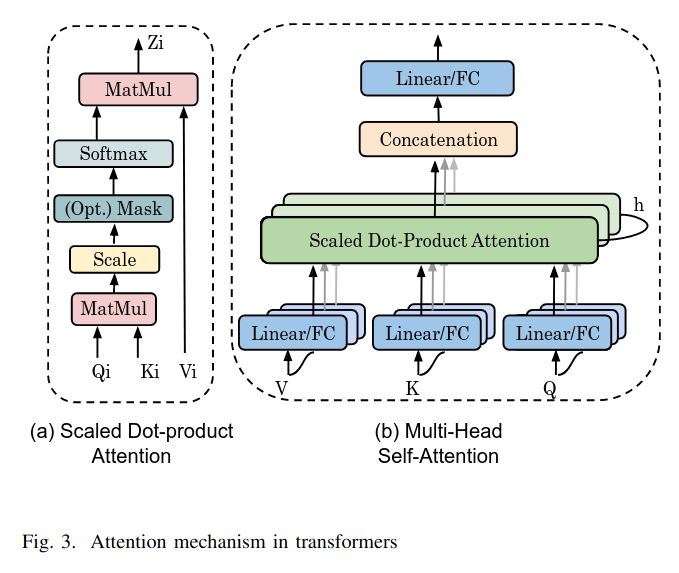

Рис. 5.3. Архитектура Attention блока.

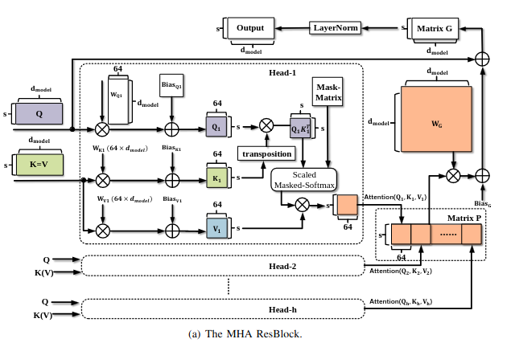

Рис. 5.4. Архитектура Multi-head Self-attention (MHA).

Лу и др. представляют **[аппаратный ускоритель для блоков MHA и FFN](https://arxiv.org/abs/2009.08605)** в трансформерах.
FFN представлен в виде FFN(x) = ReLU(xW<sub>1</sub> + b<sub>1</sub>)W<sub>2</sub> + b<sub>2</sub>. Они отмечают, что все весовые тензоры
имеют форму [BatchSize, s, d_model], где batchSize - размер пакета данных,
s - максимальная длина последовательности, а dmodel - размерность эмбеддинга.
Как блоки MHA, так и блоки FFN включают вычисления GEMM. Во
всех главах вычисления General Matrix Multiply (GEMM) линейных подуровней может быть выполнено с помощью систолической
матрицы(SA) размером s × 64. Они отмечают, что в хорошо известных трансформерах d<sub>model</sub> = 64h, а d<sub>ff</sub> = 4*d<sub>model</sub> (Рис. 5.5.). Исходя из этого,
они разделяют весовые матрицы W1, W2 и WG (способом, показанным на Рис. 5.6.). Тогда большинство GEMM могут быть выполнены с
использованием SA размером s × 64. Использование одного SA
экономит аппаратные ресурсы.

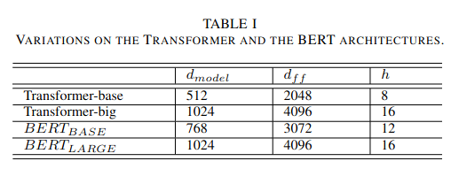

Рис. 5.5. Архитектуры популярных трансформеров.

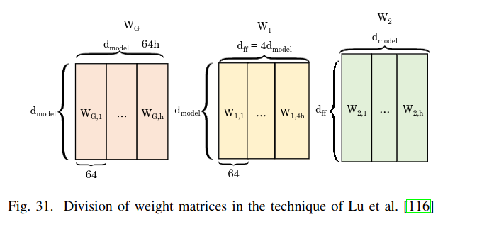

Рис. 5.6. Разделение весовых матриц.

Матрица S × 64 SA имеет s строк и 64 столбца, что создает выходную матрицу столбец за столбцом.
Затем смещение и остаточные входные данные суммируются с использованием двух наборов сумматоров s. Вычисления softmax
выполняются параллельно с вычислениями  “value” для повышения эффективности использования аппаратного обеспечения этого SA.
Они гарантируют, что softmax выдает выходные данные до того, как SA вычислит  “value”, так что общая задержка
определяется блоком SA и layerNorm. В блоке softmax они избегают Look-Up Table (LUT) и множителей, используя стратегию “log-sum-exp”,
которая использует линейную аппроксимацию для логарифмических функций и возведения в степень. Оба блока MHA и FFN должны вычислять
layerNorm; следовательно, layerNorm — один из важнейших аспектов вычислений. Для минимизации задержки, они начинают вычисление
layerNorm как можно раньше. Они реализуют свою технологию на Field-Programmable Gate Array (FPGA) и показывают, что она обеспечивает
высокое ускорение по сравнению с графическим процессором.

### Пропуск избыточных, неэффективных или тривиальных вычислений

Большая часть вычислений, выполняемых в трансформерах, либо не влияют на конечный результат (поскольку
конечный результат определяется только высокими показателями внимания), либо являются тривиальными (например,
умножение на ноль или единицу). Выявление и предотвращение таких вычислений может значительно повысить эффективность.

**[Методика ELSA](https://ieeexplore.ieee.org/document/9499860)** сокращает количество вычислений при работе с вниманием. Не выполняя полных вычислений,
они стремятся выбрать для каждого запроса ключ, который привел бы к высоким показателям внимания. Они вычисляют
приблизительное само-внимание в три этапа:
* Они вычисляют расстояние Хэмминга между k-битными хэшами двух векторов (скажем, ключа и запроса), чтобы угадать
  угол между ними. Хэш-функция вычисляется с использованием структурированной ортогональной матрицы.
* Более высокое значение косинуса угла показывает более высокое значение скалярного произведения между
  ними и, следовательно, более высокое сходство между ними.
* Релевантность ключа запроса определяется путем сравнения приблизительного сходства с пороговым значением.
  Затем нерелевантные отношения отфильтровываются, и точное скалярное произведение вычисляется только для значимых
  отношений. В то время как для вычисления точного точечного произведения требуется d умножений, их алгоритм требует
  только двух умножений, косинусной функции и вычисления расстояния Хэмминга.

Множество значений косинуса может еще больше сократить вычисления. Основываясь на степени приближения, приемлемой
для пользователя, их методика определяет пороговое значение для каждого подуровня. Для этого целевая модель запускается с
обучающим набором, а для подуровня релевантными считаются ключи, нормализованный по softmax показатель внимания которых
больше s/n, где n - количество входных элементов. Только с 1% потери точности, предлагаемый ими метод обеспечивает высокое
ускорение и повышение энергоэффективности по сравнению с графическим процессором.

**[Методика A^3](https://arxiv.org/abs/2002.10941)** предлагает две схемы аппроксимации для ускорения вычислений внимания.

Поскольку матрицы ключей и значений приобретаются во время понимания знаний, а не ответа на запрос, они предварительно
обрабатывают матрицу ключей, чтобы сократить количество требуемых операций и время ответа на запрос. В частности,
для d-мерного запроса скалярное произведение между запросом и строкой ключевой матрицы представляет собой сумму
умножений каждого измерения. Их ключевая идея заключается в том, что если умножение одного измерения является большим
положительным числом, ожидается, что конечный результат точечного произведения также будет большим. Если это значение
является большим отрицательным числом, конечный результат вряд ли будет большим положительным числом. Их методика
направлена на оценку “приблизительной оценки” для каждой строки жадным способом (Рис. 5.9.).
На J-й итерации их методика проверяет J-е наибольшее и наименьшее числа в результате и добавляет их
к приблизительной оценке их строки. Это повторяется для Z итераций. Строки с положительной приблизительной оценкой
содержат большие положительные элементы и наоборот. Затем их методика дополнительно обрабатывает только строки,
имеющие положительный приблизительный балл. Они сортируют матрицу ключей во время понимания знаний, чтобы уменьшить
задержку критического пути. Затем, когда поступает запрос, применяется описанная выше методика. Накладные расходы
на предварительную обработку легко компенсируются в сетях, где многие запросы используют одну и ту же матрицу ключей (например, 320 в BERT).

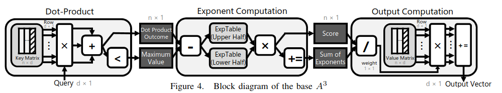

Рис. 5.7. Схема вычисления блока self-attenteion по методу A^3.

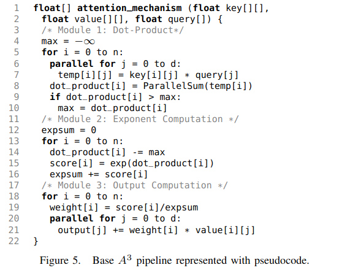

Рис. 5.8. Код вычисления блока self-attenteion по методу A^3.

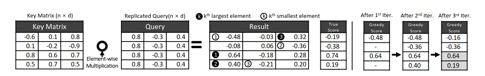

Рис. 5.9. Пример работы алгоритма вычисления приближенной оценки произведения матрицы ключей на запрос.

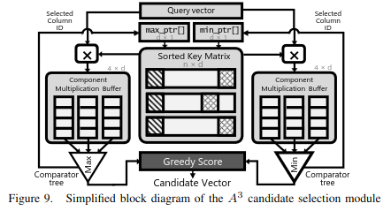

Рис. 5.10. Диаграма алгоритма вычисления приближенной оценки произведения матрицы ключей на запрос.

Они точно вычисляют оценку внимания для выбранных выше строк и далее отмечают, что функция softmax преобразует значения
оценки в веса, так что небольшие оценки приводят к малым весам. Эти малые веса не влияют на точность проверки модели.
Следовательно, эти близкие к нулю веса можно рассматривать как нули. Исходя из этой идеи, если оценка
строки находится в пределах T % от оценки верхней строки, только тогда она передается функции softmax. Они квантуют входные
данные FP в FX и используют разную битовую ширину в разных слоях. Они также предлагают ускоритель для своей технологии,
который позволяет достичь увеличение производительности и энергоэффективности на порядок по сравнению с CPU и GPU-процессорами.

Чен и др. представляют **[модификацию метода A3](https://ieeexplore.ieee.org/document/9869924)**. Они хранят матрицу ключей таким образом, что близкие
к нулю /положительные/отрицательные числа в матрице ключей становятся 0/1/-1 в матрице ключей. При умножении ключа
на запрос относительный порядок оценок внимания не меняется, как показано на рисунке 33. Их методика позволяет
находить Y строк с положительной приблизительной оценкой. Далее, в то время как в A3 выполняется точное точечное
произведение для этих строк, а затем дополнительно отбирают верхние K строк, В модификации А3 выбирают лучшие K строк
из Y строк, выбранных на основе их приблизительных оценок. Их технология приводит к снижению точности модели BERT
на 1% при одновременном повышении энергоэффективности.

### Блочно-циркуляционная матрица для уменьшения объема хранения

Блочно-циркуляционная матрица или же block-circulant matrix (BCM) уменьшает объем хранения веса путем замены исходной
весовой матрицы одним или несколькими блоками циркуляционных матриц, где каждая строка/столбец является циклическим
переформулированием другой. Это позволяет хранить только один вектор первой строки/столбца, называемый индексным
вектором, вместо всей матрицы. Кроме того, умножение матрицы на вектор может быть заменено операцией БПФ,
которая снижает сложность с O(b^2) до O(b^log(b)), где b - размер строки (или столбца) циркулирующей матрицы.

**[Усовершенствованный преобразователь на основе BCM CirCNN и C-LSTM](https://arxiv.org/pdf/2007.08563.pdf)**
применил BCM для сжатия моделей на наборах данных малого и среднего масштаба при классификации изображений
и распознавании речи, соответственно, и добились значительного улучшения
с точки зрения производительности и энергоэффективности по сравнению с
к известному уровню техники. Используя этот метод, можно уменьшить объем запоминаемого веса,
заменив исходную матрицу веса одним или несколькими блоками
циркулирующих матриц, где каждая строка/столбец является
циклическим преобразованием остальных. Используя b для представления размера строки/столбца
каждой циркулирующей матрицы (или размера блока, размера БПФ).
В каждом BCM для хранения и вычислений необходим только первый столбец/строка,
которые называются вектором индекса, p_ij .
Модифицируя формулировку вектора индекса следующим образом:

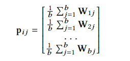


где W_ij - циркулирующая матрица.
Замечаем, что таким образом
можно лучше сохранить информацию о параметрах и поддерживать
общую точность прогнозирования. Основная причина заключается в том, что предыдущие работы
использовали первый столбец/строку в качестве вектора индекса, пропуская эффективные
представления для других строк/столбцов.


Основываясь на теореме циркулянтной свертки, вместо
непосредственного выполнения умножения матрица-вектор можно использовать
метод умножения на основе быстрого преобразования Фурье (FFT), и
это эквивалентно умножению матрица-вектор.
