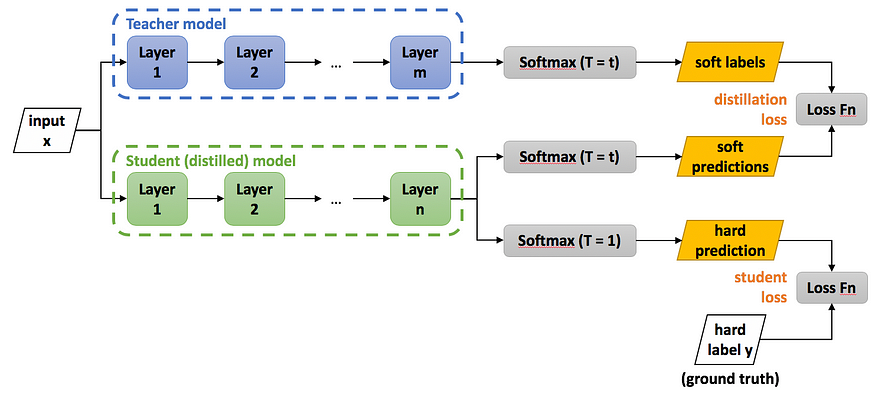

## Дистилляция знаний (Knowledge distillation)

Последняя техника оптимизации инференса, которую мы затронем в этом разделе, — это дистилляция знаний.

Все полезные модели, которые сейчас используются, сильно перепараметризованы — у них огромное количество "лишних" параметров. На самом деле эти параметры не совсем лишние, потому что на практике модели с большим числом параметров обучаются лучше обобщаться на данные, которых они раньше не видели. Проблема в том, что перепараметризация сильно поднимает затраты на инференс.

Дистилляция знаний предлагает подход к решению этой проблемы. Вместо обучения маленькой модели с нуля, можно "перенести" в нее знания из более крупной модели, чтобы сгладить потерю качества.

Мы разберем, что такое дистилляция знаний и какие есть подходы к ее реализации.

### Что такое дистилляция знаний?

<figure>
  
  <figcaption>Общая схема процесса переноса знаний</figcaption>
</figure>

Дистилляция знаний — это техника сжатия модели, в которой компактная модель-студент учится воспроизводить поведение большой модели-учителя. Концептуально на дистилляцию можно смотреть так: 

У нас есть обученная на каких-то данных модель. По сути это просто функция, которую мы можем аппроксимировать. Если мы сможем с достаточной точностью сделать это моделью, у которой число параметров поменьше, то мы как раз и получим нужный эффект.

**Важно!** Данные, которые используются для переноса знаний (transfer set), могут и не быть размеченными. При аппроксимации функции достаточно иметь лишь ее сигнал.

Впервые техники дистилляции знаний успешно применили в статье [Model compression (Buciluǎ et al., 2006)](https://dl.acm.org/doi/10.1145/1150402.1150464). Сам термин появился и закрепился после выхода статьи [Distilling the Knowledge in a Neural Network (Hinton et al., 2015)](https://arxiv.org/abs/1503.02531). На ее примере и рассмотрим, как в самом простом случае проводить дистилляцию.

### Distilling the Knowledge in a Neural Network

В статье рассматривали задачу классификации на датасете MNIST. С сильной регуляризацией обучили полносвязную сеть с двумя скрытыми слоями по 1200 нейронов в каждом. Далее обучали нейросеть меньшего размера (та же сеть, 800 нейронов в слоях), используя в качестве дополнительного обучающего сигнала логиты большей сети по следующей схеме:



Здесь Loss Fn — это кросс-энтропия,

$Softmax(x, T)_i = \dfrac{\exp{\frac{x_i}{T}}}{\sum_j \exp{\frac{x_j}{T}}}$, где T — это температура.

Кодом с использованием PyTorch это выглядит так:

```python
x, gt_labels = batch

student_logits = student(x)
with torch.no_grad():
    teacher_logits = teacher(x)

loss = torch.nn.functional.cross_entropy(student_logits, gt_labels) \
       + distillation_loss_alpha * torch.nn.functional.cross_entropy(
           student_logits / T, 
           torch.nn.functional.softmax(teacher_logits / T),
       )
```

#### Технические детали

У этого подхода есть два гиперпараметра: \
`distillation_loss_alpha` — коэффициент, который отвечает за вес лосса дистилляции в смеси; \
`T` — температура, которая при малых значениях делает лосс менее восприимчивым к отклонениям маленьких логитов. При большой температуре такой лосс дистилляции будет равен обычному MSE на логитах. 

На практике обычно имеет смысл подобрать оптимальную температуру поиском по логарифмической шкале.

Стоит отметить, что использование температуры уменьшает градиенты, протекающие через лосс дистилляции в $T^2$ раз. Чтобы это компенсировать, `distillation_loss_alpha` должна быть порядка $T^2$. 

<figure>
  
  <figcaption>Визуализация изменения распределения при изменении температуры</figcaption>
</figure>

#### Что получилось

Модель-учитель на тестовом множестве совершила 67 ошибок. Модель-студент, будучи обученной с нуля без регуляризации, совершила 146 ошибок. Дистиллированная модель-студент совершила 74 ошибки.

### Подходы реализации дистилляции знаний

Описанный в предыдущем разделе подход — самый популярный в силу своей простоты. В этом разделе мы обсудим, как еще можно организовать дистилляцию знаний. Поскольку способов дистилляции очень много, в технические детали мы погружаться не будем, и этот раздел — скорее обзор и разминка для фантазии, а не руководство по реализации.

Способы дистилляции можно различать по типу обучающего сигнала (знаний) для модели-студента, по организации процесса обучения студента и по архитектурной связи между учителем и студентом.

#### Тип обучающего сигнала


* **Response-based knowledge:** в качестве обучающего сигнала служат активации выходного слоя модели-учителя.
* **Feature-based knowledge:** в этом подходе дополнительно используются активации скрытых слоев учителя.
* **Relation-based knowledge:** здесь используются зависимости между активациями скрытых слоев учителя; это могут быть корреляции между активациями одного слоя, активаций с разных слоев.

#### Схема обучения


* **Offline distillation:** есть обученная модель-учитель, которая не меняется в процессе обучения студента.
* **Online distillation:** если у нас нет предобученной модели-учителя, можно все равно применять техники дистилляции - учитель и студент будут учиться одновременно, студент будет получать дополнительный обучающий сигнал от учителя; также в такой постановке могут фигурировать несколько моделей, каждая из которых одновременно является и учителем, и студентом — учатся они все вместе, а техниками дистилляции они регуляризуют друг друга.
* **Self-distillation:** в этом случае учитель и студент — одна и та же модель; например, можно использовать знания из более глубоких слоев модели для обучения более поверхностных слоев.

#### Архитектура учителя и студента

Удачно подобранная архитектура студента/учителя может положительно повлиять на успех дистилляции. Например, не всегда модель большего размера с лучшим качеством работы, будет лучшим учителем для фиксированного студента. Есть разные сочетания архитектур учителя и студента:

* Учитель и студент полностью одинаковые как в Online и Self-distillation подходах.
* Студент той же архитектуры, что и учитель, но меньше по размеру.
* Студент — это квантизированная версия учителя.
* Студент — это сеть с другой архитектурой меньшего размера.
* Учитель — ансамбль моделей, студент — одна модель.

Также при поиске удачного сочетания архитектур учителя и студента можно использовать методы автоматического поиска архитектуры (Neural Architecture Search). На практике зачастую архитектура учителя заранее определена и фиксирована, а студента подбирают под нее.
