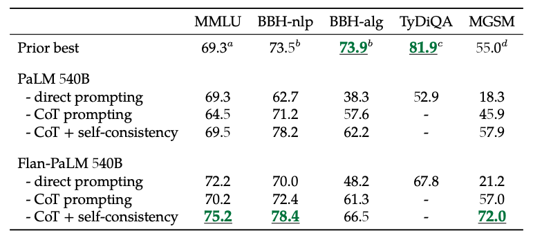

# FLAN (автор: Георгий Ангени)

Перед тем, как перейти к рассказу про методы instruction tuning вначале необходимо понять, что он из себя представляет и для чего предназначен. В предыдущем разделе вы познакомились с процессом fine-tuning, при котором предобученная модель определенным методом дообучается для того, чтобы показывать лучшие результаты на определенном спектре задач. Instruction tuning также представляет из себя процесс дообучения модели на определенном датасете, но он предследует другую цель: полученная модель должна проще обобщаться на новые задачи, в идеале включая те, с которыми модель не сталкивалась при обучении. При этом входы модели, как правило, дополняются определенными инструкциями для того, чтобы иметь возможность управлять поведением модели, добавляя к запросу некоторый контекст (можно сказать, что задача формируется "динамически" в отличие от "статического" формирования при fine-tuning).

## Данные для обучения

Существует множество вариантов получения датасета для instruction tuning:
- конвертация имеющихся датасетов для fine-tuning путем добавления инструкций ко входам
- готовые датасеты с уже имеющимися инструкциями
- генерация с помощью больших языковых моделей
- ручное создание

При этом чем большее количество задач будет представлено в датасете для instruction tuning, тем на большее количество задач модель сможет обобщиться. Для того, чтобы глубже разобраться в данном вопросе, рассмотрим статью от разработчиков Google [Scaling Instruction-Finetuned Language Models](https://arxiv.org/pdf/2210.11416.pdf), внимание в которой уделяется следующим вопросам:

- Какое количество задач нужно, чтобы значимо повысить качество модели?
- Насколько это улучшение сопоставимо с увеличением размера модели?
- Можно ли заставить модель качественно работать на ранее неизвестных задачах
- Какую пользу можно извлечь из chain-of-thought prompting?

В статье рассматривается свыше тысячи задач, разделенные на четыре набора и используемые для обучения модели. Стоит отметить, что одна задача представляет собой данные из одного датасета (например, [SQuAD](https://rajpurkar.github.io/SQuAD-explorer/)), которые были приведены к виду, походящему под определенную категорию (question generation, extractive question answering, natural language inference и т.д.), таким образом, имея небольшое количество датасетов и небольшое количество категорий можно получить множество разных задач для обучения.

На изображении ниже представлены примеры категорий, использованные для обучения и оценки качества FLAN. 

Отдельное внимание стоит уделить датасету CoT (chain-of-thought), собранному в рамках написания данной статьи, эталонные выходы в котором содержат не просто ответ, а последовательность аргументов (фактически, рассуждение), которое приводит к правильному ответу.

## Прирост качества

На графике ниже нетрудно видеть, что использование модели PaLM с бóльшим количеством параметров дает больший прирост в качестве на отложенных задачах, однако instruction tuning дает сопоставимый прирост в качестве, который особенно заметен при переходе от модели с 8 миллиардами параметров к модели с 62 миллиардами. При этом важно учесть, что instruction tuning готовой модели требует на порядки меньших вычислительных ресурсов, нежели pre-training модели с нуля, что позволяет улучшить качество модели, не прибегая к большим затратам.

*Количества задач, на которых обучены модели, которым соответствуют точки на графике, получены путем добавления наборов в смесь для обучения по мере возрастания количества задач в наборах (то есть в следующем порядке: CoT, Muffin, T0-SF, NIV2)*

### Chain-of-thought prompting

Ранее говорилось о том, что один из наборов задач для обучения называется chain-of-thought, и сейчас самое время разобраться в том, что такое [chain-of-thought prompting](https://arxiv.org/pdf/2201.11903.pdf). В сущности при chain-of-thought prompting в качестве контекста к запросу (как правило, содержащему некоторый вопрос) подается несколько примеров запросов с развернутым и обоснованным верным ответом (ниже представлены примеры). Подобный метод конструирования запросов относится к способам управления поведением языковой модели, однако впоследствии будет видно, что такой метод еще и дает прирост по качеству.

### Self-consistency

С chain-of-thought prompting хорошо сочетается другая [надстройка](https://arxiv.org/pdf/2203.11171.pdf), позволяющая улучшить качество модели, идея которой заключается в том, чтобы получить несколько ответов от модели в формате chain-of-thought и в качестве финального ответа выбрать тот, к которому модель пришла в большинстве случаев. Важно отметить, что использование подобного трюка в production среде может сильно "ударить по карману", поскольку для сравнительно небольшого улучшаения качества приходится генерировать в разы больше токенов на каждый запрос, однако можно использовать данный метод для генерации дополнительных достоверных примеров для обучения модели. Ниже приведена иллюстрация работы метода self-consistency.

#### Дополнительно: сэмплирование в языковых моделях

Поскольку в предыдущих разделах не был описан механизм, благодаря которому можно одной и той же моделью получать разные ответы на один и тот же запрос, рассмотрим его здесь. Такой механизм называется сэмплированием и заключается в том, что при генерации ответа токены выбираются не жадным образом, а из распределения. Существуют различные методы построения этого самого распределения, например:

- top-k sampling: возьмем k наибольших по вероятности токенов и отнормируем суммарное распределение к единице
- top-p sampling: возьмем достаточное для покрытия вероятности p количество наибольших по вероятности токенов и отнормируем суммарное распределение к единице
- temperature sampling: возведем все экспоненты в формуле для softmax дополнительно в степень $\frac{1}{T}$, получив $p(x) = \frac{e^{x_i/T}}{\sum_{j=1}^N e^{x_j/T}}$ (чем меньше $T$, тем более распределение смещено в сторону более вероятных токенов)

### Новый state-of-the-art

В итоге использование chain-of-thought prompting вместе с self-consistency позволил задать state-of-the-art на трех из пяти рассматриваемых отложенных наборах (набор BBH разделен на nlp – задания по языковому моделированию – и alg – алгоритмические задания).

### Роль chain-of-thought

Допонительно задачи в отложенных наборах были разбиты на CoT бенчмарки, где рассматривалось умение модели строить корректные рассуждения, приводящие к правильному ответу, и Non-CoT бенчмарки. Оказывается (из графиков в левой части), что, несмотря на то, что отсутствие 9 задач CoT не влияет на качество на Non-CoT бенчмарках, на CoT бенчмарках оно приводит к результатам существенно хуже, чем у модели без instruction tuning, что говорит о том, что свойство модели "строить рассуждения" при дообучении забывается, поэтому необходимо время от времени вливать CoT данные в обучающие выборки.

Также (из графика справа) видно, что активация chain-of-thought дополнительно улучшает качество модели на BBH (по сути это самый сложный набор задач из тех, что были взяты в отложенную выборку, поскольку на задачах в нем человеческая разметка показывает себя лучше, чем разметка языковой моделью), что еще раз указывает на значимость наличия таких данных в обучающей выборке.
