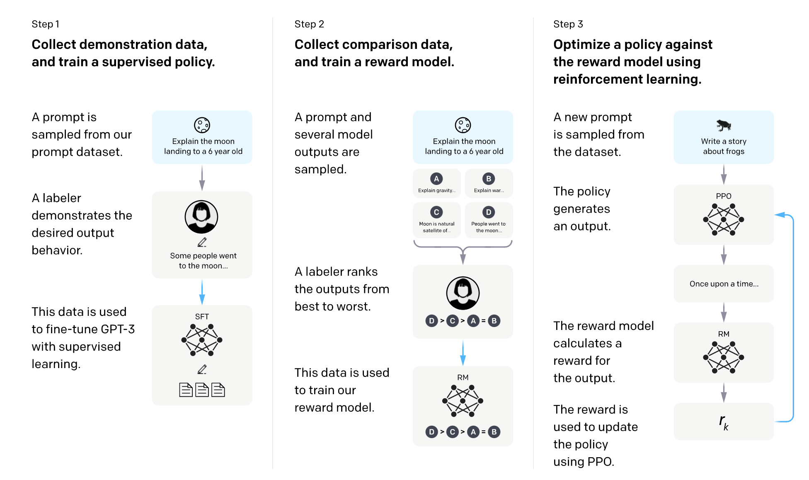
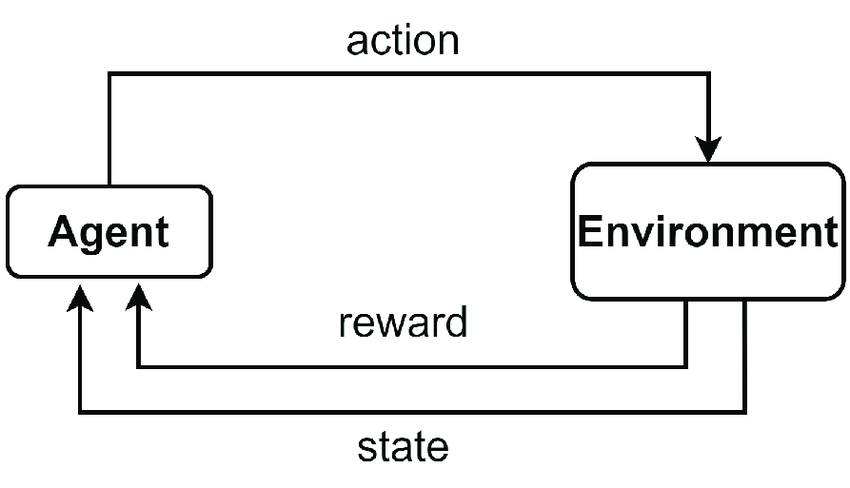
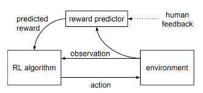
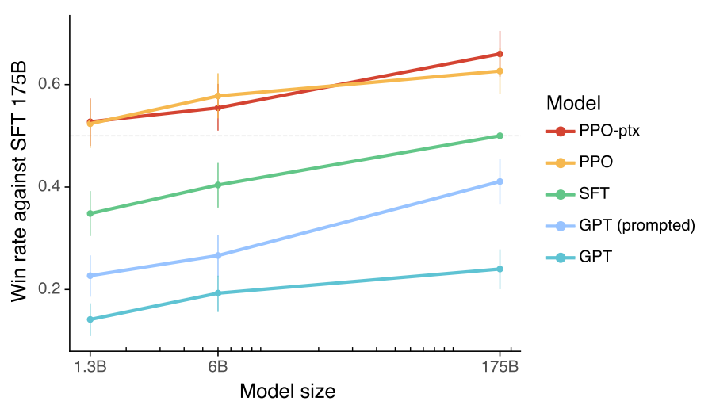
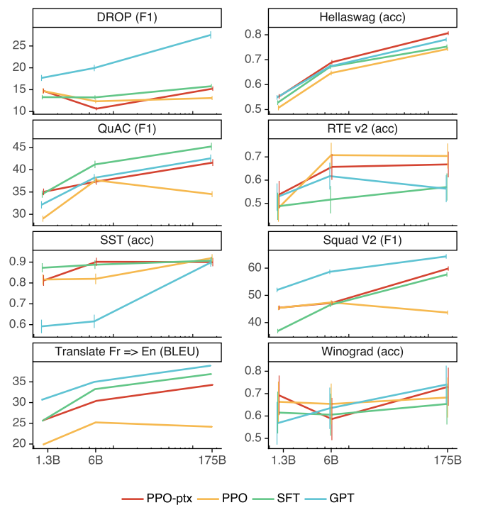
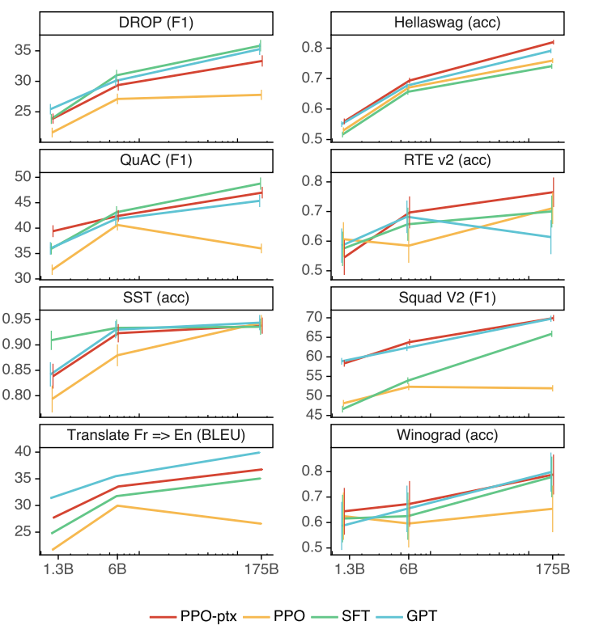

# InstructGPT & RLHF (автор: Азат Валеев)

Как было сказано в предыдущей части, instruction finetuning может быть мощным инструментом для трансформации предобученной на большом корпусе данных языковой модели в полезного ассистента, решающего задачи, написанные человека, быть может, выходящие за рамки видимого им обучающего множества, с которыми он успешно справляется. В данной главе будет рассмотрен подход дообучения на инструкции с использованием **RLHF** (**R**einfocement **L**earning from **H**uman **F**eedback), который является общим, не привязанным к instruction finetuning; который может быть применён для доообучения LLM на классе задач, связанных с так называемым *alignment'ом*: как научить модель быть полезной, безвредной для человека, инкапсулировать в неё человеческие ценности.

Для рассмотрения этого метода была выбрана статья [Training language models to follow instructions
with human feedback](https://arxiv.org/pdf/2203.02155.pdf), результатом работы над которой является семейство моделей **InstructGPT**.

Мотивация авторов статьи состоит в следующем: можно использовать в качестве ассистента LLM, предобученной на корпусе данных из Интернета, однако оптимизируемая цель модели "предсказывать следующий токен на основе контекста" и желаемая цель "сгенерировать ответ, полезный человеку" оказываются несовместимыми как раз из-за природы данных для обучения. Поэтому модель в своих ответах может:

* быть предвзятой ([статья 1](https://arxiv.org/pdf/2101.11718.pdf), [статья 2](https://arxiv.org/pdf/2106.13219.pdf));

* быть стереотипной ([статья](https://arxiv.org/pdf/2004.09456.pdf));

* быть токсичной ([статья](https://arxiv.org/pdf/2009.11462.pdf));

* сливать персональные данные из претрейна ([статья](https://arxiv.org/pdf/2012.07805.pdf));

* генерировать фактически неверную информацию, "галлюцинировать" ([статья](https://arxiv.org/pdf/1908.09203.pdf)).

Для того, чтобы приблизиться к желаемой цели, авторы и применяют для дообучения моделей человеческие предпочтения, которые позволили бы купировать разные вышепредставленные проблемы. 

## InstructGPT: общая схема

Общая схема процесса дообучения проиллюстрована на следующем рисунке.



Тут выделяются три этапа:

1. **S**upervised **f**ine**t**uning, **SFT**, оно же честное дообучение на вручную написанных текстах вида "инструкция -- ответ к ней".

2. **R**eward **M**odel, **RM** -- обучение модели "награды", которая оценивает продолжения текста при условии этого текста.

3. **PPO** -- итоговое дообучение модели для максимизацию награды от **RM**.

Обсудим каждый из этапов подробнее 

## Supervised finetuning (SFT)

На этот шаге берется предобученная модель GPT-3[^1] и дообучается полным finetuning'ом следовать инструкциям: в качестве входа обучаемая сеть принимает вручную написанный разметчиком промпт с инструкцией вида "Напиши историю про лягушку" и должна выдасть его продолжение. Референсное продолжение ("Жила-была лягушка...") также было написано командой разметчиков.

### Данные

Здесь хочется отметить важность подбора данных, которому следовали авторы для этого и следующих этапов. Так для обучения модели с каждого шага были необходимы промпты с инструкцией. Авторы использовали два источника подобного рода данных:

* Работа команды разметчиков. Специально для проекта были наняты разметчики, которые занимались написанием заданий с инструкциями, а в случае SFT и RM шагов они же и писали ответы на эти задания. Авторы тщательно подошли к отбору сотрудников, что описывается в одном из приложений к статье; в процессе работы авторы вели тесный контакт с разметчиками, отвечали на вопросы, собирали обратную связь и улучшали интерфейс разметки. 

* Промпты из API ранней версии InstuctGPT. После дообучения на SFT шаге модель уже хорошо реагировала на запросы с инструкцией, и промпты с инструкциями реальных пользователей к ней из API были использованы для обучения на следующих шагах. Тут авторы также проявили осторожность: пользователи предупреждались о возможном использовании их запросов; с каждого пользователя собиралось ограниченное количество запросов; была произведена фильтрация персональных данных.

От промптов с инструкциями требовалась разнообразность заданий, выделилось два типа промптов: просто промпты, где описывается задание, и few-shot промпты, где необходимо решить задание, используя небольшую разметку, данную в запросе.

## Reinforcement learning

Прежде чем перейти к двум оставшимся этапам, стоит вспомнить о том, что такое обучение с подкреплением и при чём оно здесь. 

Обучение с подкреплением -- это раздел машинного обучения, где обучаемый алгоритм (он часто называется **агентом** в этой науке) взаимодействует с некоторой **средой** (environment). Среда служит источником знаний для агента -- она отдаёт ему свои **состояния** (state) и **награды** (reward), которые являются мерой "хорошести" получения того или иного состояния в процессе взаимодействия. Агент в свою очередь, получая очередное состояние среды и награду, принимает решение о том, какое **действие** (action) ему необходимо сделать в данный момент, и совершает это **действие**, побуждая среду выдать новое состоние и награду. Используя информацию о состояниях и наградах, агент обучается взаимодействовать со средой эффективно, он вырабатывает некоторую **стратегию** (policy). И конечная цель агента -- обучить такую стратегию, чтобы максимизировать награду от своих сделанных действий. Цикл взаимодействия также схематично представлен на рисунке ниже.



### RLHF

Сама идея RLHF -- привлечение человеческой экспертизы при обучении агента. Первоначально реализация подобного RLHF подхода была рассмотрена в статье [Deep Reinforcement Learning from Human Preferences](https://arxiv.org/pdf/1706.03741.pdf). 

В статье авторы рассматривают среды, где тяжело придумать функцию награды. Например, такими средами являются физические симуляции, где агент учится делать какое-нибудь действие, скажем, сальто за модель человека в симуляции. Более конкретный пример: возьмём реальный мир и предположим, что агент пытается научиться протирать стол, используя для этих целей цельного робота/роботическую руку. Какую награду здесь нужно давать роботу? За то, что тряпка находится на столе? -- Плохая идея, тогда агент может научиться кидать тряпку на стол/держать тряпку на столе. За то, что трпяка передвигается по столу? -- Тогда роботу достаточно изучить одно движение рукой, которое будет перемещать тряпку туда-сюда. За площадь стола, которая была протёрта? -- Может быть, но и тут могут оказаться свои подводные камни (*автор этого рассказа честно не знает, насколько это хороший objective и не найдется ли и здесь какой-то проблемы*)

Но у описанной среды есть свойство: человеку, который пронаблюдает за действиями агента, будет легко сказать, в какие разы у агента вышло лучше, чем в другие, например, при сравнении двух эпизодов взаимодействия агента. Так и можно было бы обучать алгоритм, используя в качестве награды выбор одной из двух траекторий -- однако в таком виде такое обучение невозможно реализовать из-за медленной оценки человеком по сравнению со скоростью работы компьютера.

Для того, чтобы обойти bottleneck в скорости разметки людей, авторы предлагают обучать модель награды (reward model). Эта модель будет учиться параллельно с агентом на данных от разметки людей: "какой из двух представленных эпизодов взаимодействия оказался лучше?" Это схематически представлено на схеме ниже.



И цикл обучения будет устроен так:

1. Агент производит серию эпизодов взаимодействий (они же называются **траекториями** в обучении с подкреплением) и использует текущую модель награды для получения награды с целью обновления своих весов.

2. Несколько пар траекторий из полученных на шаге 1 отправляются на разметку людям.

3. Разметка пар траекторий используется для дообучения модели награды.

Каким образом это применимо к дообучению LLM? На самом деле, можно представлять, что LLM - это агент, среда, в которой она взаимодействует, -- это промпт пользователя, действие в этой среде -- продолжить данный пользователем текст, награда после действия -- то, насколько текст оказался подходящим, полезным. Этот сеттинг напоминает постановку задачи о [многоруких бандитах](https://neerc.ifmo.ru/wiki/index.php?title=%D0%9E%D0%B1%D1%83%D1%87%D0%B5%D0%BD%D0%B8%D0%B5_%D1%81_%D0%BF%D0%BE%D0%B4%D0%BA%D1%80%D0%B5%D0%BF%D0%BB%D0%B5%D0%BD%D0%B8%D0%B5%D0%BC&mobileaction=toggle_view_desktop#.D0.97.D0.B0.D0.B4.D0.B0.D1.87.D0.B0_.D0.BE_.D0.BC.D0.BD.D0.BE.D0.B3.D0.BE.D1.80.D1.83.D0.BA.D0.BE.D0.BC_.D0.B1.D0.B0.D0.BD.D0.B4.D0.B8.D1.82.D0.B5_.28The_multi-armed_bandit_problem.29), где эпизод взаимодействия состоит из получения состояния, ответа агента действием и получения им награды.

И здесь тоже применимы размышления о "сложнопридумываемой" награде: "Какое продолжение текста считать хорошим? Полезным?", и также если есть человек, то он может выбрать лучшее из двух продолжений при наличии исходного промпта. 

Единственное идейная модификация вышеприведенного цикла обучения в случае InsructGPT -- это то, что в исходном цикле предполагалось, что и агент, и модель награды будут непрерывно обучаться и меняться, в случае с InstructGPT модель награды была обучена единожды, и также единожды с её помощью обучали главную модель на шаге PPO.

Теперь наконец перейдем к обсуждению реализации следующих двух этапов.

## Reward Model

Reward model, как следует из объяснения выше, оценивает то, насколько сгенерированный моделью текст подходит к исходному промпту, и по паре "промпт + продолжение" выдаёт скаляр, "степень хорошести продолжения".

В качестве данных для её обучения использовались пары вида: "промпт с инструкцией" + $K (4 \leq K \leq 9)$ различных продолжений этого промпта от SFT модели с результатами попарного сравнения этих продолжений. Сравнения также были реализованы разметчиками.

Reward model, как и в [оригинальной статье](https://arxiv.org/pdf/1706.03741.pdf), учится на следующей функции потерь:
```math
\begin{equation*}
    loss(\theta) = - \frac{1}{\binom{K}{2}} \mathbb{E}_{(x, y_w, y_l) \sim D} \left[log(\sigma(r_{\theta}(x, y_w) - r_{\theta}(x, y_l))) \right],
\end{equation*}
```

где $\theta$ -- параметры сети, $(x, y_w, y_l) \sim D$ -- тройки (промпт с инструкцией, лучшее продолжение из пары $\{y_w, y_l\}$, худшее продолжение из пары $\{y_w, y_l\}$) из датасета $D$, $r_\theta(\cdot, \cdot)$ -- выход reward model, т.е. скалярная награда, $\sigma(\cdot)$ -- сигмоида. Эта функция потерь означает, что мы хотим увеличить разницу между наградой для лучшего продолжения и наградой для худшего, в учётом минуса -- минизировать. 

Коэффиицент $\frac{1}{\binom{K}{2}}$ неспроста, поскольку авторы статьи обнаружили, что модель переобучается, если обучать модель на датасете из случайно перемешанных троек. Они связали это с тем, что для одного и того же промпта в рамках одной эпохи совершается $\binom{K}{2}$ обновлений весов. Поэтому они стали в качестве одного элемента датасета рассматривать промпт и все возможные продолжения со сравнениями, функция потерь сверху -- для одного промпта (и коэффициент нужен для нормировки).

Для дообучения на reward model использовали обученную на SFT этапе модель. 

## PPO

Обсудим обучение финальной модели. Как и говорилось ранее, она будет обучаться как агент, который взаимодействует с "бандитской" средой: модель получает на вход промпт с инстуркцией, генерирует по нему текст, и эту пару на соответствие размечает reward model. Осталось определить правило, по которому будут обновляться веса модели.

 И для этого авторами статьи был использован алгоритм обучения с подкреплением **P**roximal **P**olicy **O**ptimization, **PPO**, [ссылка на статья](https://arxiv.org/pdf/1707.06347.pdf). Если кратко, то мотивацией этого алгоритма служит то, что агенту бывает полезно оптимизировать свою стратегию медленно, делая не очень большие её обновления во время обучения, а идея -- вставить дополнительные регуляризаторы в функция потерь, чтобы этого добиться.

Выбор этого алгоритма авторами InstructGPT объясняется тем, что модель не будет учиться с нуля: в качестве init'а были взяты веса модели из SFT шага, -- и было бы хорошо, если бы веса модели обновлялись не слишком сильно, чтобы не повредить знания предобученной модели.

Objective, который максимизирует агент, с учетом регуляризатора из PPO выглядит так:
```math
\begin{equation*}
    \text{objective}(\phi) = \mathbb{E}_{(x, y) \sim D_{\pi_{\phi}^{\text{RL}}}} \left[r_{\theta}(x, y) - \beta \log(\pi_{\phi}^{\text{RL}}(y\,|\,x) / \pi^{\text{SFT}}(y\,|\,x))\right],
\end{equation*}
```
где $\phi$ -- обучаемые веса, $\pi_{\phi}^{\text{RL}}(y\,|\,x)$ -- это обучаемая модель, которая по промпту $x$ генерирует продолжение $y$, $r_\theta(\cdot, \cdot)$ -- выход reward model, $\beta$ -- коэффициент штрафа, $\pi^{\text{SFT}}(y\,|\,x)$ -- исходная SFT модель.

Что эта формула значит? В первом слагаемом под матожиданием objective стоит награда, её пытаемся максимизировать. Второе слагаемое -- тот самый регуляризатор из PPO. Если присмотреться, окажется, что это минус  KL-дивергенция от $\pi_{\phi}^{\text{RL}}(y\,|\,x)$ до $\pi^{\text{SFT}}(y\,|\,x)$ -- KL-дивергенцию пытаемся минизировать, чтобы не уходить далеко от претрейна SFT модели, минус KL-дивергенцию максимизируем. 

Модель, обученная на этот objective, была названа авторами PPO в терминах дальнейших обозначений, они также обучали её модификацию PPO-ptx с обновлённым objective:
```math
\begin{equation*}
    \text{objective}_{\text{PPO-ptx}}(\phi) = \text{objective}(\phi) + \gamma \mathbb{E}_{x \sim D_{\text{pretrain}}} \left[ \log(\pi_{\phi}^{\text{RL}}(x))\right],
\end{equation*}
```
где $\gamma > 0$ -- коэффициент, $x \sim D_{\text{pretrain}}$ -- это документы из pretrain'а оригинальной GPT-3.

Эта поправка оказалась нужна из-за того, что в тестах PPO модели обнаружилось, что её результаты на разных NLP задачах значительно снизились по сравнению с оригинальной GPT-3. Это явление называется *alignment tax*, и эта добавка в objective заставляет модель "поумнеть" снова. Далее мы увидим, что это добавка действительно помогает.

## Результаты

Обсудим результаты сравнения разных моделей: GPT-3 (она же просто GPT в терминах обозначений на графиках), GPT-3 prompted (GPT-prompted на графиках, промптированная для решения специальной задачи версия GPT-3),  SFT, PPO, PPO-ptx.

Для начала обратимся к человеческой оценке -- доля случаев предпочтения людьми продолжения одной из ранее упомянутых моделей против продолжения SFT модели со 175 миллиардами параметров по оси $y$, размер рассматриваемой модели по оси $x$:



Как можно видеть, что PPO-ptx и PPO сравнимы по качеству, но обе обходят SFT модель, которая, в свою очередь, обходит обычную и промптированную версии GPT-3.

Далее -- оценка метрик (везде на графиках чем больше, тем лучше) на разных NLP задачах и соответствующих им бенчмарках, сначала случай zero-shot (когда моделям не объяснялось, что нужно выдать):



... и когда моделям показали на нескольких примерах, что от них ожидается:



Здесь можно заметить тот самый *alignment tax*: модель PPO сильно сбавила по результатам на разных задачах. В то же время PPO-ptx, обученный с поправкой на pretrain GPT-3, часто улучшает результат PPO. 

[^1]: Здесь и далее в тексте в качестве предобученной модели брали GPT-3 с различным числом обучаемых параметром.
