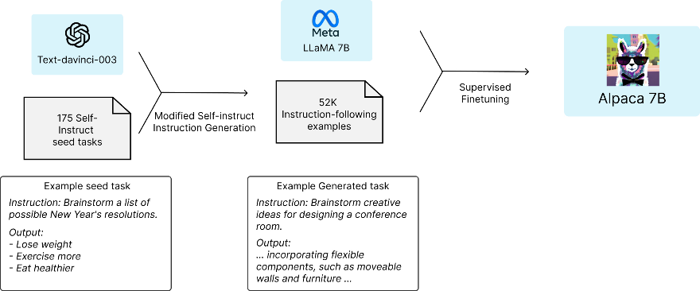

# Self-Instruct & Alpaca (автор: Мовсин Марат)

## Self-Instruct
Большие языковые модели, настроенные на инструкции, довольно сильно зависят от инструкций, написанных человеком. Такие инструкции зачастую бывают ограничены в количестве, разнообразии и креативности. При self-instruct прошлое поколение модели на основе рукописных инструкций генерирует свои, из которых выкидываются похожие и неправдоподобные.

## Alpaca
Alpaca — это модель, созданная учёными из Стэнфордского университета в качестве дешёвого аналога GPT (на разработку было потрачено менее $600). Общая идея, использованная для обучения alpaca, заключается в том, чтобы взять предобученную модель и дообучить на инструкциях, сгенерированных более качественной моделью. В случае alpaca модель LLaMA 7B была дообучена при помощи данных, сгенерированных моделью text-davinci-003.

На рисунке ниже показано, как происходило обучение. Сначала вручную было написано 175 пар инструкция-ответ. Затем text-davinci-3 была поставлена задача сгенерировать больше инструкций, используя эти 175 в качестве примера (на этом этапе примерно $500 было потрачено на использование OpenAI API). После чего, LLaMA была дообучена на сгенерированных инструкциях при помощи обучающего фреймворка от Hugging Face, используя такие методы как Fully Sharded Data Parallel и обучение смешанной точности. Это заняло 3 часа на 8 80GB A100s, что стоило примерно $100.

Оценка качества Alpaca происходила при помощи слепого тестирования, сравнивающего её с text-davinci-3. Модели показали сходный результат: Alpaca выиграла 90 против 89 сравнений с text-davinci-3.
