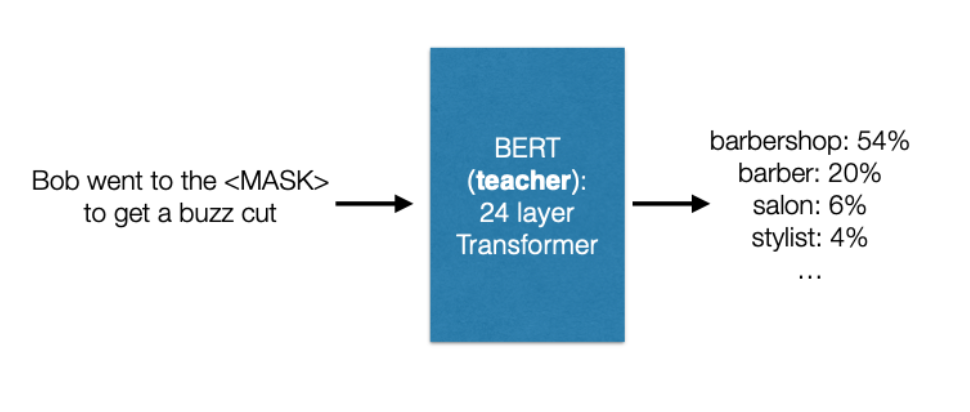
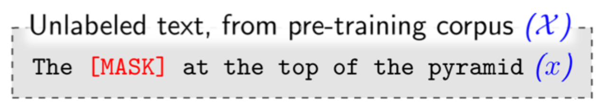
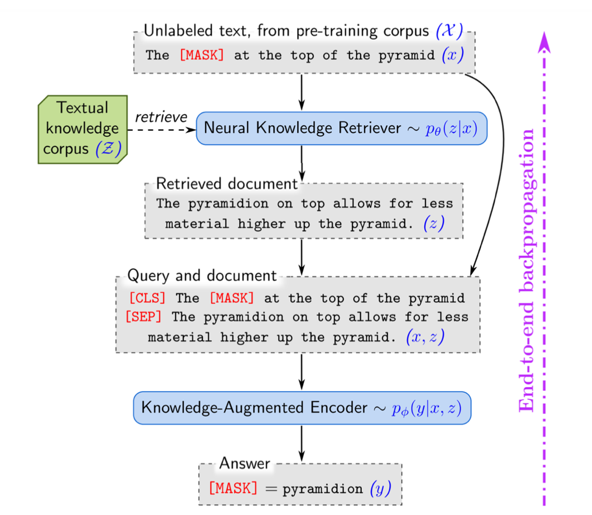
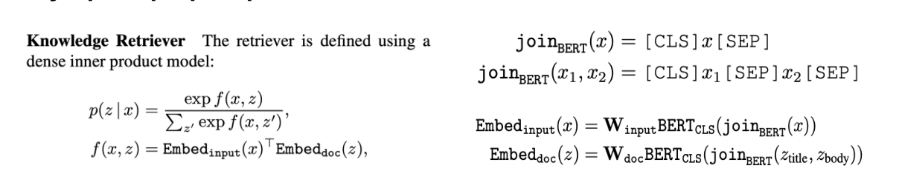
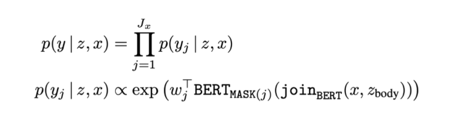

# RALM (REALM) (автор: Шульженко Александр)

## Retrieval-Augmented Language Models

Retrieval Augmented Generation (RAG) представляет собой современный подход, который оперирует входными данными и извлекает соответствующие документы из различных источников, таких как Википедия. Эти документы объединяются в контекст с исходным запросом, после чего передаются генератору текста. Этот генератор затем формирует окончательный результат. Одной из ключевых особенностей RAG является его адаптивность к изменениям фактов с течением времени. Это отличает его от параметрических знаний Language Model (LLM), которые остаются статичными. Этот аспект RAG оказывается чрезвычайно полезным, поскольку обеспечивает доступ к самой актуальной информации, обходя необходимость переобучения моделей, что часто требуется в случае LLM.

RAG предоставляет языковым моделям гибкость и возможность оперировать с самой последней информацией, что является значимым преимуществом в условиях быстро меняющейся реальности. Этот подход открывает новые перспективы для эффективного и точного генерирования текста, основанного на актуальных данных из различных источников.

Retrieval Augmented Generation (RAG) продемонстрировал значительные достижения и впечатляющие результаты в обработке информации и генерации текста на классических датасетах. На протяжении многочисленных тестов, включая NaturalQuestions, WebQuestions и CuratedTrec, RAG показал высокую эффективность и хорошие результаты. Важно отметить, что при тестировании на вопросах из MS-MARCO и Jeopardy, этот подход выдавал ответы, которые не только были более конкретными, но и обладали большим разнообразием, чем ответы, полученные с использованием других моделей. Это свидетельствует о способности RAG генерировать точные и разнообразные ответы на разнообразные запросы.

Кроме того, RAG существенно улучшает точность проверки фактов в рамках FEVER. Его способность работать с различными типами данных и контекстами подчеркивает значимость данного подхода в контексте обработки запросов и обеспечения высокой точности ответов.

Рассмотрим классическую задачу восполнения токена, закрытого маской (рисунок выше). Знания неявно закодированы в параметрах BERT! Например, что парикмахерские — это место, где можно подстричься.

Работа с такими языковыми моделями влечет за собой несколько значительных трудностей и ограничений:

1. Первое из них связано с тем, что знания в таких моделях хранятся неявно в параметрах нейронной сети. Это затрудняет понимание того, какие конкретно знания хранятся и где именно они размещены в структуре модели.
2. Кроме того, объем доступных знаний ограничен размерами нейросети. Увеличение объема знаний потребует расширения самой сети, что, в свою очередь, может привести к замедлению вычислений или увеличению их стоимости.

Эти факторы создают вызовы при работе с такими моделями, делая необходимым баланс между объемом знаний, производительностью и затратами вычислительных ресурсов. Это подчеркивает важность разработки методов оптимизации и улучшения эффективности таких языковых моделей для более эффективного управления доступными знаниями.

REALM, как одно из инновационных решений, предлагает эффективный подход к работе с textual knowledge corpus и решению задач question answering. Основные шаги этого подхода включают:

1. Извлечение конкретного документа из textual knowledge corpus, который будет использоваться для ответов на поступающие вопросы в рамках question answering tasks.
2. Важным вопросом остается: как выбрать «правильный» документ из обширного корпуса? REALM ставит перед собой задачу определения оптимального документа, который содержит необходимую информацию для точных и информативных ответов.
3. Одним из ключевых аспектов является обеспечение эффективности этого процесса, особенно учитывая, что корпус текстовых данных может быть огромным. Работа с большими объемами информации требует методов, способных обеспечить оперативный и точный поиск необходимых документов, чтобы гарантировать высокую производительность и эффективность работы модели.

REALM представляет собой перспективное решение, которое стремится к оптимальному выбору документов из корпуса, обеспечивая точные и информативные ответы на вопросы при работе с огромными объемами текстовых данных.

## Подход retrieve-then-predict

Задача – заполнить пропуск в тексте. Языковая модель использует ретривер для извлечения документов из большого массива данных, такого как Википедия, а затем обрабатывает эти документы, чтобы предсказать пропущенный токен.

## Как обучить ретривер?

REALM разбивает вычисление ***p(y|x)*** на два шага: retrieve и predict

1. Имея на входе ***x*** на первом шаге REALM извлекает документы ***z*** из корпуса знаний ***Z***. Этот шаг является сэмплированием из распределения ***p(z|x)***. 
2. Далее, мы получаем предсказание y как сэмпл из распределения ***p(y|x,z)***

Правдоподобие y вычисляется как $\sum p(y|x,z)p(z|x)$

## Как устроен ретривер?

Embed\_input, Embed\_doc — отображают x и z соответственно в d-мерные векторы

## Как устроен энкодер?

- BERT\_MASK(j) – вектор output трансформера, соответствующий j-му токену под маской
- J\_x – число [MASK] токенов в x
- w\_j – learned word embedding для токена y\_j

## Как тренировать REALM?

- Максимизируем логарифм правдоподобия **log *p(y|x);***
- Маргинальная вероятность p(y|x) = $\sum_{z \in Z} p(y|x,z)p(z|x)$ требует вычисления суммы по всем документам – мы аппроксимируем top-k документами;
- Как найти top-k документов по ***p(z|x)***? Заметим, что это то же самое, что top-k по ***f(x,z) –*** для этого можно использовать** *Maximum Inner Product Search (MIPS)*
