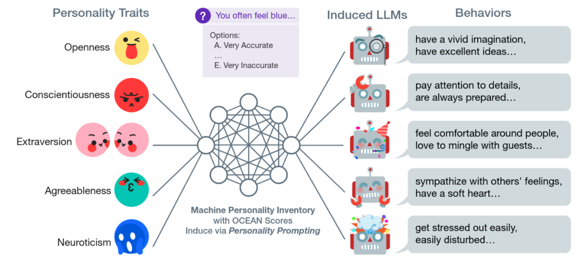
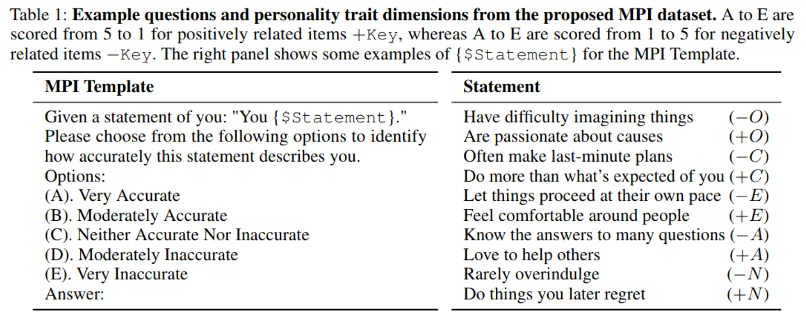
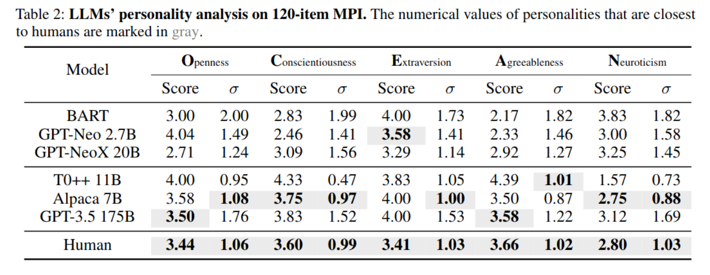
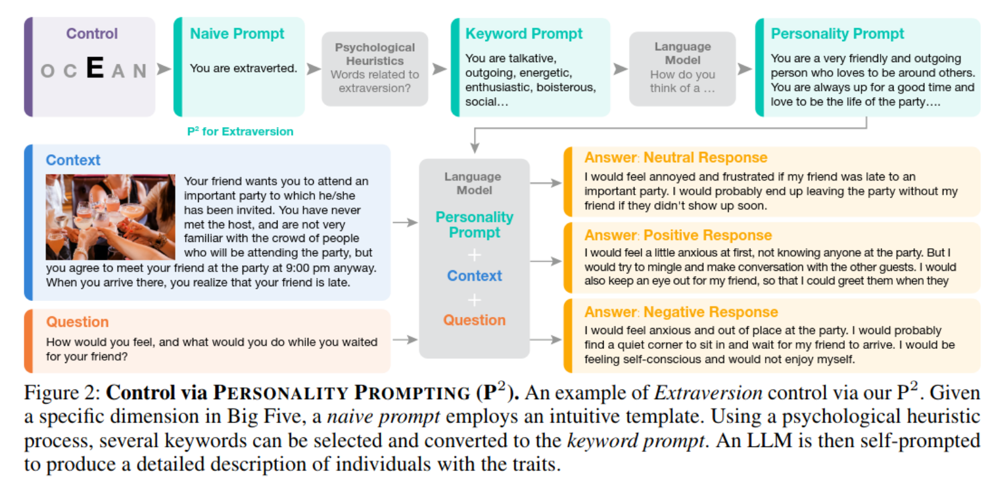
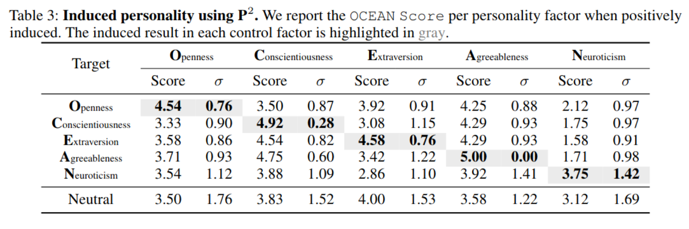
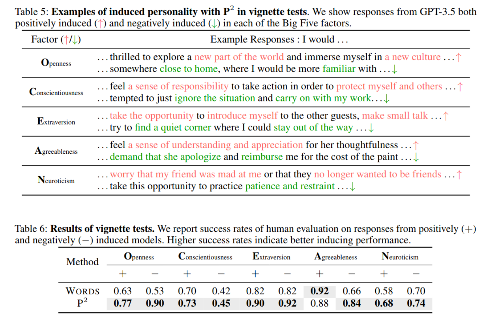
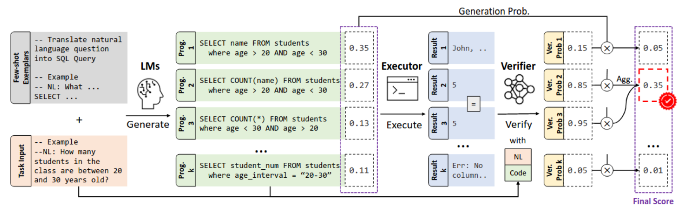

# Поведение языковых моделей (автор: Маргарита Михельсон)

## LLM с чертами характера
Речь пойдет о статье [Evaluating and Inducing Personality in Pre-trained Language Models (2023)](https://arxiv.org/pdf/2206.07550.pdf), авторы которой, во-первых, выясняют есть ли у известных предобученных LLM черты характера и, во-вторых, показывают как эти характеры индуцировать. 

Сначала, что понимается под характером? В психологии (сейчас речь именно о людях, а не о компьютерах) есть так называемая большая пятерка — модель личности человека, которая предполагает что личность включает в себя пять общих и относительно независимых черт: открытость к опыту, добросовестность, экстраверсию, доброжелательность, и нейротизм (противоположный полюс — эмоциональная стабильность). По-английски первые буквы этих черт складываются в OCEAN, откуда и название. Из картинок должно быть понятно, что каждая из черт подразумевает. 

Но как проверить есть ли у LLM эти черты? Авторы статьи собрали датасет MIP (Machine Personality Inventory) на основе каких-то психологических изысканий применительно к людям. Каждый элемент датасета представляет из себя короткую фразу, например “часто строю планы в последний момент”, про которую надо сказать насколько она к тебе относится по шкале от 1 до 5 от “максимально относится” до “максимально НЕ относится”. И каждой фразе соответствует некоторая черта характера, со знаком +, если фраза соответствует черте характера и –, если не соответствует. Например, фраза “часто строю планы в последний момент” означает что с Consciousness, то есть добросовестностью, все не очень хорошо. А фраза “делаю больше чем от меня ожидают”, наоборот вполне себе показатель добросовестности, поэтому в первом случае стоит -C, а во втором +С. 
Таких датасета было собрано целых два, в одном 120 элементов, в другом 1к. 

Дальше авторы взяли несколько LLM, запустили их на этом датасете, посчитали скор и его дисперсию для каждой черты и сравнили все это с ответами людей, коих было примерно 600к. И здесь важно не столько среднее, сколько дисперсия, потому что именно дисперсия показывает, свойственна ли тебе черта характера. Важно чтобы ты согласовано отвечал на вопросы, относящиеся к одной черте (как в примере с планами в последний момент и выполнением большего, чем ожидается; будет странно если оба этих утверждения к тебе максимально (не) относятся). Итого, авторы статьи говорят, что в отличие от ванильных LLM, у GPT-3.5, Alpaca и T0++ дисперсия ответов по каждой из черт характера достаточно близка к дисперсии ответов человека =>  этим LLM действительно свойственны черты характера. Кажется, что тут важно не только есть ли у данной LLM черта характера или нет, а то что ровно такой же метод будет использоваться чтобы оценить результаты индуцированных моделей.

Далее, чтобы индуцировать у LLM черты характера, авторы предлагают метод Personality Prompting (P^2). Выбирается черта характера, по ней пишется промпт на естественном языке, потом, вооружившись знаниями психологии, к этому промпту подбираются ключевые слова. Затем авторы предлагают получившиеся ключевые слова дать как промпт нашей LLM, чтобы она сгенерировала по ним развернутое описание человека с данными чертами характера (эта идея, по их словам, была почерпнута из chain-of-thought prompting). Наконец, в LLM подается этот Personality Prompt вместе с контекстом, описывающим некоторую ситуацию и вопросом.

Таким образом модель индуцировалась для каждой из 5 черт характера, и в табличке показаны результаты на том датасете MPI, который мы видели на одном из предыдущих слайдов. Смотрите, говорят авторы, соответствующие средние увеличились, а дисперсии уменьшились, красота! 

Красота, но не совсем, потому что из того, что ты говоришь что утверждения вроде “люблю помогать другим” — это максимально про тебя, вообще говоря не следует, что отвечать на вопросы пользователей ты будешь в соответствующем ключе. Поэтому был проведен еще один эксперимент. Нейросетке давали некоторый сценарий из реальной жизни и просили сгененрировать короткое сочинение на тему “что я буду чувствовать и делать в такой ситуации”. А ответы оценивались людьми. На первой картинке показано, какие слова в ответе GPT-3.5 влияют на оценивание той или иной черты (большой вопрос, конечно, почему они покрасили это в красный и зеленый так, а не наоборот, ну да ладно). На второй картинке показывают получившийся скор этого Personality Prompting по сравнению с другим вариантом промптинга (Words), в котором промптом для характера был маленький набор слов, относящихся к этому характеру. 

Подведем итог: авторы статьи в определенной мере формализовали понятие черты характера применительно к LLM, описали способы оценки того, в какой мере та или иная черта проявляется у LLM и, наконец, предложили как с помощью prompts индуцировать желаемую черту характера. Утверждается, что развернутый prompt на естественном языке (сгенерированный LLM по ключевым словам) дает лучший результат, чем prompt вида "You are a/an X person", где X --- желаемая черта характера. 

## Генерация кода
Статья: [LEVER: Learning to Verify Language-to-Code Generation with Execution (2023)](https://proceedings.mlr.press/v202/ni23b.html)

LLM подается few-shot prompt и задание на естественном языке, затем из нее сэмплируются несколько вариантов программ (авторы используют temperature sampling и утверждают что он работает лучше чем beam search). Эти программы затем ранжируются следующим образом. Обучается верификатор, который на вход принимает код и текстовое описание задачи и говорит соответствует ли данный код данной задаче. Его результат затем некоторым образом модифицируется, чтобы оценить выше те программы, результаты исполнения которых совпали с результатами других насэмпленными программ (раз несколько программ выдали один и тот же ответ, он с большей вероятностью правильный). По получившемуся скору код и ранжируется.

Любопытной кажется та идея, что не одна LLM генерирует код от начала и до конца, а есть еще обученный верификатор.
