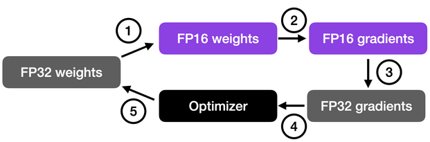

# Обучение нейронных сетей с математической точки зрения

## Forward & backward pass в нейронных сетях (автор: Азат Валеев)

## SGD и прочие оптимизаторы (автор: Александра Павлова)

При обучении нейронных сетей в первую очередь выбирается некоторая **прокси-функция**, которая оценивает то, насколько выход модели отличается от ожидаемого -- она обычно называется **функцией потерь** и должна быть дифференцируема по параметрам модели.

Например, MSE: $$\frac{1}{N} \sum_{i=1}^N (y_i - f(x_i))^2$$

Далее повторяется следующая процедура: forward/backward проход, вычисление функции потерь и изменение параметров модели в соответствии с вычисленным результатом. Последние меняются при помощи **оптимизатора** (оптимизационного алгоритма), который стремится уменьшить функцию потерь и сойтись к “хорошим” параметрам.

<!-- Посчитаем общий вес модели: $$|model\_size| = sizeof(fp\_32) * |\#parameters|$$. -->

Чаще всего оптимизация происходит градиентными методами (для того и нужна дифференцируемость функции потерь).

**Градиентный спуск (GD)** - обновляем каждый вес:

$$\ x_{k+1} = x_k - \alpha \nabla f(x_k)$$


### SGD

Но на практике вычислять градиент очень затратно по времени и памяти. Хотим заменить его на какое-то приближение:

$$\nabla f(x) = {E}\nabla L(x, \xi)$$

Если взять оценку Монте-Карло по подвыборке (батчу) в качестве приближения, то получится **стохастический градиентный спуск (SGD)**:

$$\ x_{k+1} = x_k - \alpha \tilde{\nabla} f(x_k),\ \ \tilde{\nabla} f(x) = \frac{1}{B}\sum_{i=1}^B\nabla L(x, \xi_i)$$

SGD спасает от проблемы использования при этом O(N*N*M*K) временной памяти и вычисления градиента за O(N), заменяя N на B. Он сходится более хаотично и медленно, но зато не требует таких огромных вычислительных мощностей.

### Метод импульса

При использовании SGD мы не храним никаких дополнительных конструкций, кроме градиентов и активаций (о них позже в forward&backward). Но и у SGD есть свои недостатки, например, мы не никак можем использовать информацию, полученную на предыдущих шагах оптимизации.

Мы можем применить концепцию **импульса** к нашему обычному алгоритму градиентного спуска. На каждом шаге, помимо обычного градиента, добавляется также изменение с предыдущего шага.

Таким образом появляется **метод импульса**:

$$v_{k+1} = \beta_kv_k - \alpha_k\nabla f(x_k),\ \ x_{k+1} = x_k + v_k$$

Эту идею можно развить ещё дальше, если попытаться взять вместо обычного градиента "будущий градиент" той точки, в которой мы окажемся. Получится **метод импульса Нестерова**.

$$x_{ahead} = x_k + v_k,\ v_{k+1} = \beta_kv_k - \alpha_k\nabla f(x_{ahead}),\ x_{k+1} = x_k + v_{k+1}$$


В итоге, вектор параметров будет наращивать скорость в том направлении, где присутствует стабильный градиент. Что способствует ускорению сходимости и выходу из локальных минимумов (Momentum (magenta) vs. Gradient Descent (cyan)).


### AdaGrad

Вместо отслеживания суммы градиента, как в случае импульса, алгоритм **Ада**птивного **Град**иента, или **AdaGrad** в сокращенной форме, отслеживает сумму квадратов градиента и использует ее для адаптации градиента в различных направлениях.

$$G_{k+1} = G_k + (\nabla f(x_k))^2,\ x_{k+1} = x_k - \frac{\alpha}{\sqrt{G_k + \epsilon}} \nabla f(x_k)$$

Это свойство позволяет AdaGrad (и другим аналогичным методам, основанным на квадрате градиента, таким как RMSProp и Adam) лучше выбираться из седловых точек. AdaGrad пройдет прямо, тогда как градиентный спуск (и, связанный с этим, импульс) выбирает подход "я сперва скатываюсь вниз по крутому склону, и, возможно, потом позабочусь о более медленном направлении". Иногда обычный градиентный спуск может просто остановиться в седловой точке, где градиенты в обоих направлениях равны 0 (AdaGrad (white) vs. gradient descent (cyan)).


### RMSProp

Проблема AdaGrad, однако, заключается в том, что он работает невероятно медленно. Это связано с тем, что сумма квадратов градиента только увеличивается и никогда не уменьшается.

**RMSProp (Root Mean Square Propagation)** решает эту проблему путем введения коэффициента затухания.

$$G_{k+1} = \gamma G_k + (1-\gamma)(\nabla f(x_k))^2,\ x_{k+1} = x_k - \frac{\alpha}{\sqrt{G_k + \epsilon}} \nabla f(x_k)$$


### Adam

И, наконец, **Adam** (сокращение от **Adaptive Moment Estimation**) берет лучшее из метода импульса и RMSProp. Эмпирически Adam хорошо себя показывает, и поэтому в последние годы часто является стандартным выбором для задач глубокого обучения.

$$v_{k+1} = \beta v_k - (1 -\beta)\nabla f(x_k)$$

$$\ G_{k+1} = \gamma G_k + (1-\gamma)(\nabla f(x_k))^2$$

$$x_{k+1} = x_k - \frac{\alpha}{\sqrt{G_{k+1} + \epsilon}} v_{k+1}$$


[Классная тула](https://github.com/lilipads/gradient_descent_viz) для визуализации всяческих сходимостей.

Литература: [A Visual Explanation of Gradient Descent Methods](https://towardsdatascience.com/a-visual-explanation-of-gradient-descent-methods-momentum-adagrad-rmsprop-adam-f898b102325c)

## Анализ памяти для наивного шага обучения (автор: Азат Валеев)

# Оптимизации

## Модификации оптимизатора по памяти: Adafactor, 8-bit Adam (автор: Александра Павлова)

### Adafactor

Adam хранит два дополнительных значения для каждого параметра. Одно хранит импульс; другое хранит экспоненциально сглаженные квадраты градиентов. Таким образом, требования к памяти утраиваются по сравнению с обычным оптимизатором SGD. Adafactor значительно сокращает это требование (более чем в два раза), сохраняя при этом сравнимую производительность.

- Хотим заменить полную матрицу сглаженных квадратов градиентов низкоранговым приближением. Теперь будем хранить только агрегированную информацию (суммы скользящих средних по строкам и столбцам). Это снижает требования к памяти для квадратных градиентов с O(nm) до O(n+m).
- Adafactor полностью избавляется от импульса. Это вызывает некоторую нестабильность в обучении, однако, возможно проблема в устаревшем аккумуляторе второго момента (экспоненциальное сглаживание квадратов градиентов).
Увеличивая коэффициент затухания со временем (новые значения имеют более высокий вес) и ограничивая обновление градиента, Adafactor может сходиться нормально даже без импульса.
- Adafactor умножает скорость обучения на масштаб параметров (это называется "относительным размером шага"). Обучение с относительными размерами шага обеспечивает большую робастность для параметров различного масштаба.

### 8-bit Optimizers

Существуют некоторые оптимизаторы, которые используют 8-битные данные, сохраняя при этом производительность 32-битных состояний оптимизатора.
Для преодоления возникающих проблем с вычислениями, квантованием и стабильностью было придумано блочное динамическое квантование. При блочном квантовании входные тензоры делятся на небольшие блоки, которые квантуются независимо друг от друга. Каждый блок обрабатывается параллельно на всех ядрах, что обеспечивает более быструю оптимизацию и высокую точность квантования.

Чтобы сохранить стабильность и производительность, блочное квантование сочетается с двумя дополнительными изменениями:
- динамическим квантованием, формой нелинейной оптимизации, которая точна как для больших, так и для малых величин
- стабильным слоем встраивания для уменьшения дисперсии градиента, возникающей из-за крайне неравномерного распределения входных лексем в языковых моделях.

В результате 8-битные оптимизаторы сохраняют 32-битную производительность при малой доле занимаемой памяти в целом ряде задач, без изменения исходных гиперпараметров оптимизатора.

### Mixed Precision Training

В глубоком обучении использование 64-битных операций с плавающей запятой считается ненужным и вычислительно затратным, поскольку 64-битные операции обычно более дорогостоящие, а аппаратное обеспечение GPU также не оптимизировано для 64-битной точности. Поэтому стандартом для обучения глубоких нейронных сетей на GPU стали 32-битные операции с плавающей запятой (также известные как single-precision).

#### 16-bit precision

В последнее время распространенной схемой обучения стало обучение со смешанной точностью, когда для вычислений с плавающей запятой временно используется 16-битная точность, которую часто называют "половинной" точностью.

Как показано на рисунке ниже, обучение со смешанной точностью включает в себя преобразование весов в более низкую точность (FP16) для ускорения вычислений, вычисление градиентов, преобразование градиентов обратно в более высокую точность (FP32) для численной стабильности и обновление исходных весов с помощью масштабированных градиентов.



#### Brain Floating Point (bfloat16)

В последнее время набирает популярность еще один формат с плавающей точкой - **Brain Floating Point (bfloat16)**. Bfloat16 расширяет динамический диапазон по сравнению с обычным форматом float16 за счет снижения точности.

Расширенный динамический диапазон помогает bfloat16 представлять как очень большие, так и очень маленькие числа, что делает его более подходящим для приложений глубокого обучения, где может встречаться широкий диапазон значений. Однако более низкая точность может повлиять на точность некоторых вычислений или привести к ошибкам округления в некоторых случаях. Однако в большинстве задач глубокого обучения эта пониженная точность оказывает минимальное влияние на результат.


#### Built-in mixed precision

Некоторые библиотеки включают в себя встроенную настройку точности вычисления произведения матриц.

К примеру, PyTorch выдаёт подобное сообщение при использовании GPU:

```
You are using a CUDA device ('NVIDIA A100-SXM4-40GB') that has Tensor Cores. 
To properly utilize them, you should 
set `torch.set_float32_matmul_precision('medium' | 'high')` 
which will trade-off precision for performance.
```

Приведенные выше настройки будут использовать тип данных bfloat16 для матричных умножений. Другими словами, использование `torch.set_float32_matmul_precision("high"/"medium") `будет неявно включать обучение со смешанной точностью (через матричные умножения), если ваш GPU поддерживает тензорные ядра.


Литература:

[Adafactor: Adaptive Learning Rates with Sublinear Memory Cost](https://arxiv.org/pdf/1804.04235v1.pdf)

[8-Bit Optimizers Via Block-wise Quantization](https://arxiv.org/pdf/2110.02861.pdf)

[Accelerating Large Language Models with Mixed-Precision Techniques](https://sebastianraschka.com/blog/2023/llm-mixed-precision-copy.html)

## Gradient Accumulation (автор: Азат Валеев)

## Activation Checkpointing (автор: Азат Валеев)

## Mixed Precision (автор: Георгий Ангени)
