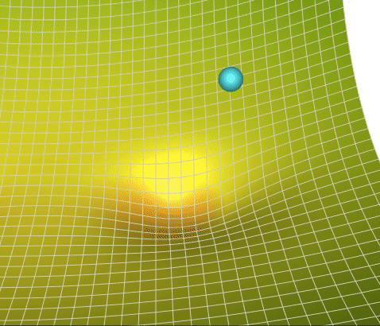
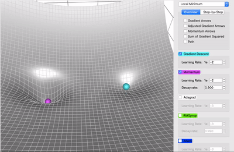
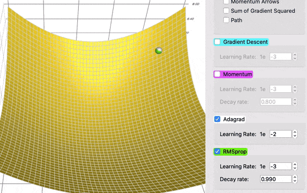
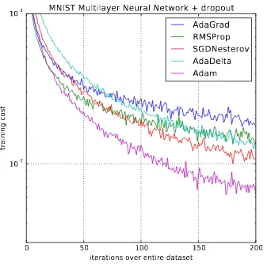

# Обучение нейронных сетей с математической точки зрения

## Forward & backward pass в нейронных сетях (автор: Азат Валеев)

## SGD и прочие оптимизаторы (автор: Александра Павлова)

При обучении нейронных сетей в первую очередь выбирается некоторая **прокси-функция**, которая оценивает то, насколько выход модели отличается от ожидаемого -- она обычно называется **функцией потерь** и должна быть дифференцируема по параметрам модели.

Например, MSE: $\frac{1}{N} \sum_{i=1}^N (y_i - f(x_i))^2$

Далее повторяется следующая процедура: forward/backward проход, вычисление функции потерь и изменение параметров модели в соответствии с вычисленным результатом. Последние меняются при помощи **оптимизатора** (оптимизационного алгоритма), который стремится уменьшить функцию потерь и сойтись к “хорошим” параметрам.

<!-- Посчитаем общий вес модели: $|model\_size| = sizeof(fp\_32) * |\#parameters|$. -->

Чаще всего оптимизация происходит градиентными методами (для того и нужна дифференцируемость функции потерь).

**Градиентный спуск (GD)** - обновляем каждый вес:

$\ x_{k+1} = x_k - \alpha \nabla f(x_k)$

### SGD

Но на практике вычислять градиент очень затратно по времени и памяти. Хотим заменить его на какое-то приближение:

$\nabla f(x) = \mathbb{E}\nabla\mathcal{L}(x, \xi)$.

Если взять оценку Монте-Карло по подвыборке (батчу) в качестве приближения, то получится **стохастический градиентный спуск (SGD)**:

$\ x_{k+1} = x_k - \alpha \tilde{\nabla} f(x_k),\ \ \tilde{\nabla} f(x) = \frac{1}{B}\sum_{i=1}^B\nabla\mathcal{L}(x, \xi_i)$

SGD спасает от проблемы использования при этом O(N*N*M*K) временной памяти и вычисления градиента за O(N), заменяя N на B. Он сходится более хаотично и медленно, но зато не требует таких огромных вычислительных мощностей.

### Метод импульса

При использовании SGD мы не храним никаких дополнительных конструкций, кроме градиентов и активаций (о них позже в forward&backward). Но и у SGD есть свои недостатки, например, мы не никак можем использовать информацию, полученную на предыдущих шагах оптимизации.

Мы можем применить концепцию **импульса** к нашему обычному алгоритму градиентного спуска. На каждом шаге, помимо обычного градиента, добавляется также изменение с предыдущего шага.

Таким образом появляется **метод импульса**:

$v_{k+1} = \beta_kv_k - \alpha_k\nabla f(x_k),\ \ x_{k+1} = x_k + v_k$

Эту идею можно развить ещё дальше, если попытаться взять вместо обычного градиента "будущий градиент" той точки, в которой мы окажемся. Получится **метод импульса Нестерова**.

$x_{ahead} = x_k + v_k,\ v_{k+1} = \beta_kv_k - \alpha_k\nabla f(x_{ahead}),\ x_{k+1} = x_k + v_{k+1}$

В итоге, вектор параметров будет наращивать скорость в том направлении, где присутствует стабильный градиент. Что способствует ускорению сходимости и выходу из локальных минимумов (Momentum (magenta) vs. Gradient Descent (cyan)).

### AdaGrad

Вместо отслеживания суммы градиента, как в случае импульса, алгоритм **Ада**птивного **Град**иента, или **AdaGrad** в сокращенной форме, отслеживает сумму квадратов градиента и использует ее для адаптации градиента в различных направлениях.

$G_{k+1} = G_k + (\nabla f(x_k))^2,\ x_{k+1} = x_k - \frac{\alpha}{\sqrt{G_k + \epsilon}} \nabla f(x_k)$

Это свойство позволяет AdaGrad (и другим аналогичным методам, основанным на квадрате градиента, таким как RMSProp и Adam) лучше выбираться из седловых точек. AdaGrad пройдет прямо, тогда как градиентный спуск (и, связанный с этим, импульс) выбирает подход "я сперва скатываюсь вниз по крутому склону, и, возможно, потом позабочусь о более медленном направлении". Иногда обычный градиентный спуск может просто остановиться в седловой точке, где градиенты в обоих направлениях равны 0 (AdaGrad (white) vs. gradient descent (cyan)).

### RMSProp

Проблема AdaGrad, однако, заключается в том, что он работает невероятно медленно. Это связано с тем, что сумма квадратов градиента только увеличивается и никогда не уменьшается.

**RMSProp (Root Mean Square Propagation)** решает эту проблему путем введения коэффициента затухания.

$G_{k+1} = \gamma G_k + (1-\gamma)(\nabla f(x_k))^2,\ x_{k+1} = x_k - \frac{\alpha}{\sqrt{G_k + \epsilon}} \nabla f(x_k)$

### Adam

И, наконец, **Adam** (сокращение от **Adaptive Moment Estimation**) берет лучшее из метода импульса и RMSProp. Эмпирически Adam хорошо себя показывает, и поэтому в последние годы часто является стандартным выбором для задач глубокого обучения.

$v_{k+1} = \beta v_k - (1 -\beta)\nabla f(x_k)$

$\ G_{k+1} = \gamma G_k + (1-\gamma)(\nabla f(x_k))^2$

$x_{k+1} = x_k - \frac{\alpha}{\sqrt{G_{k+1} + \epsilon}} v_{k+1}$

[Классная тула](https://github.com/lilipads/gradient_descent_viz) для визуализации всяческих сходимостей.

Литература: [A Visual Explanation of Gradient Descent Methods](https://towardsdatascience.com/a-visual-explanation-of-gradient-descent-methods-momentum-adagrad-rmsprop-adam-f898b102325c)

## Анализ памяти для наивного шага обучения (автор: Азат Валеев)

# Оптимизации

## Модификации оптимизатора по памяти: Adafactor, 8-bit Adam (автор: Александра Павлова)

Одна из оптимизаций памяти заключается в том, чтобы уменьшить точность весов с fp32 до fp16.

<!-- TODO -- ещё оптимизации по памяти -->

## Gradient Accumulation (автор: Азат Валеев)

## Activation Checkpointing (автор: Азат Валеев)

## Mixed Precision (автор: Георгий Ангени)
