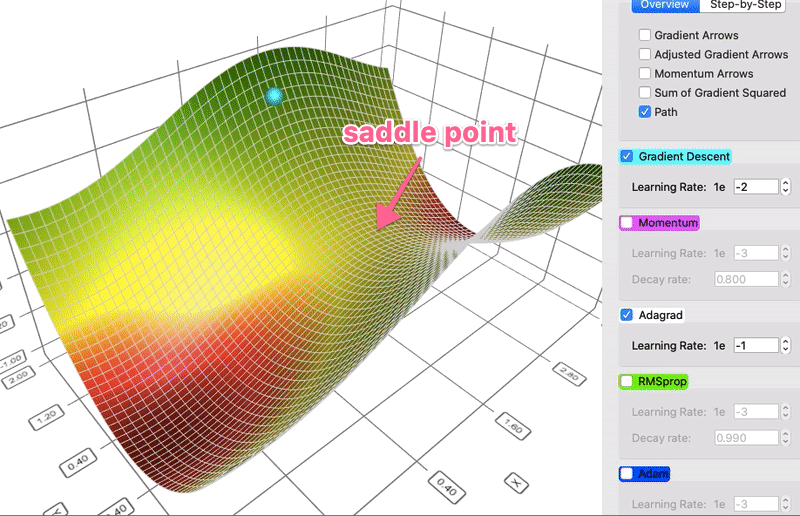

# Обучение нейронных сетей с математической точки зрения

## Forward & backward pass в нейронных сетях (автор: Азат Валеев)

*Данный параграф является кратким пересказом [соответствующей главы](https://education.yandex.ru/handbook/ml/article/metod-obratnogo-rasprostraneniya-oshibki) из ml-handbook от ШАДа, оттуда же позаимствованы медиа материалы, для более детального погружения читателям советуется обращаться к ней.*

Традиционно обучение нейронных сетей сводят к задаче оптимизации некоторой целевой функции, которая оценивает то, насколько выход модели отличается от ожидаемого. Она обычно называется **функцией потерь** и должна быть дифференцируема по параметрам модели для применения градиентных методов оптимизации. А для их использования необходимо уметь эффективно вычислять градиенты функции потерь по обучающимся параметрам. 

Для эффективного же вычисления градиентов применяется алгоритм обратного распространения ошибки (back propagation), суть которого вытекает из формулы вычисления производной сложной функции: если $f(w_0) = g_m(g_{m-1}(\ldots g_1(w_0)\ldots))$ (в качестве примера возьмём одномерный случай, переменная $w_0$ -- скаляр, все функции $g_i$ -- скалярные), то
```math
\begin{equation*}
    f'(w_0) = g_m'(g_{m-1}(\ldots g_1(w_0)\ldots)) \cdot g'_{m-1}(g_{m-2}(\ldots g_1(w_0)\ldots)) \cdot \ldots \cdot g'_1(w_0).
\end{equation*}
``` 

Как видно из формулы, для того, чтобы посчитать производную $f'(w_0)$ за один проход, достаточно посчитать промежуточные значения функции $g_1(w_0), g_2(g_1(w_0)),\ldots,g_{m-1}(\ldots g_1(w_0)\ldots)$ и:

* взять производную $g_m$ в точке $g_{m-1}(\ldots g_1(w_0)\ldots)$;

* умножить на производную $g_{m-1}$ в точке $g_{m-2}(\ldots g_1(w_0)\ldots)$;

* и так далее, пока не дойдём до производной $g_1$ в точке $w_0$.

В нейронных сетях алгоритм обратного распространения ошибки формулируется в терминах двух фаз: прямой проход (forward pass) и обратный проход (backward pass):

* **Forward pass**: вычисляем выход модели по входу, подсчитываем значение функции потерь, при этом для каждого слоя запоминаем его вход (вход промежуточного слоя также часто называется **активацией**).

    

    На картинке представлен forward pass для некоторой нейронной сети, сохраненные активации показаны в верхней части рисунка.

* **Backward pass**: подсчитываем градиенты функции потерь по входу/обучаемым весам слоёв, начиная с самого последнего слоя и двигаясь к самому первому. При этом для вычисления градиентов очередного слоя применяются градиенты следующих слоёв, чьим входом был выход данного слоя, и активации данного слоя.

    

    На анимации представлен backward pass для всё той же нейронной сети, вычисление градиентов поиллюстрировано в нижней её части. 

Вычисленные градиенты применяются оптимизационными алгоритмами, о которых написано [далее](#sgd-и-прочие-оптимизаторы-автор-александра-павлова). 

## SGD и прочие оптимизаторы (автор: Александра Павлова)

Обновление весов модели осуществляется с помощью **оптимизатора** (оптимизационного алгоритма) и полученных с backward pass'а градиентов. Оптимизатор стремится уменьшить функцию потерь и сойтись к “хорошим” параметрам.

<!-- Посчитаем общий вес модели: $$|model\_size| = sizeof(fp\_32) * |\#parameters|$$. -->

**Градиентный спуск (GD)** - обновляем каждый вес:

$$\ x_{k+1} = x_k - \alpha \nabla f(x_k)$$


[В этой книге](https://hengshuaiyao.github.io/papers/nesterov03.pdf) показано, что он сходится за $O(\frac{1}{N})$, где $N$ -- количество итераций.

### SGD

Но на практике вычислять градиент очень затратно по времени и памяти. Хотим заменить его на какое-то приближение:

$$\nabla f(x) = \mathbb{E}\nabla L(x, \xi)$$

Если взять оценку Монте-Карло по подвыборке (батчу) в качестве приближения, то получится **стохастический градиентный спуск (SGD)**:

$$\ x_{k+1} = x_k - \alpha \tilde{\nabla} f(x_k),\ \ \tilde{\nabla} f(x) = \frac{1}{B}\sum_{i=1}^B\nabla L(x, \xi_i)$$

SGD спасает от проблемы использования при этом $O(N \cdot N \cdot M \cdot K)$ временной памяти и вычисления градиента за $O(N)$, заменяя $N$ на $B$. К тому же, он вносит некоторый естественный шум, который помогает меньше переобучаться на данных и сходиться к лучшему результату, а не ближайшему локальному минимуму.

Если объяснять на пальцах, то оптимизация GD уже смещённая и сходится только к минимуму на обучающей выборке (а не на реальной, которая нам неизвестна). Сходимость SGD обеспечивается несмещённостью стохастического градиента.

За вычислительные мощности мы платим скоростью сходимости, получая $O(\frac{1}{\sqrt{N}})$, как доказано в [статье](https://arxiv.org/pdf/1606.04838.pdf), а в невыпуклом случае так вообще $O(\frac{1}{N^{1/4}})$. А ещё получается очень большая дисперсия, которую нужно как-то уменьшать. Таким образом появляется ряд оптимизаторов описанных далее.

### Метод импульса

<!-- convergence -->

При использовании SGD мы не храним никаких дополнительных конструкций, кроме градиентов и активаций (о них позже в forward&backward). Но и у SGD есть свои недостатки, например, мы никак не можем использовать информацию, полученную на предыдущих шагах оптимизации.

Мы можем применить концепцию **импульса** к нашему обычному алгоритму градиентного спуска. На каждом шаге, помимо обычного градиента, добавляется также изменение с предыдущего шага.

Таким образом появляется **метод импульса**:

$$v_{k+1} = \beta_kv_k - \alpha\nabla f(x_k),\ \ x_{k+1} = x_k + v_{k+1}$$

Эту идею можно развить ещё дальше, если попытаться взять вместо обычного градиента "будущий градиент" той точки, в которой мы окажемся. Получится **метод импульса Нестерова**.

$$x_{ahead} = x_k + \beta_kv_k,\ v_{k+1} = \beta_kv_k - \alpha\nabla f(x_{ahead}),\ x_{k+1} = x_k + v_{k+1}$$


В итоге, вектор параметров будет наращивать скорость в том направлении, где присутствует стабильный градиент. Что способствует ускорению сходимости и выходу из локальных минимумов (Momentum (magenta) vs. Gradient Descent (cyan)).


### AdaGrad

Вместо отслеживания суммы градиента, как в случае импульса, алгоритм **Ада**птивного **Град**иента, или **AdaGrad** в сокращенной форме, отслеживает сумму квадратов градиента и использует ее для адаптации градиента в различных направлениях.

$$G_{k+1} = G_k + (\nabla f(x_k))^2,\ x_{k+1} = x_k - \frac{\alpha}{\sqrt{G_k + \varepsilon}} \nabla f(x_k)$$

Это свойство позволяет AdaGrad (и другим аналогичным методам, основанным на квадрате градиента, таким как RMSProp и Adam) лучше выбираться из седловых точек. AdaGrad пройдет прямо, тогда как градиентный спуск (и, связанный с этим, импульс) выбирает подход "я сперва скатываюсь вниз по крутому склону, и, возможно, потом позабочусь о более медленном направлении". Иногда обычный градиентный спуск может просто остановиться в седловой точке, где градиенты в обоих направлениях равны 0 (AdaGrad (white) vs. gradient descent (cyan)).



Есть [статья](https://arxiv.org/pdf/1806.01811.pdf) про сходимость AdaGrad-Norm (делаем $G_{k+1} = G_k + ||\nabla f(x_k)||^2$), в ней доказываются две теоремы, из которых можно сделать вывод, что алгоритм сходится со скоростью $O(\frac{1}{N})$ в детерминированной среде и со скоростью $O(\frac{log(N)}{\sqrt{N}})$ в стохастической среде (где $N$ - это количество итераций алгоритма).

### RMSProp

Проблема AdaGrad, однако, заключается в том, что он работает невероятно медленно. Это связано с тем, что сумма квадратов градиента только увеличивается и никогда не уменьшается.

**RMSProp (Root Mean Square Propagation)** решает эту проблему путем введения коэффициента затухания.

$$G_{k+1} = \gamma G_k + (1-\gamma)(\nabla f(x_k))^2,\ x_{k+1} = x_k - \frac{\alpha}{\sqrt{G_k + \varepsilon}} \nabla f(x_k)$$


### Adam

И, наконец, **Adam** (сокращение от **Adaptive Moment Estimation**) берет лучшее из метода импульса и RMSProp. Эмпирически Adam хорошо себя показывает, и поэтому в последние годы часто является стандартным выбором для задач глубокого обучения.

$$v_{k+1} = \beta v_k - (1 -\beta)\nabla f(x_k)$$

$$G_{k+1} = \gamma G_k + (1-\gamma)(\nabla f(x_k))^2$$

```math
\begin{equation*}
    \hat{v}_{k+1} = \frac{v_{k+1}}{1 -\beta^t}
\end{equation*}
``` 
```math
\begin{equation*}
    \hat{G}_{k+1} = \frac{G_{k+1}}{1-\gamma^t}
\end{equation*}
``` 
```math
\begin{equation*}   
    x_{k+1} = x_k - \frac{\alpha}{\sqrt{\hat{G}_{k+1} + \varepsilon}} \hat{v}_{k+1}
\end{equation*}
``` 


В изначальной [статье 2015 года](https://arxiv.org/pdf/1412.6980v8.pdf), представлявшей Adam, было приведено и доказательство сходимости, однако, оно было опровергнуто в [2018 году](https://arxiv.org/pdf/1904.09237.pdf). С тех пор многие статьи пытаются либо предложить возможные оптимизации Adam (например [AMSGrad](https://arxiv.org/pdf/1904.09237.pdf#section.4)), либо предложить ограничения, которые гарантируют сходимость (например [ADAMNC](https://arxiv.org/pdf/1904.09237.pdf#subsection.5.1), который уже очень близок к AdaGrad).

Касаемо скорости сходимости, например, [вот такой результат](https://www.researchgate.net/profile/Weizhong-Zhang-5/publication/329182126_A_Sufficient_Condition_for_Convergences_of_Adam_and_RMSProp/links/5d3af96b92851cd046888e6e/A-Sufficient-Condition-for-Convergences-of-Adam-and-RMSProp.pdf) (см. Corollary 10). Он применим и к RMSProp, так как можно увидеть, что Adam сводится к RMSProp. При $\beta = 0$ мы забываем про метод инерции и $v_k$ просто дублирует градиент, получается уже формула RMSProp.

<!-- 

 -->

Дальнейшие исследования сходимости Adam фокусируются на минимизации дисперсии, доказав что при сходящейся дисперсии сходится и Adam. Например, [одна из статей](https://arxiv.org/pdf/2210.05607.pdf) предлагает модификацию под названием VRAdam (Variance Reduced Adam) опираясь на построение SVRG (stochastic variance reduced gradient). Также в этой статье рассказано о различных исследованиях сходимости Adam.

[Классная тула](https://github.com/lilipads/gradient_descent_viz) для визуализации всяческих сходимостей.

Литература: [A Visual Explanation of Gradient Descent Methods](https://towardsdatascience.com/a-visual-explanation-of-gradient-descent-methods-momentum-adagrad-rmsprop-adam-f898b102325c)

## Анализ памяти для наивного шага обучения (автор: Азат Валеев)

После обсуждения оптимизационных алгоритмов можно наконец подсчитать суммарное потребление памяти, которая необходима для реализации наивного шага обучения нейронной сети с использованием back propagation (наивного в том смысле, что пока не будут применяться никакие оптимизации, связанные с памятью). Также в рамках этого параграфа:

* ещё не предполагается природа памяти -- можно думать о том, что мы взаимодействуем с RAM;
* предполагается, что тип данных, в котором хранятся числа, выполняются вычисления, занимает $N$ байт в памяти. Так что для простоты записей необходимое домножение на константу будет опущено и будет применено только в самом конце подсчетов. А подробнее про типы использующихся чисел написано [далее](#mixed-precision-training-автор-георгий-ангени).

Первоначально, для обучения нейронной сети её веса необходимо разместить в памяти -- для этого нам необходимо {количество весов модели} памяти.

Далее -- forward pass, в процессе вычисления которого запоминаются активации. Под конец выполнения в памяти лежат веса модели + все посчитанные активации.

Затем -- backward pass. При обратном проходе необходимо выделить место под градиенты весов модели, которые по размеру в памяти эквиваленты самим веса модели. Поскольку, вообще говоря, каждая активация может быть необходима для подсчета градиентов первых слоёв, память под активации мы не можем высвобождать (к тому же, эту память можно переиспользовать для следующих шагов обучения). Таким образом, после окончания подсчёта градиентов в памяти лежат веса модели + все посчитанные активации + все градиенты весов.

Для подсчета памяти при применении оптимизационного алгоритма необходимо учитывать, хранит ли алгоритм статистики градиентов для обновления весов. 

Так, например, ванильный SGD не применяет статистики, поэтому ему не нужна дополнительная память. А оптимизатору Adam нужно хранить скользящее среднее предыдущих градиентов и скользящее среднее квадратов элементов градиентов, обе статистики по размерам эквивалентны размеру градиентов модели, который как уже упоминалось эквивалентен размеру весов модели. 

Так что если мы рассмотрим Adam в качестве стандартного оптимизиатора, то в памяти лежат $\approx$ веса модели + все посчитанные активации + все градиенты весов + 2 * все градиенты весов.

После первого шага обучения потребление памяти остается на том же уровне, поскольку не добавляется ничего нового и успешно переиспользуется ранняя выделенная память (в предположении, что размер батча зафиксирован).

Таким образом, собирая всё вместе, с использованием Adam необходимо $\approx$ веса модели + все посчитанные активации + все градиенты весов + 2 * все градиенты весов = 4 * веса модели + все посчитанные активации памяти; в терминах байт -- $N$ * (4 * количество параметров модели + количество элементов в активациях).

Теперь когда ясно, сколько и на что выделяется память при обучении, можно перейти к обсуждению разных оптимизаций.

# Оптимизации

Эта и дальнейшие главы в рамках данного раздела будут посвящены разным оптимизациям, преимущественно, связанным с уменьшением потребляемой памяти при обучении нейронных сетей, в частности, больших языковых моделей. 

## Модификации оптимизатора по памяти: Adafactor, 8-bit Adam (автор: Александра Павлова)

### Adafactor

Adam хранит два дополнительных значения для каждого параметра. Одно хранит импульс; другое хранит экспоненциально сглаженные квадраты градиентов. Таким образом, требования к памяти утраиваются по сравнению с обычным оптимизатором SGD. Adafactor значительно сокращает это требование (более чем в два раза), сохраняя при этом сравнимую производительность.

- Хотим заменить полную матрицу сглаженных квадратов градиентов низкоранговым приближением. Теперь будем хранить только агрегированную информацию (суммы скользящих средних по строкам и столбцам). Это снижает требования к памяти для квадратных градиентов с O(nm) до O(n+m).
- Adafactor полностью избавляется от импульса. Это вызывает некоторую нестабильность в обучении, однако, возможно проблема в устаревшем аккумуляторе второго момента (экспоненциальное сглаживание квадратов градиентов).
Увеличивая коэффициент затухания со временем (новые значения имеют более высокий вес) и ограничивая обновление градиента, Adafactor может сходиться нормально даже без импульса.
- Adafactor умножает скорость обучения на масштаб параметров (это называется "относительным размером шага"). Обучение с относительными размерами шага обеспечивает большую робастность для параметров различного масштаба.

### 8-bit Optimizers

Существуют некоторые оптимизаторы, которые используют 8-битные данные, сохраняя при этом производительность 32-битных состояний оптимизатора.
Для преодоления возникающих проблем с вычислениями, квантованием и стабильностью было придумано блочное динамическое квантование. При блочном квантовании входные тензоры делятся на небольшие блоки, которые квантуются независимо друг от друга. Каждый блок обрабатывается параллельно на всех ядрах, что обеспечивает более быструю оптимизацию и высокую точность квантования.

Чтобы сохранить стабильность и производительность, блочное квантование сочетается с двумя дополнительными изменениями:
- динамическим квантованием, формой нелинейной оптимизации, которая точна как для больших, так и для малых величин
- стабильным слоем встраивания для уменьшения дисперсии градиента, возникающей из-за крайне неравномерного распределения входных лексем в языковых моделях.

В результате 8-битные оптимизаторы сохраняют 32-битную производительность при малой доле занимаемой памяти в целом ряде задач, без изменения исходных гиперпараметров оптимизатора.

## Gradient Accumulation (автор: Азат Валеев)

Мотивация данной оптимизации проста: при обучении нейронных сетей нам хочется иметь размер батча данных, по которому оценивается матожидание значения функции потерь и по оценке которого выполняется оценка градиентов весов модели, как можно больше -- из-за того оценка тем точнее, чем больше подвыборках[^1]. А в случае LLM с миллиардами обучаемых параметров и нехваткой памяти для хранения их весов/активаций/градиентов наичнает влиять и используемый размер батча.

Идея оптимизации также проста: предположим, что максимальный допустимый размер батча при обучении нейронной сети равен $n$, но хотелось бы иметь эффективный размер батча $n \cdot m$. Тогда вместо того, чтобы делать шаг оптимизатора после каждого обработанного батча, будем делать этот шаг раз в $m$ батчей! При этом не забывая домножить значения функции потерь на $\frac{1}{m}$ перед каждым подсчётом градиентов для полной консистентности с усреднением по батчу размера $n \cdot m$. Такое обновление градиентов полностью эквивалентно размеру батча $n \cdot m$ в смысле получающихся градиентов.

Стоит сделать пару замечаний по поводу этой отимизации.

Во-первых, использование gradient accumulation увеличивает время обучения в сравнении с применением увеличенного размера батч (как если бы сразу хватало памяти на размер батча $n \cdot m$).
Это связано с тем, что аккумулирование градиентов с нескольких малых батчей требует нескольких обращений к памяти, что является дорогой с точки зрения времени операцией. Кроме того, несколько малых батчей обрабатываются при таком подходе последовательно, что не эксплуатирует, например, оптимизированную под параллельность работу видеокарт. Также последовательная природа такой обработки требует большее число forward-backward pass'ов (хоть и для батчей меньшего размера), чем для вычисления на одном большом батче данных, что, в свою очередь, расходует больше вычислительных ресурсов.

Во-вторых, эквивалентность применения gradient accumulation и большого размера батча неверна для некоторых слоёв, опирающихся на статистики по батчу, например, для слоя Batch Normalization. В качестве альтернативы его использования при gradient accumulation может стать Instance Normalization, Group Normalization. 

## Activation Checkpointing (автор: Азат Валеев)

Идеей этой оптимизации служит сокращение памяти, выделяемой под активации обучаемой нейронной сети, ценой замедления обработки одного шага обучения.

Предлагается посмотреть на то, в какой момент становится необходима активация при вычисление градиентов связанного слоя. В качестве примера рассмотрим шаг обучения полносвязной нейронной сети:


Верхняя часть анимации соответствует forward pass: крайний левый кружок -- это вход модели, следующие кружки за ним -- это активации слоёв, стрелочки -- применение полносвязных слоёв. Последовательное их закрашивание означает их последовательное вычисление на forward pass'е.

Нижняя часть -- это backward pass. Кружки снизу означают градиенты соответствующих слоёв из forward pass'а, их последовательное мигание от крайнего правого до левого -- вычисление градиента соответствующего слоя, от последнего к первому.

Как можно видеть, в случае такого шага обучения память тратится неэффективно: для вычисления градиента первого слоя нам совсем не нужна активация последнего слоя, если с её помощью мы посчитали градиенты этого самого последнего слоя. 

Можно ли избавиться от хранения ненужных в моменте активаций? -- Можно, давайте просто получать активацию в момент, когда она необходима для вычисления градиентов очередного слоя и не будем хранить их на forward pass'e. Этот алгоритм проиллюстрирован на следующей анимации.


На forward pass'е хранится только последняя активация, и память под неё высвобождается, когда вычислилась следующая. Таким образом, в один момент времени под активации выделяется $\leq 3$ "ячеек" памяти ($+1$ из-за входа), если считать память под вход и активации равными одному кружку. В свою очередь, на обратном проходе последовательно вычисляются градиенты, и когда необходимо посчитать градиент для очередного слоя, то активация для него высчитывается с самого начала применением слоёв ко входу до текущего не включительно.

Выглядит как трюк: если считать "кружочек" атомарной ячейкой памяти, то если в нейронной сети $n$ слоёв, то в стандартной реализации шага обучения тратится $O(n)$ ячеек памяти под активации, а в "жадной по памяти" -- $O(1)$. На деле, нам пришлось заплатить временем: если взять каждую операцию подсчёта активации/градиента за атомарную, то в стандартной реализации было выполнено $O(n)$ операций, в "жадной по памяти" же -- $O(n^2)$ из-за пересчёта активаций на вычисление каждого граидиента.

Мотивация activation checkpointing -- поиск баланса между памятью под активации и временем выполнения одного шага обучения. Алгоритм продемонстрирован на следующей анимации.


На forward pass'e предлагается запоминать некоторые активации так, чтобы число запомненных активаций было $O(\sqrt{n})$ и расстояние в слоях между запомненными активациями было $O(\sqrt{n})$. Сохраненные активация назовём **чекпоинтами**. На backward pass'e происходит следующее: если активация -- чекпоинт **ИЛИ** если оказалась подсчитанной (об этом далее), то вычисляем градиент, иначе, если активация для данного слоя не подсчитана, то для всех слоёв начиная с последнего, для которого есть чекпоинт, до текущего слоя, прогоняем сеть ещё раз -- и запоминаем все активации по пути.

Из подобранных количества чекпоинтов и расстояния между последовательными ними вытекает, что потратится $O(\sqrt{n})$ ячеек памяти -- $O(\sqrt{n})$ при forward pass'е и ещё столько же при подсчёте активаций на очередном сегменте между чекпоинтами. При этом время останется линейным -- каждая активация будет подсчитана $\leq 2$ раз, при этом единожды будут вычислены только чекпоинты.

Gradient checkpointing можно выполнять для более сложных сетей, с более запутанной структурой, например, для архитектур со skip-connection'ами, когда активации со сколь угодно ранних слоёв могут понадобиться для градиентов сколь угодно поздних слоёв.

В случае больших языковых моделей следует сохранять выходы Multi-Head Attention слоя, полносвязных сетей после -- поскольку эти блоки самые вычислительно дорогие, они тратят больше всего памяти внутри себя, для их подсчёта необходимо много вычислений. Похожее замечание относится к выходам слоёв нормализации вроде BatchNormalization -- как правило, эти слои занимают немного памяти, но их тяжело подсчитывать.

## Mixed Precision Training (автор: Георгий Ангени)

Часто встречающимися типами значений для представления нейронных моделей в памяти являются FP32 и FP16 – форматы значений с плавающей точкой, занимающие в памяти 4 и 2 байта соответственно. Ясно, что использование FP16 вместо FP32 позволит уменьшить объем памяти, занимаемый моделью, и увеличить скорость ее обучения, но оно также приведет к ограничению точности параметров, которые модель сможет выучить.

Ниже проиллюстрированы представления FP32 и FP16 в памяти: $S$ – бит знака, $M$ – мантисса (часть числа с плавающей точкой) в двоичном виде, которая умножается на $2^E$, где $E$ – экспонента, представляющая собой целое число в двоичном виде.


В Mixed Precision Training в процессе обучения для весов, значений активации и градиентов используется формат FP16, но сама модель, или ее так называемые master weights, хранятся в FP32. Соответственно, веса, используемые при обучении, получаются именно путем конвертации master weights в FP16.


Почему же мы не храним все веса модели в FP16 изначально? Заметим, что разница между экспонентами двух чисел в FP16 (так же, как и в FP32) на единицу соответствует битовому сдвигу мантиссы. Это в сущности означает, что при складывании двух чисел в FP16, отличающихся друг от друга в $2048$ раз (число $2^{11}$, которое приведет к битовому сдвигу на 11 бит) меньшее число будет обращено в ноль, что сильно скажется на потенциальной точности, которую могут достичь параметры модели при обучении.

Также для того, чтобы значения градиентов в FP16 при обратном проходе не были приравнены к нулю, значение функции потерь искусственно увеличивается в несколько раз и обратное преобразование осуществляется сразу после backward pass (операция называется loss scaling) для того, чтобы не пришлось изменять ранее подобранные гиперпараметры, связанные с градиентами, такие как gradient clipping threshold. На изображении ниже показано распределение изменения весов модели на одной итерации обучения и видно, что без loss scaling все обновления левее красной полосы будут обращены в ноль. Увеличение значения функции потерь даже в 8 раз приведет к тому, что будет учтено сильно больше обновлений и модель обучится лучше.


### Brain Floating Point (bfloat16) (автор: Александра Павлова)

В последнее время набирает популярность еще один формат с плавающей точкой - **Brain Floating Point (bfloat16)**. Bfloat16 расширяет динамический диапазон по сравнению с обычным форматом float16 за счет снижения точности.

Расширенный динамический диапазон помогает bfloat16 представлять как очень большие, так и очень маленькие числа, что делает его более подходящим для приложений глубокого обучения, где может встречаться широкий диапазон значений. Однако более низкая точность может повлиять на точность некоторых вычислений или привести к ошибкам округления в некоторых случаях. Однако в большинстве задач глубокого обучения эта пониженная точность оказывает минимальное влияние на результат.


### Built-in mixed precision (автор: Александра Павлова)

Некоторые библиотеки включают в себя встроенную настройку точности вычисления произведения матриц.

К примеру, PyTorch выдаёт подобное сообщение при использовании GPU:

```
You are using a CUDA device ('NVIDIA A100-SXM4-40GB') that has Tensor Cores. 
To properly utilize them, you should 
set `torch.set_float32_matmul_precision('medium' | 'high')` 
which will trade-off precision for performance.
```

Приведенные выше настройки будут использовать тип данных bfloat16 для матричных умножений. Другими словами, использование `torch.set_float32_matmul_precision("high"/"medium") `будет неявно включать обучение со смешанной точностью (через матричные умножения), если ваш GPU поддерживает тензорные ядра.


Литература:

[Adafactor: Adaptive Learning Rates with Sublinear Memory Cost](https://arxiv.org/pdf/1804.04235v1.pdf)

[8-Bit Optimizers Via Block-wise Quantization](https://arxiv.org/pdf/2110.02861.pdf)

[Accelerating Large Language Models with Mixed-Precision Techniques](https://sebastianraschka.com/blog/2023/llm-mixed-precision-copy.html)

[^1]: Хотя существуют свидетельства из статей ([статья 1](https://arxiv.org/pdf/1712.09913.pdf), [статья 2](https://arxiv.org/pdf/1804.07612.pdf), [статья 3](https://arxiv.org/pdf/2004.13146.pdf)), говорящие о том, что меньший размер батча может приводить к лучшей обобщающей способности модели.
