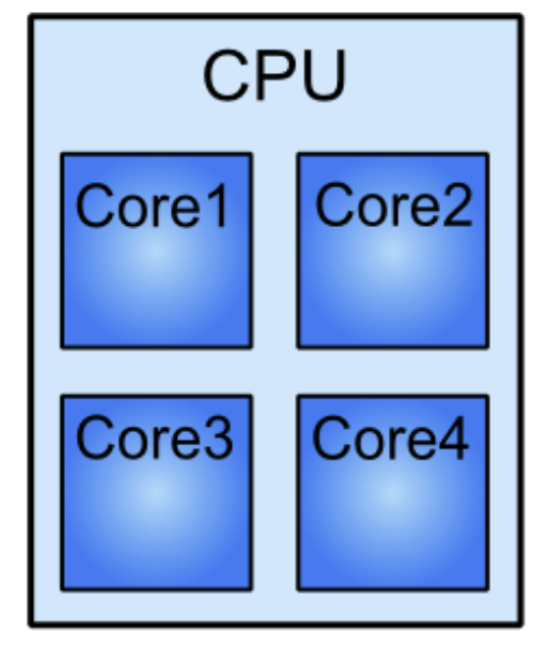
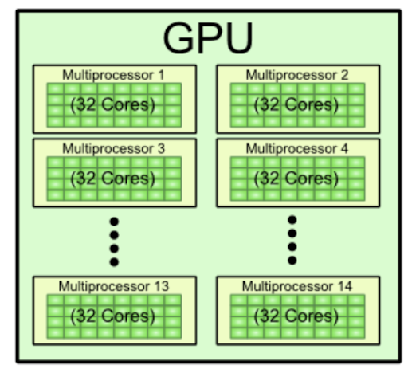
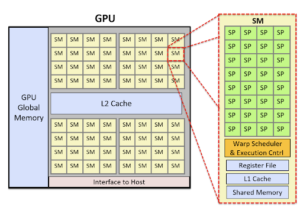
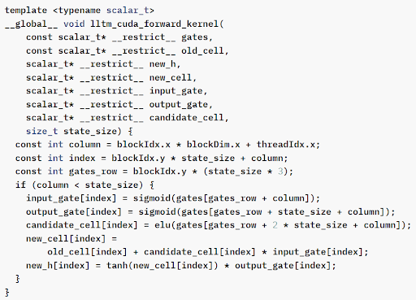
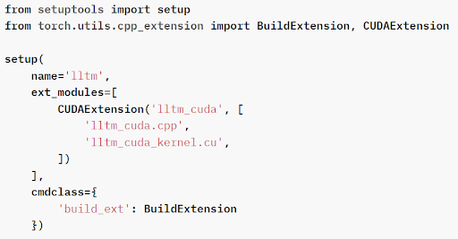
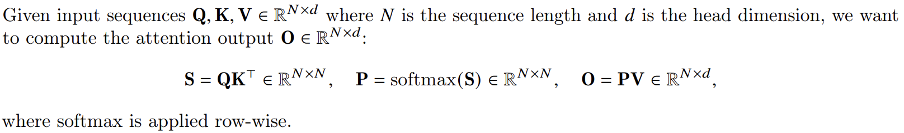
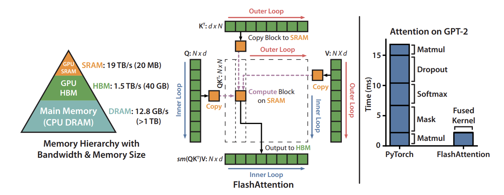
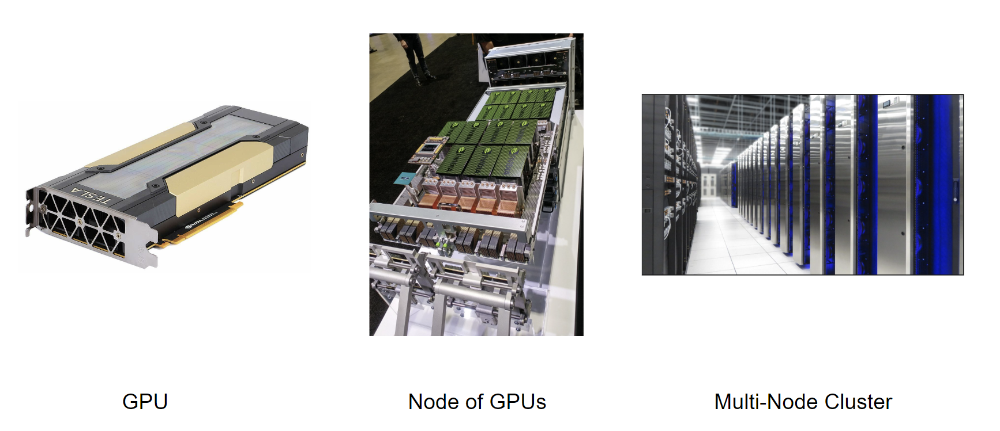

## Intro to Hardware and optimization

Инженерные оптимизации — важная часть тренировочного процесса. Во-первых, из-за большого веса LLM не укладывается на одно вычислительное устройство. Во-вторых, тренировка больших моделей — это долго и дорого (training cost для GPT-4 превосходил 100M$ согласно Sam Altman).

### CPU vs GPU
Главный вычислительный юнит в DL – это GPU. Есть и альтернативы, например, Google использует TPU, разработанный специально для нейросетей. Однако это скорее исключение, и, кроме того, по основным принципам устройства схожи.

  
  

GPU отличается от CPU в основном тем, что вместо небольшого количества быстрых и универсальных ядер у хорошей GPU в распоряжении тысячи Streaming Multiprocessors (SM). Каждый из SM заточен на параллельное исполнение простых операций над частью данных (например, над блоком матрицы). В одном SM обычно сидит 32 Single Processors (SP) (обозначенных на скрине как Cores, хотя, строго говоря, Core — это скорее SM), они получают одну общую простую инструкцию at a time и исполняют ее каждый над своей частичкой данных (например, над одним числом из того блока матрицы, которым занимается их SM).

GPU получает преимущество над CPU потому, что forward и backward pass хорошо распараллеливаются на группы простых вычислений. То есть не составляет большого труда воспользоваться десятками тысяч SP одновременно, в отличие от большинства не-ML-ных задач. И увеличить таким образом мощность по сравнению с CPU. А то ограничение, что ядро GPU не может произвести все разнообразие инструкций CPU, для тренировочного процесса не принципиально.

### GPU architecture
SP внутри одного SM очень зависимы – они исполняют одновременно одни и те же инструкции и имеют доступ к общему быстрому куску памяти. Однако между SP из разных SM синхронизация обычно не предполагается — ради эффективности параллелизации. Поэтому нужно выстраивать вычисления так, чтобы инструкции, исполняемые одним SM, не зависели от действий другого — одна иллюстрация, почему архитектура GPU подходит не для всех задач. С другой стороны, forward pass через Self-Attention легко делится на независимые вычисления по батчу и по разным Attention Heads. Для большей эффективности можно распараллелить и одну голову на одной точке батча, см., например, [FlashAttention-2](https://arxiv.org/pdf/2307.08691.pdf).

GPU состоит не только из ядер, внутри есть много другого железа, в частности, своя иерархия памяти. Более глобальные уровни иерархии имеют большее хранилище, но медленную скорость доступа. 
Тут хочется отметить две особенности, к которым мы вернемся. Во-первых, самая длительная операция при вычислениях на GPU – чтение/запись в память, особенно обращения к GPU Global Memory (также называемой High Bandwidth Memory — HBM), поэтому хочется избегать их любой ценой.  Во-вторых, как и ядра CPU, каждый SM можно натравливать сразу на несколько задач, чтобы он мог заниматься чем-то полезным пока ждет, когда к нему из HBM или L2-кэша доедет, скажем, часть матрицы, необходимая для какой-то задачи. То есть если SM приписано мало задач, появляется риск, что SM будет простаивать и средняя мощность просядет.

### What all that has to do with us?
Выше кратко описана целая архитектура со своими ограничениями и сильными сторонами. Под нее пишутся специальные программы, называемые кернелами. Когда я пишу в torch перемножение тензоров или иную популярную операцию, она транслируется в код кернелов, написанный разработчиками. Обычно кернелы для отдельных операций реализованы относительно оптимально. Но когда я запускаю большой алгоритм, состоящий из множества последовательных операций, последовательное независимое исполнение кернелов создает разного рода оверхеды. Например, поскольку кернелы очищают за собой быструю память, следующим кернелам может понадобиться подгрузить те же данные заново из медленной памяти.
Поэтому для ускорения алгоритма можно переписать последовательность кернелов в один длинный кернел, который знает все про алгоритм и засчет этого может срезать углы. Эта концепция называется  Kernel Fusion. К ней мы еще вернемся, а пока ниже приведена иллюстрация как имплементировать собственный кернел в торче. Цитата из документации:

"_The general strategy for writing a CUDA extension is to first write a C++ file which defines the functions that will be called from Python, and binds those functions to Python with pybind11. Furthermore, this file will also declare functions that are defined in CUDA (.cu) files_":

<figure>
    <figcaption>CUDA kernel code (.cu) </figcaption>
    
  </figure>
  
<figure>
    <figcaption>.py script to compile C++ and use 'lltm' directly from Python</figcaption>
    
  </figure>

Для полной (и подробной) инструкции по реализации собственного кернела в PyTorch можно обратиться, например, к [этому гайду](https://pytorch.org/tutorials/advanced/cpp_extension.html).

Кроме переписывания кернелов алгоритмы можно делать менее интенсивными засчет разного рода аппроксимаций — например, mixed precision (см., например, предыдущую главу) или с помощью разнообразных приближенных алгоритмов вроде [Linformer](https://arxiv.org/abs/2006.04768), к которому мы вернемся в главе про оптимизацию инференса. Однако они приводят к потере качества и часто концентрируются на computational complexity вместо увеличения wall-clock speed на практике, из-за чего в основном не получили широкого применения.

### Attention: "computational" bottleneck
Грубо говоря, все LLM сегодня используют Attention механизм (см., например, предыдущий раздел). При этом Attention – главный ботлнек при масштабировании на последовательности большой длины. Причина в подсчете матрицы весов для перевзвешивания Values, растущей квадратично по длине последовательности.

Таким образом, значительная часть оптимизации LLM — это оптимизация Attention-слоя. 

### Flash-Attention
Хотя с первого взгляда таинственной и озадачивающей, однако вполне правдоподобной исходя из общей логики пайплайна развития ML смотрится дата 2022 года на первой странице [FlashAttention: Fast and Memory-Efficient Exact Attention with IO-Awareness](https://arxiv.org/pdf/2205.14135.pdf).

Суть статьи — оптимизация Attention-слоя с помощью [Kernel Fusion](#Fusion). Wall-clock speedup в тот момент составил x3.5 для GPT-2 по сравнению с имплементацией [Huggingface](https://huggingface.co/docs/hub/index), а дополнительная память уменьшилась с квадратичной до линейной по N в терминах [нотации выше](#Atten_notation). 
Flash-Attention (FA) можно воспринимать как минимально разумную имплементацию механизма Attention на GPU. По сути FA — это два кернела, один для подсчета forward pass через Attention слой, второй — для подсчета backward pass. Основной инсайд авторов состоит в том, что ботлнек наивной имплементации Attention — это не объем вычислений, а объем памяти больших промежуточных матриц, переезжающих то в кэш SM, то обратно в глобальную память GPU по несколько раз (матрицы S и P).
Далее я буду строить рассуждения в предположении $N \gg d$.

Вычислений на одном проходе происходит немного — $O(N^2)$, поскольку все операции либо element-wise, либо состоят из перемножения небольших матриц $N \times d$. На этом фоне обмен памяти порядка $N^2$ очень значителен, ведь самая тяжелая часть вычислений на GPU — это доступы к памяти. Ситуация усугубляется при добавлении masking и dropout — последовательное выполнение этих операций разными кернелами также предполагает загрузку матриц $N\times N$ из глобальной памяти, выполнение $O(N^2)$ операций, и выгрузку обновленной матрицы обратно.

Исходя из этих соображений авторы написали реализацию одним кернелом, проходящим через весь Attention-слой разом, без необходимости "запоминать", а затем "вспоминать" большие промежуточные матрицы. Если абстрактно, то ценой небольшого увеличения [FLOPs](https://stackoverflow.com/questions/58498651/what-is-flops-in-field-of-deep-learning) можно перевзвешивать Values с помощью матрицы вероятностей P поступательно, не удерживая большие матрицы в памяти целиком. Алгоритм (не страшный) можно посмотреть в [статье](https://arxiv.org/pdf/2205.14135.pdf).

На практике Flash-Attention можно использовать в большей части сценариев, он доступен для Attention-слоя начиная с PyTorch 2.0 (как [custom kernel](https://pytorch.org/blog/accelerated-pytorch-2/)), имплементирован в DeepSpeed и Huggingface Accelerate. Более того, в документации PyTorch пишут: "Scaled dot product attention attempts to automatically select the most optimal implementation", поэтому можно пользоваться FA и в неведении. Однако FA поддерживается не для всех архитектур GPU, типов тензоров и масок attention. Но все быстро меняется.

### Flash-Attention 2
FA2 — логичное развитие FA.
В статье про FA внимание уделялось не столько [загруке SM](#SM_load) и обеспечению высокой производительности GPU, сколько уменьшению больших потоков памяти, текущих между слоями иерархии памяти GPU. 
В результате проблему с памятью удалось нивелировать, и вопрос загрузки SM стал острее. Авторы обнаружили, что в текущем варианте имплементации невысока occupancy и присутствуют конфликты памяти, из-за которых одним потокам приходится ждать другие. Решение — увеличение параллелизации (для загрузки SM) и небольшое перетасовывание задач между SM, чтобы разные SM не лезли в общие куски глобальной памяти. Как устроена эта оптимизаци можно найти в небольшой [cтатье](https://arxiv.org/pdf/2307.08691.pdf).

### Single GPU is not enough though
Вернемся к первой причине этого разговора — большая модель не влезает на одну видеокарту! Поэтому придется класть ее сразу на несколько.

## Сравнение скоростных показателей на примере DGX-2 (автор: Георгий Ангени)

## (возможно, прочие технологии, например, NVLink) (автор: Георгий Ангени)
