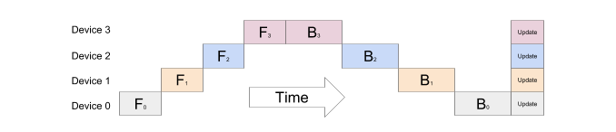
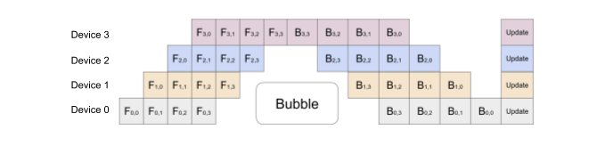
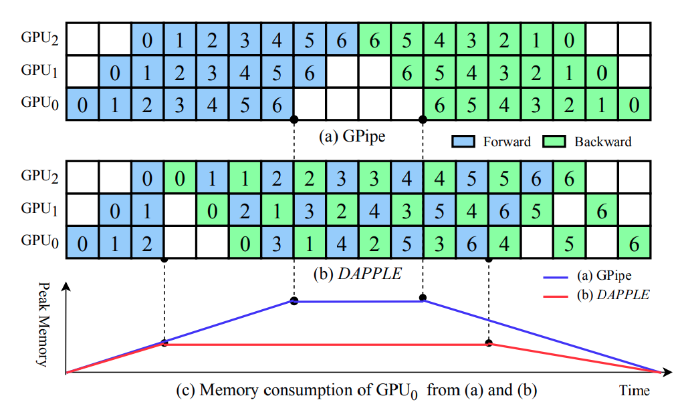
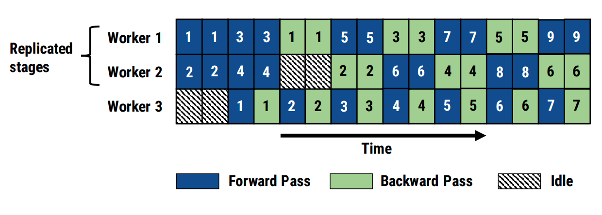
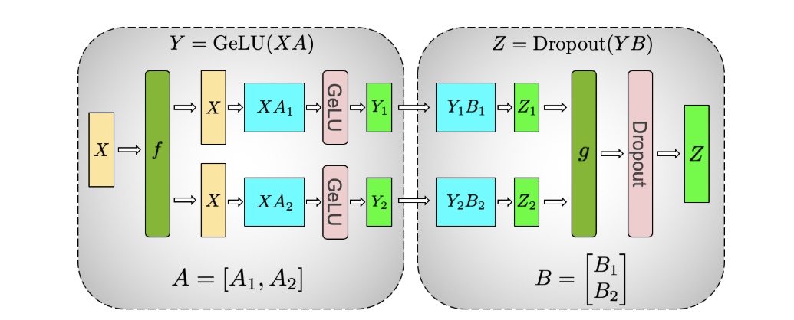
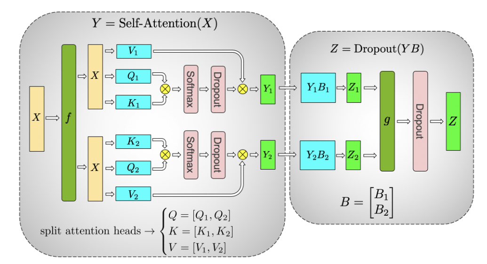
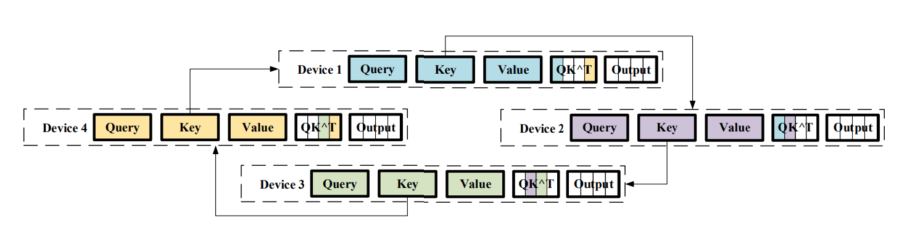
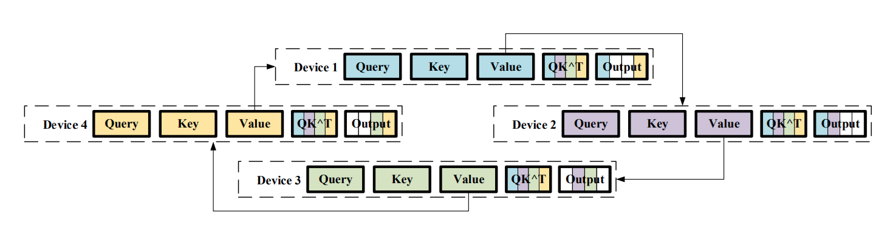

# Алгоритмы параллелизации в распределенных системах (автор: Георгий Ангени)

Как упоминалось ранее, вместе с усовершенствованием и улучшением качества LLM, растут и потребляемые ими ресурсы:

- увеличивается количество обучаемых параметров модели, и, как следствие, модель не вмещается на одну видеокарту или даже систему с несколькими видеокартами (а помимо весов нужно также хранить, например, состояние оптимизатора и градиенты)
- увеличивается объем вычислительных ресурсов, необходимый для обучения этого растущего количества параметров, поэтому одной или даже нескольких видеокарт уже не хватит для эффективного обучения с точки зрения времени

Ниже представлен график, на котором виден экспоненциальный тренд роста количества параметров в больших языковых моделях.

Рассмотрим несколько алгоритмов, призванных "параллелизовать" обучение больших нейронных моделей в распределенных системах.

## Data Parallelism

На каждом устройстве будем хранить копию обучаемой модели, а каждый батч данных для обучения будем разбивать на микро-батчи. Каждый микро-батч будет подаваться на вход одной копии модели. Как только градиенты определенного слоя будут посчитаны на всех устройствах, выполним [AllReduce](https://docs.nvidia.com/deeplearning/nccl/user-guide/docs/usage/operations.html#allreduce) для получения тензора со средними значениями градиента на слое по всему батчу и используем его независимо на каждом устройстве для обновления весов слоя.

Данный подход позволяет существенно снизить временные затраты на обучение нейронной модели, однако, здесь и далее важно понимать, что при наличии в алгоритме операций по типу AllReduce конечная скорость в сущности зависит от канала связи, по которому устройства обмениваются данными (в случае этого алгоритма, устройства обмениваются посчитанными градиентами).

## Pipeline Parallelism

Но как быть, если мы имеем дело с моделью, которая не может быть помещена на одно вычислительное устройство? За примером подобных сетей далеко ходить не надо: GPT-3 состоит из 175 миллиардов обучаемых параметров, а поскольку, как правило, значения весов хранятся в виде float, на хранение каждого из которых нужно 2 или 4 байта, получаем оценку веса всей модели (только самой модели!) в несколько сотен гигабайт. Для сравнения, даже представленный в 2023 году ускоритель H100 NVL от NVIDIA обладает 188 Гб видеопамяти, чего недостаточно, чтобы вместить GPT-3.

Решим возникшую проблему следующим образом: разобьем модель по слоям и будем хранить отдельный набор слоев на отдельном устройстве, а результаты вычислений "крайних" слоев (последнего при forward pass и первого при backward pass) будем передавать между устройствами. Как видно из изображения ниже, наивный параллелизм фактически не является "параллельным", а именно в конкретный момент времени он задействует только одно устройство.

Для того, чтобы задействовать больше устройств, инженеры Google [предложили](https://arxiv.org/pdf/1811.06965.pdf) метод, ключевой идеей которого является обработка микро-батчей данных распределенным образом на всех доступных GPU.

Даже подобное разделение на микро-батчи оставляет место для того, чтобы в распределении нагрузки возник такой "пузырек", но эмпирически было установлено, что при количестве микро-батчей хотя бы в 4 раза больше, чем партиций модели на разных машинах, его влияние становится неощутимым.

Также с целью экономии памяти, потребляемой вычисляемыми при forward проходе значений функции активации, GPipe поддерживает рематериализацию. Это означает, что каждая машина хранит только значения активации граничные для последовательности слоев, которые на ней хранятся, при этом во время backward прохода, чтобы посчитать значения градиента для каждого слоя, внутренние значения активации пересчитываются. Аналогично, только значения активации с последнего слоя передаются по промежуточному соединению на другую машину.

Для pipeline parallelism существуют отличные от GPipe средства. Например, [DAPPLE](https://arxiv.org/pdf/2007.01045.pdf) планирует выполнение backward pass для микро-батчей раньше, чем GPipe, что позволяет высвободить память, занимаемую значениями активации для этого микро-батча, раньше и невелировать влияние вычислительного "пузырька". Для поиска оптимального размещения частей модели на устройствах используется метод динамического программирования.

В отличие от сихнронных методов pipeline parallelism, двое из которых были представлены выше, также существуют асинхронные методы, одним из которых является PipeDream. Его целью является гарантировать уровень загрузки, при котором ни в какой момент времени (кроме некоторого начального периода) ни одно устройство не будет простаивать.

Однако асинхронность приводит к потенциальной проблеме использования старых весов при backward pass. Данная проблема решается с помощью weight stashing, а именно после во время каждого forward pass используются самые свежие веса модели (и сохраняются по окончании forward pass), а во время backward pass для обновления градиентов используются те же веса, что и при forward pass. Естественно, такое решение приводит в допонительной нагрузке по памяти, от которой удалось избавиться в [PipeMare](https://proceedings.mlsys.org/paper_files/paper/2021/file/9412531719be7ccf755c4ff98d0969dc-Paper.pdf), который использует любые доступные на данный момент веса при подсчете градиентов.

## Tensor Parallelism

Если же мы имеем дело с обучаемыми тензорами настолько большого размера, что они сами не вмещаются на одно вычислительное устройство (или если у нас в распоряжении нет устройств с достаточным количеством памяти), предыдущий способ параллелизации не поможет нам обеспечить обучение и вывод модели, включающей в себя подобные тензоры. Для решения этой проблемы есть другая техника, заключающаяся в размещении частей весов тензора на разных устройствах и последующей агрегации промежуточных результатов вычислений.

Говоря о трансформерах, авторы Megatron-LM [предлагают](https://arxiv.org/pdf/1909.08053.pdf) свою архитектуру двухслойного MLP и блока self-attention в архитектуре трансформера. В архитектуре MLP первая матрица весов $A$ разбивается постолбцово и входная матрица весов $X$ копируется на каждое устройство и перемножается с соответствующими столбцами ($A_1$ и $A_2$ на изображении), после чего к каждому выходу применяется нелинейность [GeLU](https://paperswithcode.com/method/gelu). Важно отметить, что для применения GeLU не нужна синхронизация между устройствами.

Теперь, когда мы имеем матрицу $GeLU(XA)$, разнесенную по устройствам по группам столбцов, происходит ее домножение на вторую матрицу весов $B$, разделенную между устройствами по строкам. Поскольку разные части строк $GeLU(XA)$ расположены на разных устройствах, на каждом устройстве со строками матрицы $B$ ($B_1$ и $B_2$ на изображении) мы посчитаем только частничные произведения строк на столбцы, а в конце выполним AllReduce и просуммируем эти значения (функция $g$). Соответственно, при backward pass AllReduce нужно будет выполнить в начале архитектуры (функция $f$).

В архитектуре self-attention тензоры $W^Q$, $W^K$ и $W^V$ (на изображении $Q$, $K$ и $V$) бьются таким образом, чтобы вычисление одной attention head происходило на одном устройстве, а матрица $W^O$ (на изображении $B$), выходом которой является результат всего multi-head attention блока, аналогично матрице $B$ в MLP, разбита по строкам, после домножения на которую осуществляется AllReduce.

Суммарно получается, что ценой в 2 AllReduce операции для каждого forward и backward pass мы можем хранить большие тензоры и распределенно загружать память GPU.

## Sequence Parallelism

До сих пор не был рассмотрен один момент: как быть, если на вход модели подается последовательность токенов настолько большая, что посчитать результат одного attention head на одном устройстве не представляется возможным (как известно, память, используемая self-attention блоком, квадратично зависит от длины входной последовательности)? Чтобы решить эту проблему, [предлагается](https://arxiv.org/pdf/2105.13120.pdf) разделить последовательность на части и использовать алгоритм ring-based attention.

Алгоритм заключается в следующем: последовательность токенов разделяется на подпоследовательности, для каждой из которых $query$, $key$ и $value$ вектора считаются на отдельных устройствах (обозначим их как $Q_1,...,Q^n$, $K_1,...,K^n$ и $V^1,...,V^n$, где $n$ – размерность разбиения, соответственно, индекс указывает на номер устройства). Далее между устройствами происходит "круговой обмен" этими векторами в два этапа, в результате которого на $i$-ом устройстве будут находится значения $Attention(Q^i, K, V).

На первом этапе считаются скалярные произведения $QK^T$: вначале на каждой машине считаются свои скалярные произведения и получаются $Q^1(K^1)^T, Q^2(K^2)^T, ..., $Q^n(K^n)^T$, далее $i$-ая машина отправляет $K^i$ на $i+1$-ое устройство (для $i < n$, а $n$-ая машина отправляет на первую) и считаются $Q^1(K^n)^T, Q^2(K^1)^T, ..., $Q^n(K^{n-1})^T$. В ходе последующего обмена данными $i$-ая машина отправляет $K^(i+1)$, который она получила в результате предыдущего обмена, на $i+2$-ое устройство (опять же, для $i < n+1$ на первое и второе устройство) и так далее, пока не будет совершен $n-1$ обмен и для каждого $i$ на соответствующем устройстве не будет посчитан $Q^iK^T$, из которого на каждом устройстве независимо можно получить $Softmax(\frac{Q^iK^T}{\sqrt{d_k}})$. Для лучшего понимания процесс обмена проиллюстрирован ниже.

Во время второго этапа на устройствах считаются $Softmax(\frac{Q^iK^T}{\sqrt{d_k}})V^i$ происходит $n-1$ обменов значениями $V^i$ до тех пор, пока не будут получены $Softmax(\frac{Q^iK^T}{\sqrt{d_k}})V$, соответственно, на $i$-ом устройстве.

Важно заметить, что "круговой обмен" имеет место и во время backward pass, и он будет осуществляться аналогичным способом в обратном порядке.
