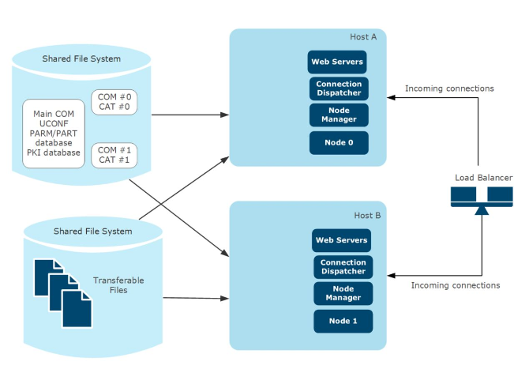
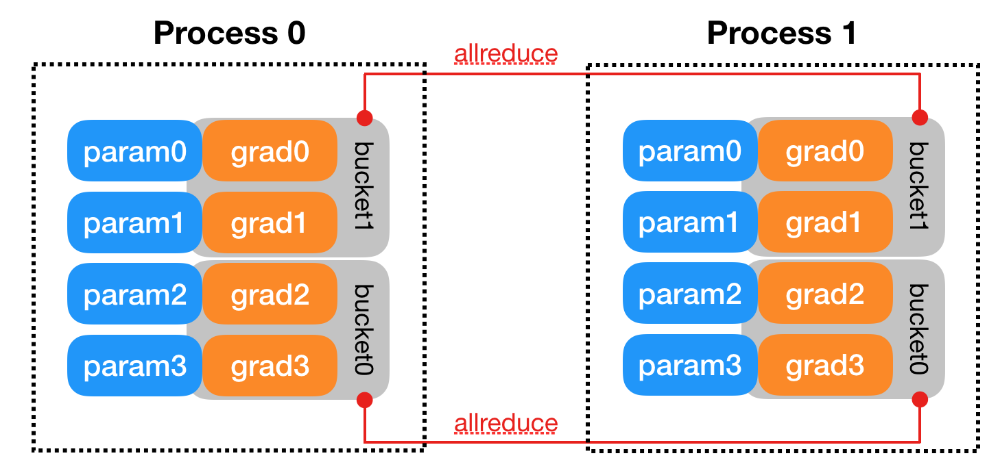
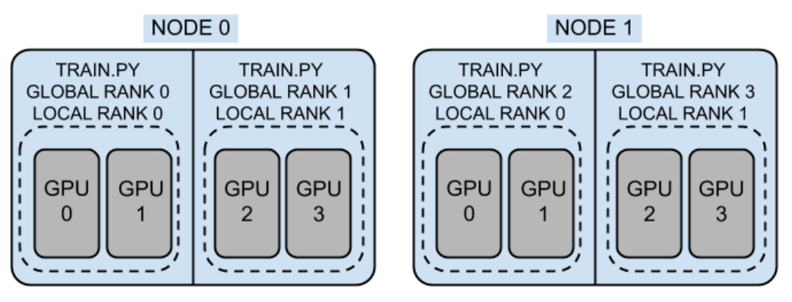

# Распределенное обучение в коде (автор: Владислав Понизяйкин)

Ранее мы разобрались, что такое:
* single device
* multi-device
* multi-node
* 
И даже поняли, как работает _DistributedDataParallel_.

В этой главе мы посмотрим на практическое применение вышеупомянутых методов, а точнее посмотрим как оно реализуется в коде.

> Для удобства, мы рассмотрим методы запуска на разном количестве GPU/машин в случае использования PyTorch и PyTorch-lightning

## Single device

> Это способ обучения, представляющий из себя обучения на одной GPU. Отлично подойдет, если необходимо обучить небольшую модель.

На самом деле, реализуется он довольно просто. Достаточно указать:

```
# PyTorch
device = torch.device("cuda:0")
model.to(device)
```

После этого, как правило, ваша модель начнет обучаться на GPU. В частных случаях придется аналогичным образом руками перекинуть данные на GPU, а также, возможно, указать `export CUDA_VISIBLE_DEVICES=1`, чтобы _PyTorch_ увидел _cuda_.

## Multi-device

> Этот метод заключается в обучении модели на нескольких GPU, установленных на **одной** ноде. Под нодой мы понимаем машину с GPU, CPU и RAM.

Как мы успели увидеть, зачастую возникают случаи, когда мы не можем обучиться на одной GPU - например, это слишком медленно, или нам не хватает видеопамяти одной GPU (хотя на самом деле, тут _DataParallel_ не поможет). Тут нам на помощь приходит **Data Parallel** - способ "раскидать" данные по нескольким GPU на одной тачке, чтобы обучаться на них параллельно.

В PyTorch стандартное обучение на GPU - это обучение на одной GPU, поэтому придется немного подправить код. К счастью, делается это так же не сложно:

```
model = nn.DataParallel(model)
```

Ниже можно увидеть более детальный код.
<details><summary>Пример кода для DataParallel с 4 GPU</summary>
<pre><code>
import torch
import torch.nn as nn
from torch.utils.data import Dataset, DataLoader
    
input_size = 5
output_size = 2

batch_size = 30
data_size = 100

device = torch.device("cuda:0" if torch.cuda.is_available() else "cpu")

class RandomDataset(Dataset):

    def __init__(self, size, length):
        self.len = length
        self.data = torch.randn(length, size)

    def __getitem__(self, index):
        return self.data[index]

    def __len__(self):
        return self.len

class Model(nn.Module):
    # Our model

    def __init__(self, input_size, output_size):
        super(Model, self).__init__()
        self.fc = nn.Linear(input_size, output_size)

    def forward(self, input):
        output = self.fc(input)
        print("\tIn Model: input size", input.size(),
              "output size", output.size())

        return output

rand_loader = DataLoader(dataset=RandomDataset(input_size, data_size),
                         batch_size=batch_size, shuffle=True)

model = Model(input_size, output_size)
if torch.cuda.device_count() > 1:
  print("Let's use", torch.cuda.device_count(), "GPUs!")
  model = nn.DataParallel(model)

model.to(device)

for data in rand_loader:
    input = data.to(device)
    output = model(input)
    print("Outside: input size", input.size(),
          "output_size", output.size())
</code></pre>
</details>
<details><summary>Пример вывода</summary>
<pre><code>
        In Model: input size torch.Size([8, 5]) output size torch.Size([8, 2])
        In Model: input size torch.Size([8, 5]) output size torch.Size([8, 2])
        In Model: input size torch.Size([8, 5]) output size torch.Size([8, 2])
        In Model: input size torch.Size([6, 5]) output size torch.Size([6, 2])
Outside: input size torch.Size([30, 5]) output_size torch.Size([30, 2])
        In Model: input size torch.Size([8, 5]) output size torch.Size([8, 2])
        In Model: input size torch.Size([8, 5]) output size torch.Size([8, 2])
        In Model: input size torch.Size([6, 5]) output size torch.Size([6, 2])
        In Model: input size torch.Size([8, 5]) output size torch.Size([8, 2])
Outside: input size torch.Size([30, 5]) output_size torch.Size([30, 2])
        In Model: input size torch.Size([8, 5]) output size torch.Size([8, 2])
        In Model: input size torch.Size([8, 5]) output size torch.Size([8, 2])
        In Model: input size torch.Size([8, 5]) output size torch.Size([8, 2])
        In Model: input size torch.Size([6, 5]) output size torch.Size([6, 2])
Outside: input size torch.Size([30, 5]) output_size torch.Size([30, 2])
        In Model: input size torch.Size([3, 5]) output size torch.Size([3, 2])
        In Model: input size torch.Size([3, 5]) output size torch.Size([3, 2])
        In Model: input size torch.Size([3, 5]) output size torch.Size([3, 2])
        In Model: input size torch.Size([1, 5]) output size torch.Size([1, 2])
Outside: input size torch.Size([10, 5]) output_size torch.Size([10, 2])
</code>
</pre></details>

Таким образом, мы видим, что распараллелить данные на несколько GPU не так сложно.

Но более интересный вопрос - а как распараллелить вычисления на несколько нод?

## Multi machines

> DistributedDataParallel (DDP) реализует параллелизм данных на модульном уровне, и может работать на нескольких машинах.

Для начала разберемся, в чем разница между _DataParallel_ и _DistributedDataParallel_:
* Для начала, _DataParallel_ - это одиночный процесс, который работает только на одной ноде. В то же время, _DistributedDataParallel_ может содержать несколько процессов и работать сразу на нескольких нодах.
* Как мы упомянули в предыдущем пункте - _DataParallel_ не сможет помочь в случае, когда для обучения не хватает видеопамяти одной GPU. Дело в том, что для подобного необходимо пользоваться не _DataParallel_, а _ModelParallel_. И вот _DistributedDataParallel_ это умеет.

Сама суть подхода такая: приложение, использующее DDP должно порождать несколько процессов, и создавать по одному экземпляру DDP для каждого процесса. Как правило, один процесс запускается на нескольких GPU на одной ноде. Допустим, они смогут обучаться с конкретным экземпляром DDP на разных нодах - но как синхронизировать эти вычисления? DDP делает так, что при вычислении градиента на _backward_ шаге он запускает этап "синхронизации градиентов" - агрегирует полученные градиенты и отправляет обновление во все экземпляры.

Как не странно, рекомендуемый подход - создавать ровно по одному процессу для каждой реплики модели. Это довольно удобно при вычисления градиента для конкретной реплики. Причем одна реплика может охватывать несколько GPU.

Схематично, это выглядит так:



А процесс обмена информацией выглядит так:



Процессы, в то же время, можно изобразить как тут:



Тут каждый процесс запущен на двух GPU. Кстати говоря, можно увидеть _global rank_ и _local rank_ - это ровно то, о чем мы говорили в главе **Алгоритмы параллелизации в распределенных системах**.

<details><summary>Пример кода</summary>
<pre><code>
  import os
  import sys
  import tempfile
  import torch
  import torch.distributed as dist
  import torch.nn as nn
  import torch.optim as optim
  import torch.multiprocessing as mp
    
    from torch.nn.parallel import DistributedDataParallel as DDP
    
    def setup(rank, world_size):
        os.environ['MASTER_ADDR'] = 'localhost'
        os.environ['MASTER_PORT'] = '12355'
        dist.init_process_group("gloo", rank=rank, world_size=world_size)
    
    def cleanup():
        dist.destroy_process_group()
    
    class ToyModel(nn.Module):
        def __init__(self):
            super(ToyModel, self).__init__()
            self.net1 = nn.Linear(10, 10)
            self.relu = nn.ReLU()
            self.net2 = nn.Linear(10, 5)
            
        def forward(self, x):
            return self.net2(self.relu(self.net1(x)))
    
    
    def demo_basic(rank, world_size):
        print(f"Running basic DDP example on rank {rank}.")
        setup(rank, world_size)
    
        model = ToyModel().to(rank)
        ddp_model = DDP(model, device_ids=[rank])
    
        loss_fn = nn.MSELoss()
        optimizer = optim.SGD(ddp_model.parameters(), lr=0.001)
    
        optimizer.zero_grad()
        outputs = ddp_model(torch.randn(20, 10))
        labels = torch.randn(20, 5).to(rank)
        loss_fn(outputs, labels).backward()
        optimizer.step()
    
        cleanup()
    
    
    def run_demo(demo_fn, world_size):
        mp.spawn(demo_fn,
                 args=(world_size,),
                 nprocs=world_size,
                 join=True)
</code></pre>
</details>

## Применение в библиотеках

В этом пункте мы посмотрим, как применяется распараллеливание в библиотеках, которые мы успели упомянуть ранее.

### Deepspeed

Стратегия проста - при имеющемся:

```
model_engine, optimize, _, _ = deepspeed.initialize(args=cmd_args, model=model, model_parameters=params
```

Можно действовать по указанному выше способу. Достаточно заменить

```
torch.distributed.init_process_group(...)
```

на

```
deepspeed.init_distributed()
```

Сам процесс обучения при этом не меняется.

### PyTorch Lightning

Тут все даже интуитивнее - достаточно добавить `accelerator`, `devices` и `strategy` в `Trainer`:

```
trainer = Trainer(..., accelerator="gpu", devices=8, strategy="ddp")

# или

trainer = Trainer(..., accelerator="gpu", devices=8, strategy="ddp", num_nodes=4) # 8*4 = 32 gpus
```

## EXTRA. Model Parallel

> Подход, позволяющий "разбить" модель на части, тем самым позволяя обучаться модели, которая не лезет на одну GPU (не хватает видеопамяти)

Идея проста - у нас есть модель, состоящая из блоков/слоев. Зачем мы будем хранить модель на одной GPU, когда можно разделить ее и положить на несколько? Ниже приведем пример, как "поделить" _resnet50_:

```
from torchvision.models.resnet import ResNet, Bottleneck

num_classes = 1000


class ModelParallelResNet50(ResNet):
    def __init__(self, *args, **kwargs):
        super(ModelParallelResNet50, self).__init__(
            Bottleneck, [3, 4, 6, 3], num_classes=num_classes, *args, **kwargs)

        self.seq1 = nn.Sequential(
            self.conv1,
            self.bn1,
            self.relu,
            self.maxpool,

            self.layer1,
            self.layer2
        ).to('cuda:0')

        self.seq2 = nn.Sequential(
            self.layer3,
            self.layer4,
            self.avgpool,
        ).to('cuda:1')

        self.fc.to('cuda:1')

    def forward(self, x):
        x = self.seq2(self.seq1(x).to('cuda:1'))
        return self.fc(x.view(x.size(0), -1))
```

Заодно, посмотрим, как _ModelParallel_ сказывается на скорости обучения:

<details><summary>Код запуска</summary>
<pre><code>
  import matplotlib.pyplot as plt
  plt.switch_backend('Agg')
  import numpy as np
  import timeit
    
    num_repeat = 10
    
    stmt = "train(model)"
    
    setup = "model = ModelParallelResNet50()"
    mp_run_times = timeit.repeat(
        stmt, setup, number=1, repeat=num_repeat, globals=globals())
    mp_mean, mp_std = np.mean(mp_run_times), np.std(mp_run_times)
    
    setup = "import torchvision.models as models;" + \
            "model = models.resnet50(num_classes=num_classes).to('cuda:0')"
    rn_run_times = timeit.repeat(
        stmt, setup, number=1, repeat=num_repeat, globals=globals())
    rn_mean, rn_std = np.mean(rn_run_times), np.std(rn_run_times)
    
    
    def plot(means, stds, labels, fig_name):
        fig, ax = plt.subplots()
        ax.bar(np.arange(len(means)), means, yerr=stds,
               align='center', alpha=0.5, ecolor='red', capsize=10, width=0.6)
        ax.set_ylabel('ResNet50 Execution Time (Second)')
        ax.set_xticks(np.arange(len(means)))
        ax.set_xticklabels(labels)
        ax.yaxis.grid(True)
        plt.tight_layout()
        plt.savefig(fig_name)
        plt.close(fig)
    
    
    plot([mp_mean, rn_mean],
         [mp_std, rn_std],
         ['Model Parallel', 'Single GPU'],
         'mp_vs_rn.png')
</code></pre>
</details>


Видим, что при распараллеливании модель отрабатывает на 7% дольше. Это доказывает, что сам метод не призван улучшить производительность - он только помогает выйти из ситуации критической нехватки ресурсов.
