## I-Code V3(CoDi): Any-to-Any Generation via Composable Diffusion

Уже существуют генеративные модели, работающие с несколькими модальностями(чаще всего с текстом и изображениями). 
Однако авторы [статьи](https://arxiv.org/pdf/2305.11846.pdf) пошли дальше и предложили модель $CoDi$, 
способную обрабатывать и генерировать произвольные наборы модальностей. 

До этого модели были ограничены требуемыми данными, которые должны содержать разные модальности и при этом 
соотноситься друг с другом. Например, нужно видео с аудиодорожкой и при этом должно быть некоторое текстовое описание для него. 
Очевидно, таких данных не много. А последовательно из одной модальности генерировать следующую - долго, 
дорого и качество такой генерации будет ограничено.

### Общая схема обучения

Во-первых, авторы обучили латентные диффузионные модели (LDM) для каждой модальности(текст, изображения, видео и аудио). 
Так получили качественные одномодальные генеративные модели. Для условной межмодальной 
генерации(например, по тексту генерировать аудио) входные модальности проецируются в общее пространство признаков. 
Такой механизм подготавливает диффузионную модель к обуславливанию на произвольный набор модальностей, без прямого обучения для этого. 

Во-вторых, добавляются модули cross-atetntion для каждого диффьюзера и environment encoder V для проекции 
латентных переменных разных LDM в общее пространство признаков. Далее замараживаются LDM. Поскольку V для каждого энкодера выравнены, LDM могут взаимодействовать с люым набором модальностей, интерполируя входные данные эмбеддингами из V.

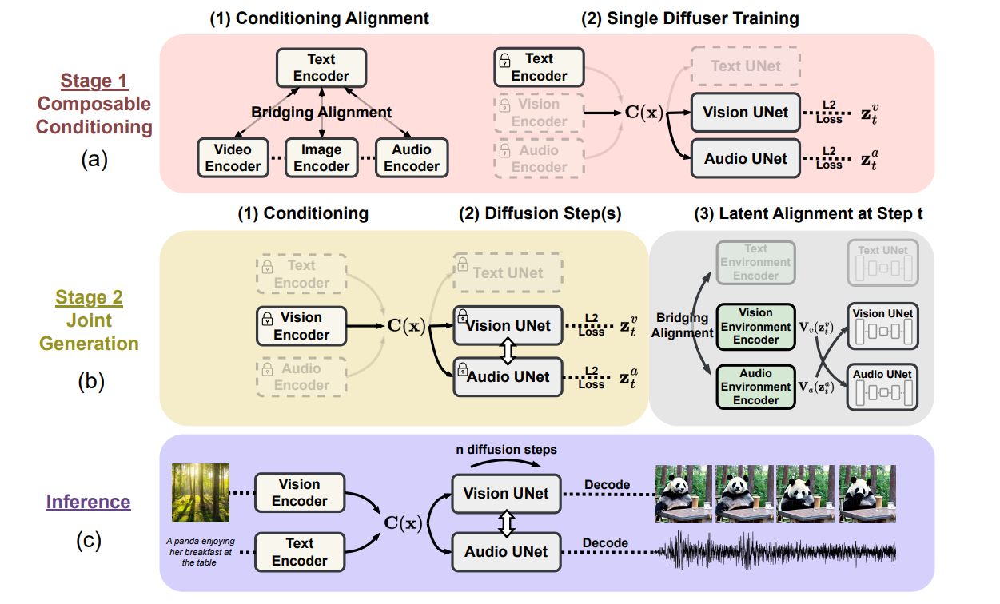

### Composable Multimodal Conditioning

Одновременная оптимизация всех четырех кодеров подсказок комбинаторным способом требует больших вычислительных затрат при наличии $O(n_2)$ пар. Более того для некторых модальностей мало парных датасетов(например, изображение и аудио). Чтобы решить эту проблему, авторы предлажили метод "Bridging Alignment" для выравнивания энкодеров. В качестве связующей модальности выбран текст, так как с ним существует множество парных датасетов. 

### Composable Diffusion

#### Image Diffusion Model

Для энкодеров изобраений была выбрана архитектура Stable Diffusion 1.5 и инициализирована теми же весами. Повторное использование весов переносит знания и исключительную точность генерации Stable Diffusion 1.5, обученной на крупномасштабных наборах данных изображений высокого качества.

#### Video Diffusion Model

Чтобы моделировать временные свойства видео и одновременно поддерживать
качество генерации видения, создается видео diffuser, расширяя diffuser изображений временными модулями. В частности, используем псевдовременной механизм внимания перед residual блоком. Однако утверждается, что псевдовременное внимание позволяет видеокадрам глобально взаимодействовать друг с другом только путем выравнивания пикселей (размерность высоты, ширины), что приводит к
отсутствию межкадрового взаимодействия между локальными пикселями. Авторы утверждают, что это приводит к общей проблеме временной несогласованности расположения, формы и цвета при генерации видео. Для решения этой проблемы предлагается адаптировать метод скрытого
сдвига, который выполняет пространственно-временные сдвиги скрытых объектов в соответствии с временным
вниманием. Видео делится по скрытому измерению на k = 8 фрагментов, и для каждого фрагмента i = от 0 до 7 мы сдвигаем временное измерение вперед на i позиций. 

#### Audio Diffusion Model
Чтобы обеспечить гибкое переключение между модальностями при совместной генерации, аудиодиффузор спроектирован так, чтобы иметь архитектуру, аналогичную визуальным диффузорам, где mel-спектрограмму можно естественным образом рассматривать как изображение с 1 каналом. Используется энкодер VAE для кодирования мелспектрограммы звука в сжатое скрытое пространство. При синтезе звука декодер VAE сопоставляет скрытую
переменную с mel-спектрограммой, а vocoder генерирует аудиосэмпл из mel-спектрограммы.

#### Text Diffusion Model

VAE для текстового LDM является OPTIMUS, а его кодировщиком и декодером являются BERT и GPT-2 соответственно. Для денойзинга UNet, в отличие от UNet в image diffusion, $2D$ свертка в residual блоках заменяется одномерной сверткой.

### Joint Multimodal Generation by Latent Alignment

Заключительный шаг заключается в обеспечении перекрестного внимания между потоками диффузии при одновременной генерации двух или более модальностей. Это достигается добавлением подуровней перекрестного внимания к UNet θ. 
V (·) различных модальностей обучаются для выравнивания с помощью contrastive learning. Задача V - достигнуть генерации людых наборов модальностей. В итоге, CoDi может генерировать модальности A и B, хотя в данных были только пары A-C и D-C.

### Результаты

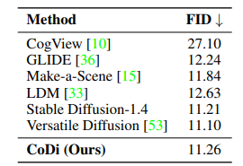 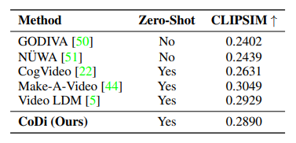

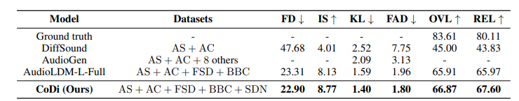

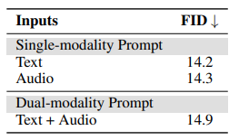

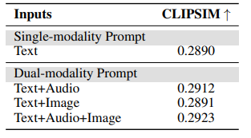

## I-Code Studio: A Configurable and Composable Framework for Integrative AI

Интегративный ИИ является одним из важных направлений подхода
AGI, посредством объединения нескольких моделей для
решения сложных мультимодальных задач. В этой [статье](https://arxiv.org/pdf/2305.13738.pdf) Microsoft предлагает i-Code Studio, настраиваемый
и компонуемый фреймворк для интегративного AGI. I-Code Studio объединяет несколько предобученных моделей без fine-tuning'а для выполнения сложных мультимодальных задач. Вместо композиции моделей i-Code Studio предоставляет интегративную, гибкую и компонуемую среду, позволяющую разработчикам быстро и легко
создавать передовые сервисы и технологии, адаптированные к их конкретным требованиям.
I-Code Studio добивается впечатляющих результатов при
выполнении различных мультимодальных задач в zero-shot формате, таких как
преобразование видео в текст, перевод речи в речь и визуальные ответы на вопросы.

### The i-Code Studio Framework

Для сложных мультимодальных задач,
i-Code Studio предоставляет
разработчикам универсальную платформу для быстрой и простой интеграции и создания нескольких больших предварительно обученных моделей и сервисов
в различных модальностях без какого-либо обучения или
fine-tuning'а.

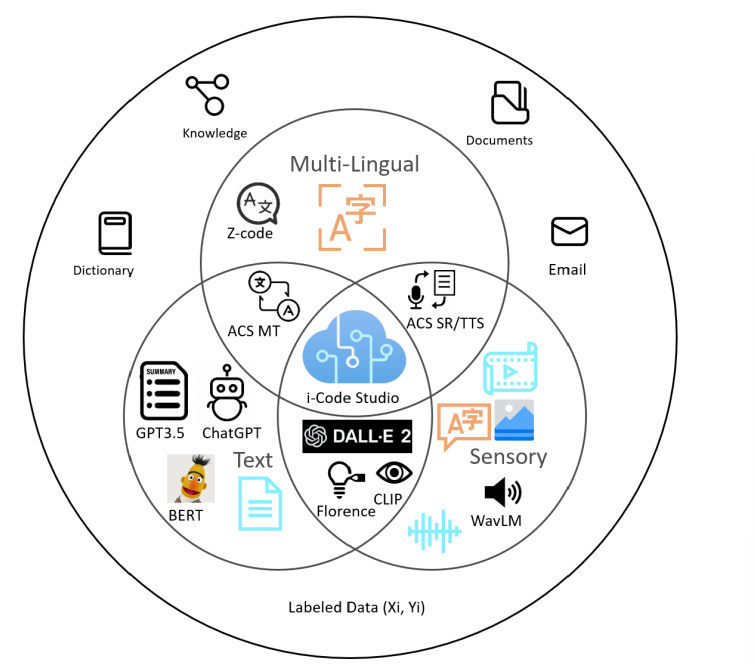

Для каждой задачи фреймворк может быть представлен
с помощью DAG, где узлы без входящего ребра
являются необработанными входными данными, такими как изображение, текст, видео
и речь, узлы без исходящих ребер являются
выходными данными данной задачи, а остальные
узлы являются базовыми моделями/сервисами или хранить промежуточные выходные данные модели из других моделей/сервисов.
Входные данные для узла поступают из необработанных входных данных
и/или выходных данных предыдущих узлов. Входные
данные проходят через каждый узел в DAG, позволяя
выполнять сложные мультимодальные задачи.
Исходящий ребро от узла модели/сервиса представляет
API, предоставляемый моделью/сервисом. Для каждой задачи, входные данные поступают в DAG из входных узлов
и обрабатываются одной или несколькими моделями или
сервисами моделей. 

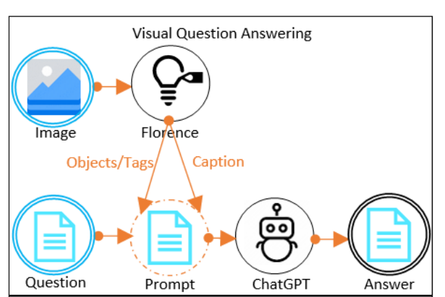

Для каждой задачи DAG настраивается таким образом, чтобы
связанные модели взаимодействовали для получения желаемого
результата. Различные компоненты i-Code Studio взаимодействуют, образуя единое интегрированное
решение и его можно настроить в соответствии с конкретными
потребностями пользователя. Например, для
задачи "Ответы на визуальные вопросы" (VQA) входными данными являются изображение и
вопрос, связанный с изображением (см. рис. 2).
Сначала мы можем применить к входному изображению службы субтитров и обнаружения объектов. Выходной текст,
содержащий визуальную информацию, объединяется
с вводимым вопросом в качестве запроса для ChatGPT,
который отвечает на вопрос. Для преобразования речи в речь
в DAG настроено распознавание речи
(SR) → Машинный перевод (MT) →
Преобразование текста в речь (TTS). Этот DAG расшифровывает
исходную речь, переводит транскрипцию на
целевой язык и генерирует целевую речь.

### Результаты

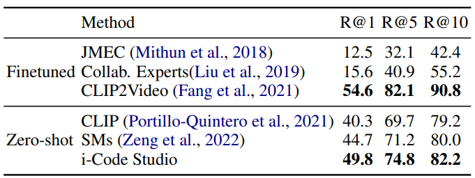

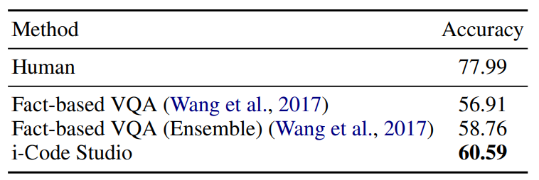

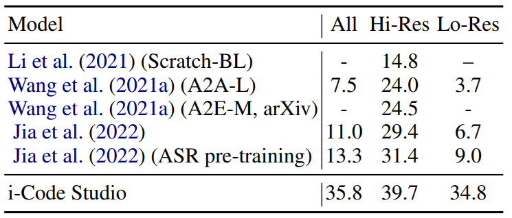
