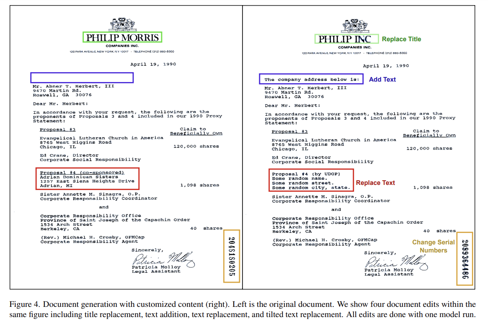
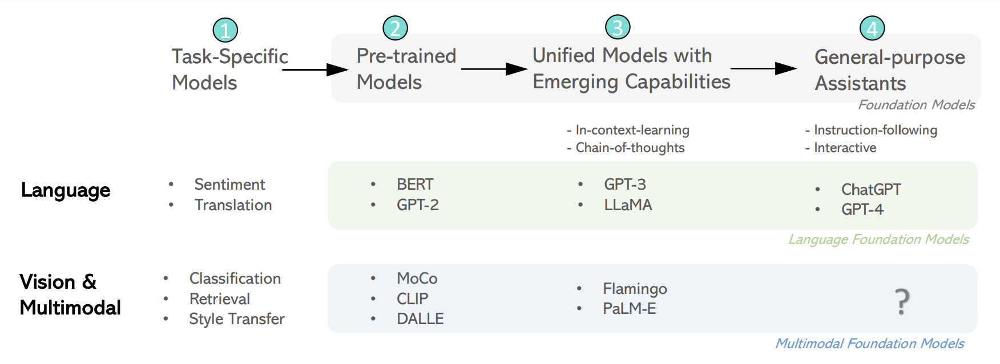
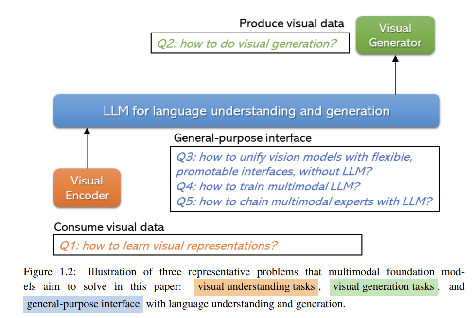
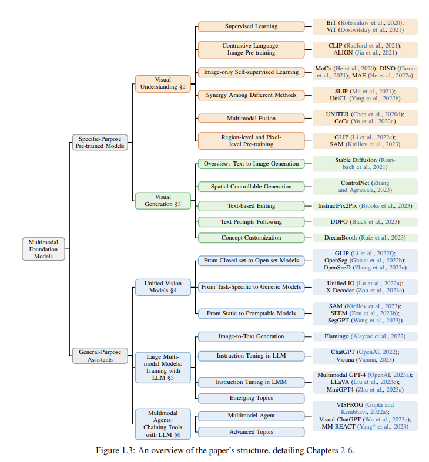

## Intro to Multimodal Models
_"... a large gap persists between the capabilities of LLMs and true humanlike intelligence. 
This is partially because humans perceive a variety of sensory inputs while LLMs are typically
restricted to Language..."_ - Microsoft Azure Cognitive Services Research (MACSR)

"_The convergence of text, visual, and audio data is a key step towards human-like
artificial intelligence_" - MACSR.
### Selling Multimodal

#### Ilya Sutskever, OpenAI chief scientist
В [недавнем интервью](https://www.nvidia.com/en-us/on-demand/session/gtcspring23-s52092/?ncid=so-yout-561702)
Илья рассказал про свое видение Multimodal направления развития ML. 
Две причины почему расширение LLM на другие модальности (в основном vision) кажется Илье интересным:

 - Humble: это просто полезно.
   Мир, как его воспринимает человек, очень визуален. 
   Поэтому полезность нейросеток без визуальной модальности не такая большая, 
   как могла бы быть если бы сетки видели то, что видят люди. 
   Кстати, в GPT-4 добавили vision, теперь это мультимодальная модель.
 - Not as clear-cut as it may seem: дополнительно учась на изображениях, 
   модель узнает и поймет больше, чем пользуясь одним текстом.
   Люди за всю жизнь слышат не более миллиарда слов, 
   и для людей важно получать информацию из всех доступных модальностей, 
   причем он считает, что мы выучиваем гораздо больше из визуальной модальности. 
   То же верно для сеток, с тем исключением, что сетки успевают увидеть триллионы слов, 
   поэтому им проще узнать много о мире из одного лишь текста. 
   Тем не менее, это неэффективно, 
   и можно гораздо быстрее понять мир пользуясь изображениями и видео.
   То есть важное преимущество, которое приносит Multimodal - 
   благодаря новым каналам информации
   становится проще обучиться понимать мир. А также приблизить понимание
   к человеческому.

Он приводит пример с GPT-4, которая начала решать математический тест 
c диаграммами в условиях сильно лучше после добавления Vision.
Илья говорит, что кроме понимания мира есть и другие аспекты:
иметь возможность рассуждать ("to reason") визуально и коммуницировать визуально -
это очень мощные вещи.
   
#### New capabilities
С Multimodal LLM-агенты становятся приспособлены к задачам, 
которые не удавалось качественно решить в Unimodal сеттинге. 
Пример: Document Editing.

[SOTA-решение](https://arxiv.org/pdf/2212.02623.pdf) (на 13 марта) 
обрабатывает документ по трем модальностям - visual, text и layout 
(разметка, тоже своего рода модальность). На вход подается изображение,
из него экстрагируется layout и text, после чего трансформер обучается на трех
связанных модальностях. Ожидаемо 
подход имеет преимущество перед наивным ViT с masked unit modelling.

### Состояние области в соответствии с недавним [обзором](https://arxiv.org/pdf/2309.10020.pdf)
Иллюстрация текущего положения дел из [обзорной статьи](https://arxiv.org/pdf/2309.10020.pdf) 
про Multimodal c упором на vision - параллель между прогрессом Textual и Multimodal моделей.
Ниже перечислены основные модели по стадии развития - 
pre-trained модели типа BERT для LLM (e.g. CLIP, понимающий что-то про соответствия между картинками и подписями к ним),
затем более общеприменимые модели с emergent capabilities (то есть приспособленные к решению задач, на которые их не обучали прямо), 
см. [Flamingo: a Visual Language Model for Few-Shot Learning](https://arxiv.org/abs/2204.14198). И, наконец, что-то вроде GPT-4, но мультимодальное.
Скажем, GPT-4-Vision, не знаю, почему его тут нет. Авторы отделяют эту категорию от предыдущей по разрезу instruction-following и alignment.

Главные компоненты задачи (Q1-5), выделенные в той статье, в зависимости от шага в пайплайне (visual understanding, general-purpose interface посередине, и visual generation на выходе).

А также классификация существующих vision-ориентированных моделей по функции. Подробности дизайна конкретных архитектур и лосс функций можно посмотреть в статье.

### Central challenges

 - Сбор и разметка данных.
К примеру, собрать сбалансированный датасет постов, содержащих составляющие из разных модальностей -
тект, изображения, видео - непростая задача. Размечать такие данные сложнее, поскольку приходится работать с несколькими каналами информации.
Кроме того, приходится решать проблемы с неточной согласованностью модальностей -
картинка может соответствовать различным частям текста (например, относится к предыдущей странице документа), субтитры не всегда сходятся с аудиодорожками во времени.
 - Сложность модели.
Вследствие необходимости интегрировать разные типы данных мультимодальные модели имеют сложную структуру.
 - Data Fusion.
Как и в какой момент собирать разные модальности в один смешанный поток информации?
Слишком ранний или поздний Fusion приводят к нечувствительности к особенностям отдельной модальности или нечувствительности к связям между ними.
Более того, в зависимости от решаемой задачи приходится искать баланс важности между модальностями:
например, для рекомендательной системы - между текстом (тэги, жанры), визуальной частью (постеры) и аудио (саундтреки, диалоги).

### Stuff worth checking out 
[QuilLLMan](https://modal.com/docs/examples/llm-voice-chat) -- Vicuna и Whisper, смерженные в один пайплайн, то есть голосовой LLM-бот.
[Wav2Vec](https://arxiv.org/pdf/1904.05862.pdf) - как работают с аудио-модальностью? См. секцию Bimodal этой главы.
[Universal Document Processing](https://arxiv.org/pdf/2212.02623.pdf) - дублирую прикольное мультимодальное SOTA решение для редактирования документов.
