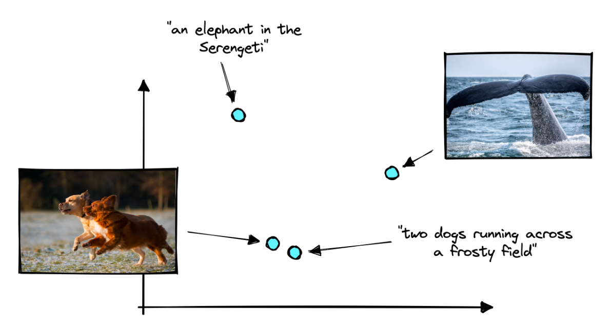

# Bimodal
## CLIP
Contrastive Learning In Pretraining (CLIP) - это третья модель мирового масштаба. Он может воспринимать концепции как в тексте, так и в изображении и даже связывать концепции между двумя модальностями. В этой главе мы узнаем о мультимодальности, о том, как работает CLIP и как использовать CLIP для различных вариантов использования, таких как кодирование, классификация и обнаружение объектов.

Мультимодальный характер CLIP обеспечивается двумя моделями кодеров, обученных “говорить на одном языке”. Текстовые входные данные передаются в кодировщик текста, а графические - в кодировщик изображений. Затем эти модели создают векторное представление соответствующих входных данных.

Обе модели “говорят на одном языке", кодируя схожие концепции в тексте и изображениях в схожие векторы. Это означает, что текст “две собаки, бегущие по морозному полю” будет выводить вектор, подобный изображению двух собак, бегущих по морозному полю.

Мы можем представить язык, на котором говорят эти модели, как векторное пространство, в котором они кодируют векторы. Эти две модели могут передавать тонкую информацию о тексте и изображениях через это векторное пространство. Однако этот “векторный язык” слишком абстрактен, чтобы мы могли его понять напрямую.

Вместо непосредственного чтения этого “языка” мы можем обучить другие простые нейронные сети понимать его и делать понятные нам прогнозы. Или мы используем векторный поиск для выявления похожих концепций и шаблонов в текстовой и графической областях.

Давайте посмотрим на CLIP в действии.

CLIP фактически состоит из двух моделей, обучаемых параллельно. 12-слойный преобразователь текста для построения текстовых вложений и ResNet или vision transformer (ViT) для построения графических вложений.

Кодировщик текста и кодировщик изображений (ResNet или ViT) выводят отдельные векторные вложения для каждой записи текста / изображения, загружаемой в кодировщики. Все векторы имеют 512 измерений и могут быть представлены в одном векторном пространстве, что означает, что похожие изображения и текст создают векторы, которые появляются рядом друг с другом.

### Contrastive Pretraining

Идея заключается в том, что, предоставляя большой модели много данных, они могут извлекать общие закономерности из набора данных.

Для языковых моделей это могут быть общие правила и шаблоны английского языка. Для визуальных моделей это могут быть характеристики различных сцен или объектов.

Проблема мультимодальности заключается в том, что эти модели обучаются отдельно и по умолчанию не понимают друг друга. CLIP решает эту проблему благодаря изображению и тексту контрастное предварительное обучение. С CLIP кодировщики текста и изображений обучаются с учетом другой модальности и контекста. Это означает, что кодировщики текста и изображений разделяют “косвенное понимание” шаблонов в обеих модальностях; языке и видении.

Контрастивное предварительное обучение работает путем взятия пары (текст, изображение), где текст описывает изображение, и обучения кодированию пар как можно точнее в векторном пространстве.

Чтобы это работало хорошо, нам также нужны отрицательные пары для обеспечения контрастного сравнения. Нам нужны положительные пары, которые должны выводить похожие векторы, и отрицательные пары, которые должны выводить разные векторы.

Это общая идея контрастного обучения, которую можно найти в обучающих функциях многих моделей, особенно тех, которые создают векторы встраивания.

Отрицательные пары могут быть извлечены непосредственно из положительных пар. Если у нас есть положительные пары  $(T_1, I_1)$ и $(T_2, I_2)$, то мы просто меняем компоненты местами, получая отрицательные пары $(T_1, I_2)$ и $(T_2, I_1)$.
 
При этом мы можем применить функцию потерь, которая максимизирует сходство между $(T_1, I_1)$ и $(T_2, I_2)$ и минимизирует сходство между $(T_1, I_2)$ и $(T_2, I_1)$. В целом это выглядит так:

На этом изображении мы можем видеть один этап предварительной подготовки для одной партии. Функция потерь предполагает, что пары по диагонали должны иметь максимальное значение произведения, а все остальные пары должны иметь минимальное значение произведения. Для этого оптимизированы как текстовые, так и графические кодеры.

Фундаментальное предположение заключается в том, что в одной партии нет других положительных пар. Например, мы предполагаем, что “две собаки, бегущие по морозному полю” относится только к изображению, с которым оно сопряжено. Мы предполагаем, что других текстов или изображений с похожим значением нет.

Это предположение возможно, поскольку наборы данных, используемые для предварительного обучения, разнообразны и достаточно велики, так что вероятность появления двух похожих пар в одном пакете ничтожно мала. Таким образом, он достаточно редкий, чтобы практически не оказывать негативного влияния на результаты перед тренировкой.

## Wav2Vec
Если выше мы говорили о связи картинок и текста, то теперь давайте поговорим о связи звука и текста.

Нейронные сети на основе трансформаторов произвели революцию в области обработки естественного языка, но только начинают набирать популярность в сообществе специалистов по обработке речи. Wav2vec 2.0 призван изменить это. Его архитектура основана на кодере Transformer, с обучающей целью, аналогичной цели **BERT’s masked language modeling**, но адаптированной для речи.

Этот новый метод позволяет проводить эффективное [обучение под контролем](https://en.wikipedia.org/wiki/Weak_supervision): сначала предварительно обучите модель большому количеству немаркированной речи, затем выполните точную настройку на меньшем маркированном наборе данных. В [оригинальной статье wav2vec 2.0](https://proceedings.neurips.cc/paper/2020/hash/92d1e1eb1cd6f9fba3227870bb6d7f07-Abstract.html) авторы продемонстрировали, что точная настройка модели всего на одном часе помеченных речевых данных может превзойти предыдущие современные системы, обученные на в 100 раз большем количестве помеченных данных.

Посмотрим на архитектуру wav2vec 2.0 подробнее:

### Feature encoder

Задача *Feature encoder* заключается в уменьшении размерности аудиоданных, преобразовывая исходную форму сигнала в последовательность векторов функций $Z_0, Z_1, Z_2, …, Z_T$ каждые 20 миллисекунд. Его архитектура проста: 7-слойная сверточная нейронная сеть (одномерная) с 512 каналами на каждом уровне.

Форма сигнала нормализуется перед отправкой в сеть, а ширина ядра и шаги сверточных слоев уменьшаются по мере того, как мы поднимаемся выше в сети. Общее поле восприятия функционального кодера составляет 400 сэмплов, или 25 мс звука (аудиоданные кодируются с частотой дискретизации 16 кГц).

### Quantization module

Одним из основных препятствий при использовании преобразователей для обработки речи является непрерывный характер речи. Письменный язык может быть естественным образом разделен на слова или подслова, что создает ограниченный словарь отдельных единиц. В речи нет таких естественных подразделений. Мы могли бы использовать волны как дискретную систему, но тогда нам понадобилось бы, чтобы люди предварительно помечали весь набор данных, поэтому мы не смогли бы предварительно обучаться работе с немаркированными данными.

Wav2vec 2.0 предлагает автоматическое изучение отдельных единиц речи путем выборки из [Gumbel-Softmax distribution](https://paperswithcode.com/method/gumbel-softmax). Возможные единицы состоят из кодовых слов , выбранных из кодовых книг (группы). Кодовые слова затем объединяются, образуя конечную речевую единицу. В Wav2vec используются 2 группы по 320 возможных слов в каждой, следовательно, теоретический максимум составляет 320 $\times$ 320 = 102 400 речевых единиц.

Скрытые характеристики умножаются на матрицу квантования, чтобы получить логические значения: по одному баллу за каждое из возможных кодовых слов в каждой кодовой книге. Gumbel-Softmax trick позволяет выбрать одно кодовое слово из каждой кодовой книги после преобразования логитов в вероятности. Это похоже на использование argmax, за исключением того, что операция полностью дифференцируема. Кроме того, в процесс выборки введен небольшой эффект случайности, действие которого контролируется температурным параметром, чтобы облегчить обучение и использование кодовых слов.

### Context network

Ядром wav2vec 2.0 является его преобразовательный кодер, который принимает в качестве входных данных векторы скрытых признаков и обрабатывает их через 12 блоков преобразования для получения *BASE* версии модели, или 24 блока для *LARGE* версии. Чтобы соответствовать внутреннему размеру преобразователя кодирования, последовательность ввода сначала должна пройти через слой проекции объектов, чтобы увеличить размер с 512 (выходной сигнал CNN) до 768 для *BASE* или 1,024 для *LARGE*.

Одно из отличий от оригинальной архитектуры Transformer заключается в том, как позиционная информация добавляется к входным данным. Поскольку функция self-attention у тарнсформера не сохраняет порядок входной последовательности, к входным векторам в исходной реализации были добавлены фиксированные предварительно сгенерированные позиционные вложения.

### Pre-training & contrastive loss

В процессе предварительной подготовки используется контрастивная задача для тренировки на немаркированных речевых данных. Маска сначала случайным образом применяется в скрытом пространстве, где ~ 50% проецируемых векторов это скрытые объекты. Замаскированные позиции затем заменяются тем же обученным вектором $Z_M'$ перед подачей в сеть трансформатора.

Затем окончательные векторы контекста проходят через последний слой проекции, чтобы соответствовать размеру квантованных речевых единиц $Q_t$. Для каждой замаскированной позиции, 100 отрицательных дистракторов равномерно выбираются из других позиций в том же предложении. Затем модель сравнивает сходство между спроецированным контекстным вектором $C_t'$ и истинная позитивная цель $Q_p$ вместе со всеми негативными отвлекающими факторами $Q_с$. Затем потеря контраста способствует высокому сходству с истинно положительной целью и наказывает за высокие показатели сходства с отрицательными отвлекающими факторами.

### Diversity loss

Во время предварительной подготовки к contrastive loss добавляется еще один loss, чтобы побудить модель использовать все кодовые слова одинаково часто. Это работает за счет максимизации энтропии для Gumbel-Softmax distribution, не позволяющий модели всегда выбирать из небольшой подгруппы всех доступных записей кодовой книги. Более подробную информацию вы можете найти в [оригинальной статье](https://proceedings.neurips.cc/paper/2020/hash/92d1e1eb1cd6f9fba3227870bb6d7f07-Abstract.html).

В завершиние хочется сказасть, что полученную предварительно обученную модель можно использовать для множества последующих задач с речью: автоматическое распознавание речи, [определение эмоций](https://jonathanbgn.com/speech/2020/10/31/emotion-recognition-transfer-learning-wav2vec.html), распознавание говорящего, определение языка… В оригинальной статье авторы напрямую доработали модель для распознавания речи с [потерей CTC](https://distill.pub/2017/ctc/), добавив линейную проекцию поверх контекстной сети для прогнозирования токена слова на каждом временном шаге.

## И ещё пара слов

Разные типы задач, решаемые одной моделью — это тоже своего рода мультимодальность. Например, классификация изображений и генрация (или object detection). Самый простой случай это, когда одна и та же модель (предобученный ViT) решает принципиально разные задачи. За счет чего так выходит? За счет семантической связности этих задач. Подробнее об этом можно поситать в статье [Exploring Plain Vision Transformer Backbones for Object Detection](https://arxiv.org/pdf/2203.16527.pdf).
