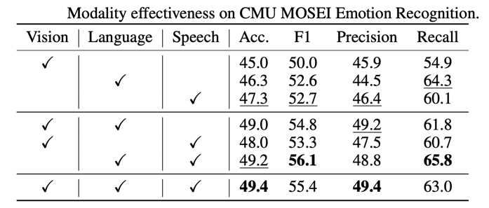

## i-Code-V1

Статья https://arxiv.org/abs/2205.01818, про i-Code-V1, была опубликована
5 мая 2022 года. На то время, по словам авторов, большинство методов предобучения
были ограничены одной или двумя размерностями. В статье был представлен i-Code – 
фреймворк для предобучения без учителя, пользователи которого могут 
гибко комбинировать компьютерное зрение, голосовую речь и естественные языки, и 
получать унифицированные представления (вектора) общего вида для любой комбинации входных данных.

В данном фреймворке данные каждой размерности вначале подаются на вход в соответствующий
предобученный одноразмерный энкодер, после чего интегрируются в мультимодальную сеть слияния, которая
использует новые механизмы внимания и другие иновационные особенности архитектуры. 
Вся система проходит сквозное предобучение с новой целевой функцией потерь, 
включая модуль маскирования размерности, и мультиразмерного контрастного обучения.

i-Code может динамически обрабатывать одно, два и три-размерные данные во время обучения и инференса.
Экспериментальные результаты демонстрируют, как i-Code может превзойти самые современные (на момент написания статьи)
методы в пяти задачах на понимание видео и бенчмарке GLUE NLP, улучшая качество на целых 11%
и демонстрируя мощь интегративного мультимодального предобучения. 

### Многоразмерные мультимодальные данные для предобучения

Для эффективного мультимодального обучения авторы собрали много данных для предобучения.
Они использовали два типа данных: видео, в которых есть все три размерности и двухмодальные наборы данных.

YT-Temporal-180M был выбран для представления видео с тремя модальностями: видео, речь и текст. 
Этот набор данных состоит из 180 миллионов видеоклипов, и для каждого видеоклипа авторы выбрали 8 кадров в качестве визуальных входных данных. 
Данные речи были извлечены из аудиофрагментов и прошли дальнейшую обработку. К каждому клипу также приложены субтитры, которые 
и использовались в качетсве текстовых данных. 

Помимо видео, использовались и двухмодальные данные. Florence computer vision foundation model (Yuan et al., 2021) 
содержит 72,8 миллионов пар изображений и текстовых описаний, а набор данных язык-речь содержит 75 тысяч часов 
английской речи с соответствующими транскрипциями. Для зрения-текста использовали датасет Spoken Moments in
Time (SMiT), состоящий из 500k содержит 500 тысяч озвученных титров, каждый из
которых изображает широкий спектр различных событий в коротком видеоролике.

Это первый случай, когда парные наборы данных использовались для обучения
моделей "зрение-язык-речь".
Такое объединение различных типов данных помогло улучшить производительность модели в мультимодальном обучении.

### Архитектура модели

Архитектура модели i-Code состоит из четырех модулей. Первые три модуля - это кодировщики отдельных модальностей (видео, язык и речь). 
Последний модуль - модуль слияния модальностей. Для каждой модальности мы подаем входные данные в соответствующий кодировщик, 
затем закодированные данные проходят через линейный и объединяются в модуле слияния модальностей.

Вместо того чтобы обучать каждый кодировщик модальности с нуля, авторы разработали модульную структуру, 
позволяющую использовать предобученные модели для каждой модальности. Это обеспечивает модулю слияния высококачественные
контекстные представления для более эффективного мультимодального понимания. 

Для каждой модальности используюстя state-of-the-art модели:

* Для кодировщика языка – DeBERTa V3 base (He et al., 2020), которая обладает разделенным механизмом внимания и достигла
выдающихся результатов на бенчмарках GLUE и SuperGLUE.
* Для кодировщика видео авторы адоптировали модель CoSwin Transformer (Yuan et al., 2021). Чтобы обеспечить возможность 
обработки как изображений, так и последовательности кадров (видео), создается экземпляр видео CoSwin Transformer из
предобученной модели CoSwin Transformer, следуя процедуре, описанной в работе Liu et al. (2021b). 
CoSwin Transformer содержит 91 миллион параметров.
* Для кодировщика речи используется предобученную версия WavLM-large (Chen et al., 2021), 315 миллионов параметров.
Модель использует темпоральный сверточный энкодер для извлечения признаков из входных речевых данных (звуковая волна) и
и трансформерный энкодер для дальнейшей обработки.

#### Модуль слияния модальностей

Характеристики, извлеченные каждым кодировщиком одной модальности, проецируются в скрытый слой сети слияния с помощью 
однослойной сети прямого распростронения. Полученные признаки (вектора) подаются на вход сети слияния модальностей для 
создания интегративных мультимодальных представлений. Поскольку позиционная информация уже включена в кодировщики одиночной 
модальности, авторы не используют позиционные эмбеддинги в модуле слияния.

Основой сети слияния является трансформерный энкодер, где каждый слой выполняет перекрестное внимание между модальностями, 
прямую проекцию и нормализацию слоя. Для облегчения более эффективного понимания разных модальностей мы исследуются две 
вариации традиционного механизма внимания: merge-attention и co-attention, как показано на рис. 1.

> Рис. 1. Слева: Общая архитектура модели i-Code. Справа: слои внимания и прямого распростронения в слое сети слияния с (a) 
> merge-attention и (b) co-attention. Для упрощения для модальности естественного языка изображены только остаточные соединения.

##### Merge-attention

В этой конфигурации для разных модальностей используются одни и те же параметры внимания. Чтобы помочь 
модулю слияния различать разные модальности, к проецированным характеристикам 
добавляется уникальный идентификатор для каждой модальности. Полученные эмбеддинги из разных модальностей объединяются 
вместе и подаются на вход сети слияния, где каждый слойповторяет слои классического энкодера трансформера (Vaswani et al., 2017).

##### Co-attention

В этой конфигурации каждый слой трансформера включает вначале слой самовнимания вместе 
с уникальными параметрами для каждой модальности.

### Предобучение

#### Masked Language Modeling

Маскирование языка показало хорошие результаты как в языковых моделях(Devlin et al., 2019), так и в моделях язык-зрение(Dou et al., 2021).
Во время предобучения в i-Code маскируется 30% текстовых токенов аналогично с предобучением BERT. Цель – предсказать 
маскированные токены; функция потерь – крсс-энтропия между исходными и предсказанными токенами.

#### Masked Vision Modeling

Для предобучения зрения авторы преобразуют входные визуальные данные в дискретные токены, затем маскируют куски входных 
изображений и максимизируют кросс-энтропию между исходными и предсказанными токенами маскированного языка из кусков изображений.
Для дискретизации последовательности фреймов используется PeCo
(Dong et al., 2021). Для маскирования применяется стратегия 3D tube-masking
(Wang et al., 2021) с коэффициентом маскирования патча равным 50%. 

#### Masked Span Modeling

Для дискретизации речевых данных в последовательность токенов используется wav2vec 2.0 (Baevski et al., 2020). 
Используется такая же маскирующая стратегия как и в HuBERT (Hsu et al., 2021) и wav2vec 2.0 (Baevski
et al., 2020). Функция потерь – кросс-энтропия между исходными токенами и предсказанными. 

Про предобучение кросс-модальной части, а также про подробнсти экспериментов с разными вариантами можели
можно прочитать в оригинальной статье 
[i-Code: An Integrative and Composable Multimodal Learning Framework](https://arxiv.org/abs/2205.01818)

### Анализ результатов

На таблице выше посчитана эффективность моделей в распознавании эмоций на CMU MOSEEI.
Авторы делают вывод, что речь является наиболее хорошим предиктором среди одиночных модальностей, что логично учитывая 
эмоциональные свойства человеческой речи (Peerzada et al., 2018).
При этом использование любого набора из двух размерностей эффективнее чем речь, а самой эффективной комбинацией является 
язык+речь. Использование всех трех уже не дает прироста по отношению к речи-языку.

Также авторы замечают, что предобученные на двухмодальных наборах данных модели выигрывают у предобученных на видео, 
где встречаются все три модальности. i-Code побеждает основные модели на 5 задачах понимания видео и GLUE NLP бенчмарке.