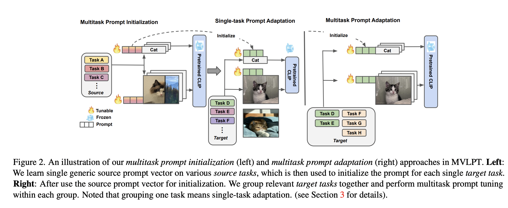
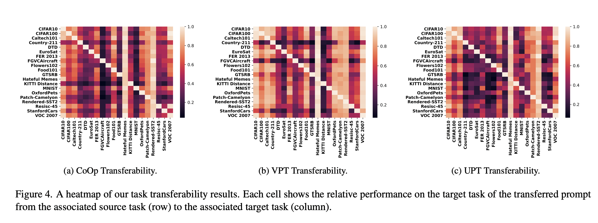
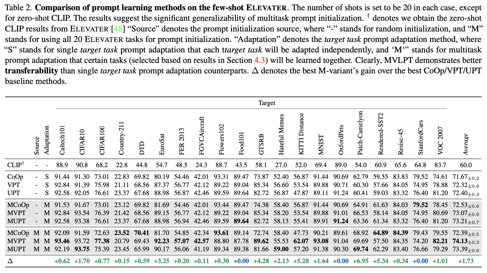
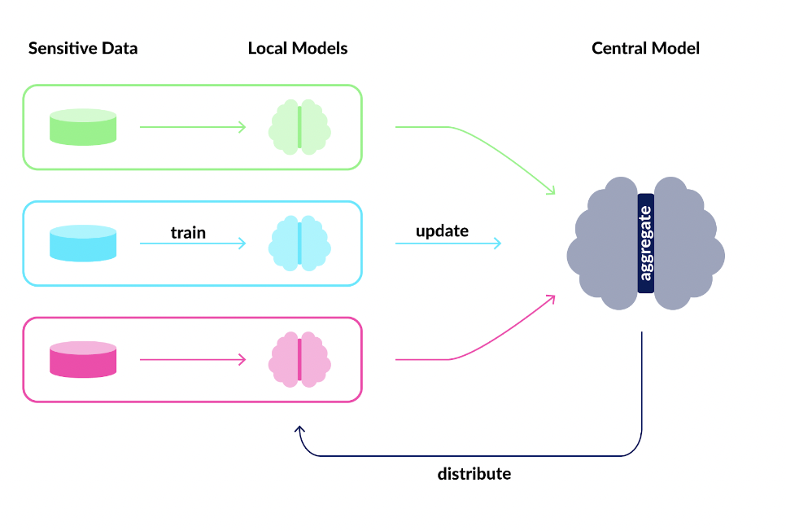
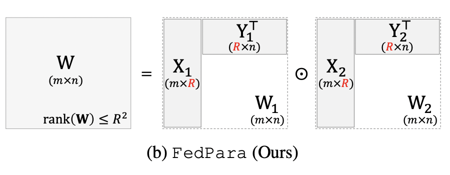

# Введение
Раньше для того, чтобы заняться глубоким обучением, вы должны были иметь доступ к большому очищенному набору данных и самостоятельно разработать и обучить эффективную модель. Значит, проекты без существенной поддержки извне были невозможны по умолчанию. Однако за последние пару лет всё изменилось. Движущая сила такого роста — трансферное обучение.

**Трансферное обучение** подразумевает использование предварительно обученной модели, разработанной для конкретной задачи, и повторное использование ее в качестве отправной точки для новой, связанной задачи. Большая языковая модель, предварительно обученная на огромных объемах данных, уже усвоила широкий спектр языковых конструкций и знаний. 

**Точная настройка** предполагает использование предварительно обученной модели и ее дальнейшее обучение новой задаче с новыми данными. Тонкой настройке обычно обучается вся предварительно обученная модель, включая все ее слои и параметры. Этот процесс может оказаться дорогостоящим и трудоемким, особенно для больших моделей.

**Точная настройка с эффективным использованием параметров** -  это метод точной настройки, который фокусируется на обучении только подмножества параметров предварительно обученной модели. Этот подход предполагает определение наиболее важных параметров для новой задачи и обновление этих параметров только во время обучения. Благодаря этому PEFT может значительно сократить объем вычислений, необходимых для точной настройки.

## Преимущества PEFT

1.  **Снижение затрат на вычисления и хранение:** PEFT включает в себя точную настройку лишь небольшого количества дополнительных параметров модели при одновременном замораживании большинства параметров предварительно обученных LLM, что значительно снижает затраты на вычисления и хранение.
2.  **Преодоление катастрофического забывания:** Во время полной настройки LLM может произойти катастрофическое забывание, когда модель забывает знания, полученные во время предварительного обучения. PEFT может решить эту проблему, обновив лишь несколько параметров.
3.  **Более высокая производительность в режимах с малым объемом данных:** Было показано, что подходы PEFT работают лучше, чем полная точная настройка в режимах с небольшим объемом данных, и лучше обобщаются на сценарии, выходящие за пределы предметной области.
4.  **Переносимость:** методы PEFT позволяют пользователям получать крошечные контрольные точки размером в несколько МБ по сравнению с большими контрольными точками
# Методы PEFT

## Prompt tuning
Первоначальная концепция prompt tuning относится к методам, которые изменяют входной промпт для достижения лучших результатов. Например, предположим, что мы хотим в перевести английское предложение на немецкий. Мы можем задать модели различные вопросы, как показано ниже:

Подход, проиллюстрированный выше, называется hard prompt tuning, поскольку мы напрямую меняем дискретные входные токены, которые не поддаются обновлению с помошью обратного распространения.

В отличие от hard prompt tuning, soft prompt tuning [Lester et al., 2021](https://arxiv.org/abs/2104.08691) объединяет ембеддинги входных токенов с обучаемым тензором, который может быть оптимизирован с помощью обратного распространения.

Soft prompts отличаются от hard prompts тем, что они обучаются путем обратного распространения и, таким образом, корректируются на основе лосса на наборе данных.

Soft prompt tuning значительно более эффективен с точки зрения параметров, чем full file tuning, хотя качество может быть немного хуже.

## Prefix tuning

Prefix tuning - это более легковесная альтернатива fine tuning больших языковых моделей [Liang 2021](https://arxiv.org/abs/2101.00190). Точная настройка требует обновления и сохранения всех параметров модели для каждой задачи, что может быть очень затратным, учитывая большой размер существующих моделей. Настройка префикса сохраняет параметры языковой модели замороженными и оптимизирует небольшой непрерывный вектор, специфичный для конкретной задачи, называемый префиксом. *Префикс* - это набор свободных параметров, которые обучаются для решения конкретной задачи.

Префикс можно рассматривать как последовательность “виртуальных токенов”, к которым могут обращаться последующие токены. Обучая только 0,1% параметров, prefix tuning обеспечивает производительность, сравнимую с full fine tuning при настройке полных данных, превосходит full fine tuning при дообучении на малом объеме данных.

*Prefix - последовательность виртуальных токенов*

Обозначим за $h_i \in \mathbb{R}^d$ вектор активаций в момент времени $i$, где $h_i = [h_i^{(1)},..,h_i^{(n)}]$ представляет собой объединение всех слоёв активации на данном временном шаге, и $h_i^{(j)}$ это вектор активации $j$ слоя в момент времени $i$.

Prefix-tuning добавляет префикс к autoregressive LM для получения $z = [Prefix;x;y]$, или добавляет префиксы для encoder и decoder: $z = [Prefix;x;Prefix';y]$.

Обозначим за $P_{\theta}$ обучаемую матрицу свободных параметров размерности $|P_{idx}| \times dim(h_i)$

 
  *При вычислении векторов активаций обрабатываем токены z по одному, если i - тый токен принадлежит префиксу, то вектор активации это i-тая строка $P_{\theta}$, иначе это вектор активаций модели после обработки $z_i$*

На практике выяснилось, что прямое обновление $P_{\theta}$ ведёт нестабильной оптимизации и падению производительности. Поэтому будем обучать матрицу меньшей размерности и с помощью полносвязной сети приводить вектора к нужному размеру. Теперь обучается P' и параметры MLP(multi layer perceptron)

$P_{theta}[i:] = MLP_{\theta}(P'_{theta}[i:])$

*NB: кол-во строк в P и P' должно совпадать*

### Рассмотрим применение prefix tuning к трансформеру.

Мы добавляем обучаемый тензор к каждому блоку трансформера (в отличие от soft prompt tuning, где обучаемый тензор добавляется только ко входным эмбеддингам). Также мы дополнительно преобразуем данный тензор с помошью полносвязной сети (двухслойный перцептрон с активацией по середине). На рисунке ниже показана разница между обычным блоком трансформера и модифицированным с помощью префикса:

При использовании prefix tuning обновляются только префиксы, в то время как остальные слои фиксируются и не обновляются.

## Vision-Language Prompt Tuning
Prompt tuning можно использовать и для задач, связанных не только с языком, но и с мультимодальными данными, например в задачах Visual-Question-Answering (VQA). Когда на вход подается картинка и какой-то вопрос о ней. Нам о VQA важно знать следующее: от картинки и от текста независимо берутся эмбеддинги, а затем уже над ними производятся какие-то операции. А значит можно использовать Prompt Tuning для этих эмбеддингов.

И если хочется построить систему, которая будет отвечать, например на 10 разных вопросов о входной картинке, то можно попробовать использовать Prompt Tuning следующими способами.

- `CoOp` - Context Optimization (Text Prompt Tuning). Prompt Tuning применяется только к текстовым эмбеддингам;
- `VPT` - Visual Prompt Tuning. Prompt Tuning применяется только к эмбеддингам картинок;
- `UPT` - Unified Prompt Tuning. Prompt Tuning применяется и к текстовым эмбеддингам и к эмбеддингам картинок.

Выбор метода зависит от природы задач, которые мы хотим решать. Если для задач у нас один пул картинок, но по каждой картинке мы хотим научиться отвечать на несколько разных вопросов, то следует использовать `CoOp`. Однако, если модель вопроса у нас одна, а картинок много, то лучше воспользоваться `VPT`, и `UPT` наверное является наиболее универсальным подходом, который стоит использовать по умолчанию.

Можно подумать, а какой еще информацией мы обладаем о природе нашей задачи? Например, некоторые вопросы могут быть похожи друг на друга, и тогда имеет смысл, чтобы у них в конечном итоге эмбеддинги были более похожим. Оказывается, что можно модифицировать процесс `UPT` таким образом, чтобы учесть это и он описан в статье "Multitask Vision-Language Prompt Tuning" ([arxiv](https://arxiv.org/abs/2211.11720)).

Мы можем сгруппировать похожие задачи и обучать эмбеддинги для схожих задач совместно. Основная задача, которая здесь возникает - сгруппировать похожие задачи между собой, и для групп похожих задач задавать одни и те же префиксы в Prompt Tuning. Определить схожесть задач можно по тому, на сколько хорошо модель обученная на задаче A применима к задаче B. На рисунке как раз показаны такие замеры

При таком подходе к файнтюнингу модели в результате получаем модель, которая в целом ведет себя лучше, чем при обучении на каждую из задач по-отдельности.

---

Методы, которые мы уже обсудили применимы в случаях, когда при файнтюнинге у нас имеется доступ ко всем данным сразу. Однако, не все модели обучаются на одном компьютере / кластере с доступом ко всем обучающим данным. Порой случается так, что данные распределены на разных компьютерах и сбор их в одно место не представляется возможным, но обучение моделей все равно хочется производить. Такой подход к обучению называется Federated Learning. 

## PEFT в Federated Learning

При Federated Learning у нас есть главная копия модели, которая рассылается на устройства, где она дообучается на локальных данных, после чего обновленная версия модели отправляется для синхранизации на главный компьютер. Там главная копия модели обновляется и новая версия снова отправляется на устройства.

Cамым узким местом в этом подходе является пересылка данных, и их синхронизация в главном компьютере. Она занимает в разы больше времени, чем непосредственно обучение модели. И естественным образом мы хотим воспользоваться каким-то эффективным методом файнтюнинга. Что приходит в голову:

- Использовать LoRA для того, чтобы не пересылать всю модель, а отправлять лишь Low Rank матрицы;
- И в принципе мы готовы увеличить время одной итерации непосредственно самого обучения модели, если от этого количество итераций, включающих пересылку станет меньше.

Такими мыслями руководствовались авторы статьи "FedPara: Low-Rank Hadamard Product For Communication-Efficient Federated Learning" ([arxiv](https://arxiv.org/abs/2108.06098)).

Вспомним еще раз, что LoRA - **Low** Rank Adaptation, т.е. матрица, которой мы аппроксимируем исходную является низкоранговой, что не очень хорошо, т.к. она не несет в себе много информации. Следовательно хотелось бы повысить ранг этой матрицы. Это можно сделать, если приближать исходную матрицу не произведением двух, а следующим образом:

Такой подход, при том же количестве параметров, что и у LoRA позволяет аппроксимировать матрицу ранга $R^2$ вместо исходного $R$, на что в том числе указывает и таблица:

Однако это повышение ранга матрицы дается не бесплатно, и такая операция делает "дороже" одну итерацию непосредственно обучения. Например для модели VGG16 в исходном варианте время на forward + backward pass одного батча уходит время $1.64 sec$ в то время как при параметризации FedPara это займет $2.34 sec$. Однако видно, на сколько быстрее  модель с FedPara сходится к тому же результату, что и оригинальная модель. И на сколько меньше данных для этого потребовалось переслать. Хотелось бы видеть сравнение еще и с версией, где использовалась LoRA, однако в статье таких сравнений нет.

