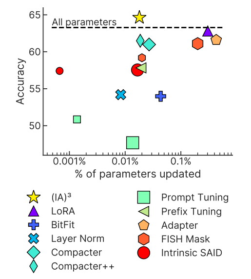

# Parameter efficient fine-tuning (PEFT)

Представьте, что перед вами стоят задачи в области NLP, которые необходимо решить. Раньше лучшее, что вы могли сделать, — собрать и очистить много данных и с нуля обучить несколько моделей. Нет большого количества ресурсов — нет проекта.

Сегодня лучшее — **дообучение**. Техника предполагает обучение предобученной модели на новые задачи с новыми данными. Дообучение обычно проходит вся модель, включая все ее слои и параметры.

Ранее уже упоминалось про дообучение в главе "Классические языковые модели и современные подходы", в которой можно более подробно ознакомиться с ним.

    

Однако у метода есть ощутимые недостатки:
* **Съедает память**. На каждую задачу придется хранить по одной версии большой модели.
* **Тяжело обучается**. Модель большая. Полное дообучение с разморозкой всех параметров может оказаться слишком дорогим, а разморозка малого числа параметров — не дать желаемого качества.
* **Много данных**. Для узкоспециализированных задач бывает трудно собрать качественный и полный датасет.
* **Проблема забывания**. Когда модель дообучается на новом наборе данных, она теряет информацию, изученную ранее.

Эти трудности решает **дообучение с эффективным использованием параметров (с англ. Parameter efficient fine-tuning, PEFT)**. PEFT-методы адаптируют предобученные модели к другим задачам без дообучения всех параметров и значительно сокращают затраты на вычисления и хранение, например размер контрольной точки может доходить до нескольких мегабайт. А самое главное позволяет достичь сопоставимого или лучшего качества на небольшом датасете.

    

Далее мы разберем некоторые PEFT-методы, их особенности и принцип работы.

## Адаптеры (Adapters)

Предложен в статье [Parameter-Efficient Transfer Learning for NLP (Houlsby et al., 2019)](https://arxiv.org/abs/1902.00751). Метод предлагает вместо дообучения весов обучать адаптеры — небольшие модули, которые размещаются после некоторых слоев модели и изменяют их выходы.

Авторы статьи применяют метод для дообучения BERT на 26 разных задач. Адаптеры здесь имеют форму ботлнек-слоя с функцией активации посередине и skip connection и располагаются после каждого полносвязного слоя в сети. Их суммарный размер для одной задачи — порядка 1-3% от размера всей модели.

    

Результаты впечатляют: качество работы модели с адаптерами сопоставимо с полностью дообученной моделью. Время инференса чуть выше, расход памяти — гораздо ниже.

**Приятный бонус**. Инференс можно организовать так, чтобы параллельно обрабатывать батч из запросов по разным задачам. Одновременно работать с несколькими версиями адаптеров не так сложно, как с несколькими версиями дообученной основной модели.

Сейчас существует много разных видов адаптеров. Идеи некоторых из них мы еще разберем в рамках этой главы.

### Что посмотреть по теме:
* [AdapterHub](https://adapterhub.ml/). Открытый репозиторий с адаптерами всех сортов для всевозможных моделей и задач. Совместим с библиотекой transformers.
* [Руководство по AdapterHub](https://huggingface.co/docs/hub/adapter-transformers). Гайд от Hugging Face.
* [GitHub аддон с адаптерами к библиотеке transformers](https://github.com/adapter-hub/adapters).

## Prompt tuning
Первоначальная концепция prompt tuning относится к методам, которые изменяют входной промпт для достижения лучших результатов. Например, предположим, что мы хотим перевести английское предложение на немецкий. Мы можем задать модели различные вопросы, как показано ниже:

Подход, проиллюстрированный выше, называется hard prompt tuning, поскольку мы напрямую меняем дискретные входные токены, которые не поддаются обновлению с помошью обратного распространения.

В отличие от hard prompt tuning, soft prompt tuning [Lester et al., 2021](https://arxiv.org/abs/2104.08691) объединяет эмбеддинги входных токенов с обучаемым тензором, который может быть оптимизирован с помощью обратного распространения. Количество обучаемых параметров составляет примерно 0.01% от количества параметров исходной модели. 

Soft prompts отличаются от hard prompts тем, что они обучаются путем обратного распространения и, таким образом, корректируются на основе лосса на наборе данных.

Более формально, наша цель при дообучении модели максимизировать правдоподобие ответа модели $Y$ при условии входа $X$ и префикса $P$ по $\theta_P$ - где $\theta_p$ - это параметры префикса (параметры модели не меняются):
$$ Pr_{\theta_P}(Y|[P; X])$$

Размерность матрицы $X$ : $n \times e$ ($n$ - длина последовательности токенов, $e$ - длина эмбеддинга)

Размерность матрицы $P$ : $p \times e$ ($p$ - длина префикса)

Размерность матрицы $[P; X]$ : $(p + n) \times e$

Soft prompt tuning значительно более эффективен с точки зрения количества обучаемых параметров, чем full file tuning, хотя качество может быть немного хуже.

## Prefix tuning

Prefix tuning - это более легковесная альтернатива fine tuning больших языковых моделей [Liang 2021](https://arxiv.org/abs/2101.00190). Настройка префикса сохраняет параметры языковой модели замороженными и оптимизирует небольшой непрерывный вектор, специфичный для конкретной задачи, называемый префиксом. *Префикс* - это набор свободных параметров, которые обучаются для решения конкретной задачи.

Префикс можно рассматривать как последовательность “виртуальных токенов”, к которым могут обращаться последующие токены. Обучая только 0,1% от количества параметров исходной модели, prefix tuning обеспечивает производительность, сравнимую с full fine tuning при дообучении на большом объеме данных, превосходит full fine tuning при дообучении на малом объеме данных.

Prefix - последовательность виртуальных токенов

Обозначим за $h_i \in \mathbb{R}^d$ вектор активаций в момент времени $i$, где $h_i = [h_i^{(1)},..,h_i^{(n)}]$ представляет собой объединение всех слоёв активации на данном временном шаге, и $h_i^{(j)}$ это вектор активации $j$ слоя в момент времени $i$.

Prefix-tuning добавляет префикс к autoregressive LM для получения $z = [Prefix;x;y]$, или добавляет префиксы для encoder и decoder: $z = [Prefix;x;Prefix';y]$.

Обозначим за $P_{\theta}$ обучаемую матрицу свободных параметров размерности $|P_{idx}| \times dim(h_i)$, где $P_{idx}$ это список индексов $z$, принадлежащих префиксу.

При вычислении векторов активаций обрабатываем токены z по одному, если i - тый токен принадлежит префиксу, то вектор активации это i-тая строка $P_{\theta}$, иначе это вектор активаций модели после обработки $z_i$

На практике выяснилось, что прямое обновление $P_{\theta}$ ведёт нестабильной оптимизации и падению производительности. Поэтому будем обучать матрицу меньшей размерности и с помощью полносвязной сети приводить вектора к нужному размеру. Теперь обучается $P'$ и параметры $MLP$(multi layer perceptron)

$P_{theta}[i,:] = MLP_{\theta}(P'_{theta}[i,:])$

*NB: кол-во строк в $P$ и $P'$ должно совпадать*

### Применение prefix tuning к архитектуре Transformers.

Мы добавляем обучаемый тензор к каждому блоку трансформера (в отличие от soft prompt tuning, где обучаемый тензор добавляется только ко входным эмбеддингам). Также мы дополнительно преобразуем данный тензор с помошью полносвязной сети (двухслойный перцептрон с активацией по середине). На рисунке ниже показана разница между обычным блоком трансформера и модифицированным с помощью prefix tuning:

## P-Tuning
Промтинг - написанные вручную шаблоны подсказок, которые используют в качестве дополнительных входных данных для языковых моделей. Он позволяет улучшить результаты предобученных языковых моделей.
Однако у промтинга есть проблемы со стабильностью, поскольку качество будет сильно зависить от каждого дополнительного слова. То есть даже изменив одно слово, качество результатов может значительно упасть. 

                                                    
Было несколько работ с попытками найти способ подбора наиболее эффективного промта[[1](https://arxiv.org/abs/2103.10385), [2](https://arxiv.org/abs/2010.15980), [3](https://arxiv.org/abs/2012.15723)].

Для решения этой проблемы с другой стороны в [статье](https://arxiv.org/abs/2103.10385) предложили P-Tuning. Идея заключаетсяя в том, чтобы не только делать промт более детальным или эффективным, а ещё обучить непрерывное представления промта для большей стабильности.

Если раньше дописывали промт $P$ к нашему тексту $X$, пропускали $concat[P, X]$ через слой эмбеддингов, получая $concat[e(P), e(X)]$, то теперь мы сначала некторорым энкодером $H$ получаем эмбеддинги $h(P)$ для $P$ и затем конкатенируем с $e(X)$, получая $concat[h(P), e(X)]$. 

Так в задаче Knowledge probing P-Tuning значительно превосходит стандартный промтинг.

### Vision-Language Prompt Tuning
Prompt tuning можно использовать и для задач, связанных не только с языком, но и с мультимодальными данными, например в задачах Visual-Question-Answering (VQA). Когда на вход подается картинка и какой-то вопрос о ней. Нам о VQA важно знать следующее: от картинки и от текста независимо берутся эмбеддинги, а затем уже над ними производятся какие-то операции. А значит можно использовать Prompt Tuning для этих эмбеддингов.

И если хочется построить систему, которая будет отвечать, например на 10 разных вопросов о входной картинке, то можно попробовать использовать Prompt Tuning следующими способами.

- `CoOp` - Context Optimization (Text Prompt Tuning). Prompt Tuning применяется только к текстовым эмбеддингам;
- `VPT` - Visual Prompt Tuning. Prompt Tuning применяется только к эмбеддингам картинок;
- `UPT` - Unified Prompt Tuning. Prompt Tuning применяется и к текстовым эмбеддингам и к эмбеддингам картинок.

Выбор метода зависит от природы задач, которые мы хотим решать. Если для задач у нас один пул картинок, но по каждой картинке мы хотим научиться отвечать на несколько разных вопросов, то следует использовать `CoOp`. Однако, если модель вопроса у нас одна, а картинок много, то лучше воспользоваться `VPT`, и `UPT` наверное является наиболее универсальным подходом, который стоит использовать по умолчанию.

Можно подумать, а какой еще информацией мы обладаем о природе нашей задачи? Например, некоторые вопросы могут быть похожи друг на друга, и тогда имеет смысл, чтобы у них в конечном итоге эмбеддинги были более похожим. Оказывается, что можно модифицировать процесс `UPT` таким образом, чтобы учесть это и он описан в статье "Multitask Vision-Language Prompt Tuning" ([arxiv](https://arxiv.org/abs/2211.11720)).

Мы можем сгруппировать похожие задачи и обучать эмбеддинги для схожих задач совместно. Основная задача, которая здесь возникает - сгруппировать похожие задачи между собой, и для групп похожих задач задавать одни и те же префиксы в Prompt Tuning. Определить схожесть задач можно по тому, на сколько хорошо модель обученная на задаче A применима к задаче B. На рисунке как раз показаны такие замеры

При таком подходе к файнтюнингу модели в результате получаем модель, которая в целом ведет себя лучше, чем при обучении на каждую из задач по-отдельности.

---

Методы, которые мы уже обсудили применимы в случаях, когда при файнтюнинге у нас имеется доступ ко всем данным сразу. Однако, не все модели обучаются на одном компьютере / кластере с доступом ко всем обучающим данным. Порой случается так, что данные распределены на разных компьютерах и сбор их в одно место не представляется возможным, но обучение моделей все равно хочется производить. Такой подход к обучению называется Federated Learning. 

## LoRA: Low-Rank Adaptation

LoRA — вид адаптеров, предложенный в статье [LoRA: Low-Rank Adaptation Of Large Language Models (Hu et al., 2021)](https://arxiv.org/abs/2106.09685).

В отличие от классических адаптеров, которые обучаются как модули-надстройки над слоями модели, адаптеры LoRA обучаются как низкоранговые аддитивные добавки к весам модели. Веса модели при этом остаются замороженными. Формульно это выглядит так:

$$h = W x + \Delta W x = W x + B A x \text{, где}$$
$W \in \mathbb{R}^{d \times d}$ — замороженная матрица весов модели,\
$\Delta W \in \mathbb{R}^{d \times d}$ — модификация весов модели ранга $r \ll d$, которая обучается в LoRA-адаптере,\
$A \in \mathbb{R}^{r \times d}$ и $B \in \mathbb{R}^{d \times r}$ — матрицы скелетного разложения матрицы-добавки $\Delta W$.

Схематически это выглядит так:

    

Перед началом обучения матрица $A$ инициализируется нормальным шумом, а матрица $B$ — нулями. Такая инициализация зануляет добавку, что соответствует обычному инференсу замороженной модели. Она служит разумной отправной точкой для обучения адаптеров.

Во время инференса, матрицы LoRA адаптеров можно сложить с весами модели: $\bar W \leftarrow W + \Delta W$. Это, по сравнению с обычными адаптерами, позволит не создавать дополнительной задержки, но, с другой стороны, затруднит обработку батчей с запросами по разным задачам.

## $(IA)^3$
Нужны PEFT методы, обладающие следующими свойствами:
 - Добавлять и обнавлять как можно меньше параметров;
 - Достигать высокой точности после few-shot обучения на новой задаче;
 - Допускать возможность решать несколько задач.

Чтобы легко обучаться батчами со смешанными задачами, метод PEFT в идеале не должен изменять саму модель. В противном случае каждый пример в батче фактически должен был бы обрабатываться другой моделью. Более удобной альтернативой являются методы, которые непосредственно изменяют активации модели, поскольку это может быть сделано независимо и дешево для каждого примера в батче в соответствии с тем, какой задаче соответствует пример. 

В [статье](https://arxiv.org/pdf/2205.05638.pdf) предлагается новый PEFT метод: $(IA)^3$, обладающий такими свойствами.  Идея в том, чтобы обучать масштабирующие векторы для некоторых наборов активаций для модели Трансформер.

Здесь $l_k$ и $l_v$ - это векторы для матриц $K$ и $V$ соответственно в Self-Attention слое. А $l_ff$ - вектор, применяющийся после функции активации в полносвязном слое.

Стоит отметить, что если теперь нужно использовать модель только для одной задачи, то достаточно перемножить полученные ваетора на матрицы и в дальшейшем не потребуется поэлементного умножения, тем самым вычислительная стоимость модели до и после будут одинаковыми.

Авторы сравнили $(IA)^3$ с другими PEFT методами:

Тем самым, обновляя только 0.01% параметров исходной модели, $(IA)^3$ превосходит другие методы по точности.

## PEFT в Federated Learning

При Federated Learning у нас есть главная копия модели, которая рассылается на устройства, где она дообучается на локальных данных, после чего обновленная версия модели отправляется для синхронизации на главный компьютер. Там главная копия модели обновляется и новая версия снова отправляется на устройства.

Cамым узким местом в этом подходе является пересылка данных, и их синхронизация в главном компьютере. Она занимает в разы больше времени, чем непосредственно обучение модели. И естественным образом мы хотим воспользоваться каким-то эффективным методом файнтюнинга. Что приходит в голову:

- Использовать LoRA для того, чтобы не пересылать всю модель, а отправлять лишь Low Rank матрицы;
- И в принципе мы готовы увеличить время одной итерации непосредственно самого обучения модели, если от этого количество итераций, включающих пересылку станет меньше.

Такими мыслями руководствовались авторы статьи "FedPara: Low-Rank Hadamard Product For Communication-Efficient Federated Learning" ([arxiv](https://arxiv.org/abs/2108.06098)).

Вспомним еще раз, что LoRA - **Low** Rank Adaptation, т.е. матрица, которой мы аппроксимируем исходную является низкоранговой, что не очень хорошо, т.к. она не несет в себе много информации. Следовательно хотелось бы повысить ранг этой матрицы. Это можно сделать, если приближать исходную матрицу не произведением двух, а следующим образом:

Такой подход, при том же количестве параметров, что и у LoRA позволяет аппроксимировать матрицу ранга $R^2$ вместо исходного $R$, на что в том числе указывает и таблица:

Однако это повышение ранга матрицы дается не бесплатно, и такая операция делает "дороже" одну итерацию непосредственно обучения. Например для модели VGG16 в исходном варианте время на forward + backward pass одного батча уходит время $1.64 sec$ в то время как при параметризации FedPara это займет $2.34 sec$. Однако видно, на сколько быстрее  модель с FedPara сходится к тому же результату, что и оригинальная модель. И на сколько меньше данных для этого потребовалось переслать. Хотелось бы видеть сравнение еще и с версией, где использовалась LoRA, однако в статье таких сравнений нет.

