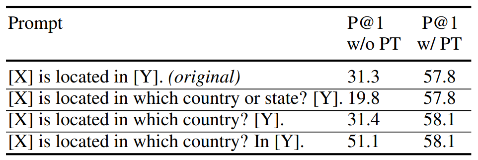
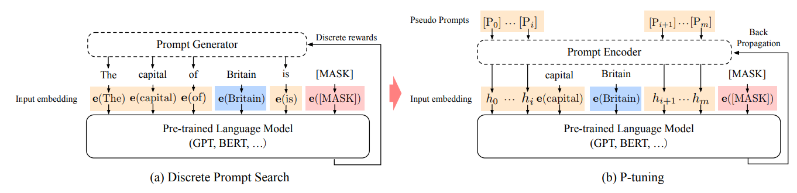
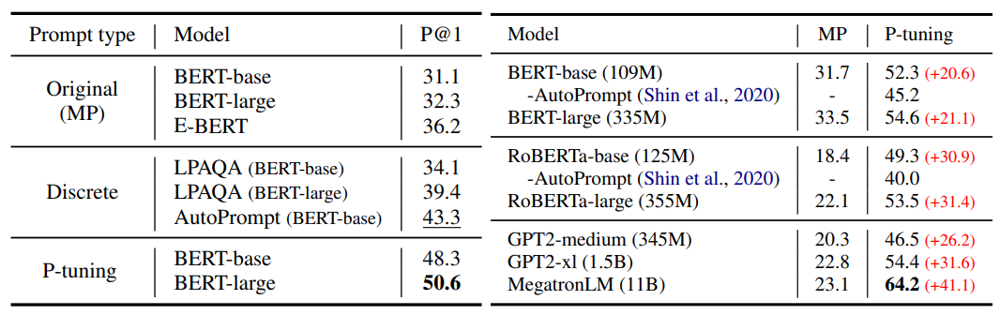
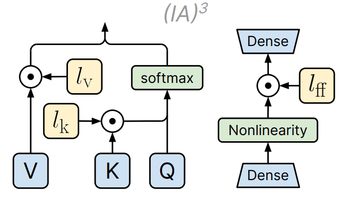
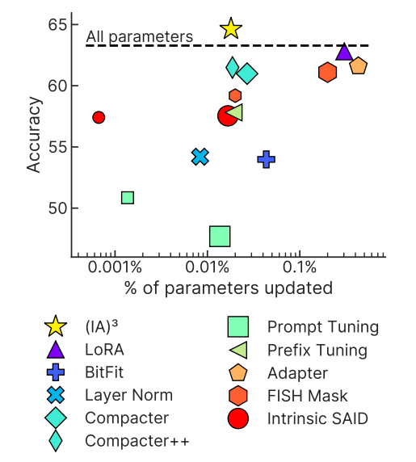

### P-Tuning
Промтинг - написанные вручную шаблоны подсказок, которые используют в качестве дополнительных входных данных для языковых моделей. Он позволяет улучшить результаты предобученных языковых моделей.
Однако у промтинга есть проблемы со стабильностью, поскольку качество будет сильно зависить от каждого дополнительного слова. То есть даже изменив одно слово, качество результатов может значительно упасть. 

                                                    
Было несколько работ с попытками найти способ подбора наиболее эффективного промта[[1](https://arxiv.org/abs/2103.10385), [2](https://arxiv.org/abs/2010.15980), [3](https://arxiv.org/abs/2012.15723)].

Для решения этой проблемы с другой стороны в [статье](https://arxiv.org/abs/2103.10385) предложили P-Tuning. Идея заключаетсяя в том, чтобы не только делать промт более детальным или эффективным, а ещё обучить непрерывное представления промта для большей стабильности.

Если раньше дописывали промт $P$ к нашему тексту $X$, пропускали $concat[P, X]$ через слой эмбеддингов, получая $concat[e(P), e(X)]$, то теперь мы сначала некторорым энкодером $H$ получаем эмбеддинги $h(P)$ для $P$ и затем конкатенируем с $e(X)$, получая $concat[h(P), e(X)]$. 

Так в задаче Knowledge probing P-Tuning значительно превосходит стандартный промтинг.

### $(IA)^3$
Нужны PEFT методы, обладающие следующими свойствами:
 - Добавлять и обнавлять как можно меньше параметров;
 - Достигать высокой точности после few-shot обучения на новой задаче;
 - Допускать возможность решать несколько задач.

Чтобы легко обучаться батчами со смешанными задачами, метод PEFT в идеале не должен изменять саму модель. В противном случае каждый пример в батче фактически должен был бы обрабатываться другой моделью. Более удобной альтернативой являются методы, которые непосредственно изменяют активации модели, поскольку это может быть сделано независимо и дешево для каждого примера в батче в соответствии с тем, какой задаче соответствует пример. 

В [статье](https://arxiv.org/pdf/2205.05638.pdf) предлагается новый PEFT метод: $(IA)^3$, обладающий такими свойствами.  Идея в том, чтобы обучать масштабирующие векторы для некоторых наборов активаций для модели Трансформер.

Стоит отметить, что если теперь нужно использовать модель только для одной задачи, то достаточно перемножить полученные ваетора на матрицы и в дальшейшем не потребуется поэлементного умножения, тем самым вычислительная стоимость модели до и после будут одинаковыми.

Авторы сравнили $(IA)^3$ с другими PEFT методами:

Тем самым, обновляя только 0.01% параметров исходной модели, $(IA)^3$ превосходит другие методы по точности.
