# Сбор данных

Допустим, мы хотим обучить какую-нибудь модельку. Как в целом будет выглядеть процесс обучения?

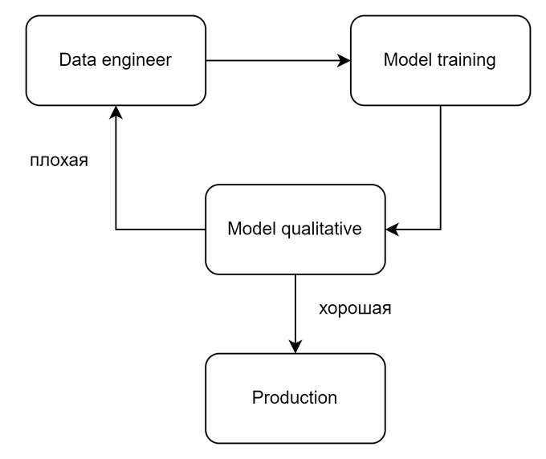

Сначала необходимо собрать и подготовить данные. Затем эти данные передаются для обучения модели. Наконец, мы оцениваем качество модели. Если показатели нас устраивают, мы выпускаем её в production, если нет - её надо улучшать.

Обсудим процесс сбора данных.

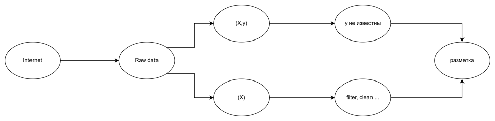

Изначально у нас есть некоторый источник, из которого мы набираем сырые данные (допустим, интернет). Далее, в зависимости от задачи, данные бывают двух типов:

1)	Есть Х, необходимо получить у, которые не известны. В таком случае очень важна разметка.
2)	Нам хватает только Х. Тогда нам необходимо провести некоторую предобработку и, возможно, дальнейшую разметку.

Немного углубимся в первый этап. Для этого надо ответить на следующий вопросы:

•	Какую информацию собирать?

•	Откуда брать данные?

•	Какие есть способы и инструменты сбора данных?

•	Когда остановиться?

•	Как хранить?

1) Какую информацию собирать?

Типы данных можно разделить на 3 вида:
Структурированные – это различные таблицы. С ними удобно работать, выполнять поиск и тд. Для работы с ними используются SQL-базы данных.
Слабоструктурированные – не так строго отформатированные, но сохраняют в себе различные теги, ключи и тд. Для работы с ними используются NoSQL-базы.
Неструктурированные – абсолютное большинство всей информации. Это могут быть текста, картинки и много-многое другое. Их легко получать, но с ними сложно работать. Они требуют много памяти для хранения и разных методик для работы с ними.
Что именно понадобится – зависит от задач.

2) Откуда брать данные?

Источники можно разделить на внутренние и внешние.
Внутренние источники сохраняют информацию внутри компании  (CRM-системы, данные, собранные с помощью колл-центров, и тд).
Внутренние источники помогают оценить текущие показатели компании, эффективность решений и многое другое.
Внешние источники связаны с получением сторонней информацией. Сюда относятся данные, полученные от партнёров, различные соцсети и открытые датасеты. Например, для обучения языковых моделей используются CrowdFlower, Wikipedia, Common Crawl

3) Какие есть способы и инструменты сбора данных?

•	Ручной сбор данных.

•	Извлечение данных при помощи интерфейсов программирования приложений (API)

•	Оптическое распознавание символов (OCR)

•	Автоматизация процессов (RPA)

4) Когда остановиться?

Иногда очевидно – например при анализе месячных или годовых показателей. Но для предсказания будущих показателей или обучения больших языковых моделей требуется много данных. Однако надо иметь в виду, что “чем больше, тем лучше” работает до определённого момента. Дальше новые данные не так сильно влияют на точность предсказаний.

5) Как хранить данные.

Что именно использовать – определяют объёмы и тип данных.
Для структурированных данных подходят реляционные базы данных. Самые популярные – Postgre, MySql и Microsoft SQL Server
Для слабоструктурированных используют NoSQL базы данных. Какие именно – зависит от формата. Это могут быть MongoDB, Apache, различные системы от Amazon
Второй вариант – хранилища и озера данных.
Хранилища, по сути, это большая реляционная база данных, хранящая в себе структурированные и слабоструктурированные данные, являющаяся единым источником для всей компании.
Озера данных хранит в себе сырые данные, и используется, когда компания собирает много данных, но ещё не отформатировала их.

# Предобработка данных

Процесс предобработки данных является неотъемлемой частью работы с данными в машинном обучении. Он включает в себя ряд шагов и техник, направленных на очистку, преобразование и подготовку данных для дальнейшего анализа и обучения моделей.

Общая схема процесса предобработки данных:

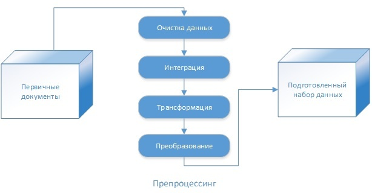

1) **Загрузка данных**
2) **Очистка данных**

    • Удаление дубликатов: Иногда данные могут содержать повторяющиеся записи, которые не несут дополнительной информации и могут исказить модель. Такие дубликаты следует исключить.

    • Обработка пропущенных значений: Если данные содержат пропущенные значения, необходимо принять решение о том, как их заполнить. Это может включать заполнение средними значениями, медианами или наиболее часто встречающимися значениями.

    • Аномалии: Анализ данных на наличие аномальных или выбросовых значений помогает исключить нежелательное влияние этих значений на модель. Возможны различные методы обнаружения аномалий

3) **Интеграция данных**: В данном шаге проводится анализ данных, чтобы получить представление о структуре и содержимом.

    • Исследование баланса классов: В задачах классификации может быть неравномерное распределение классов, исследование которого может помочь в понимании потенциальных проблем с несбалансированными классами.
   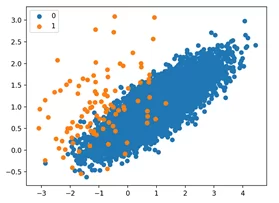

   • Исследование корреляции между признаками: Анализ корреляции между признаками может помочь в определении, есть ли сильно зависимые признаки, которые могут быть удалены или объединены.

   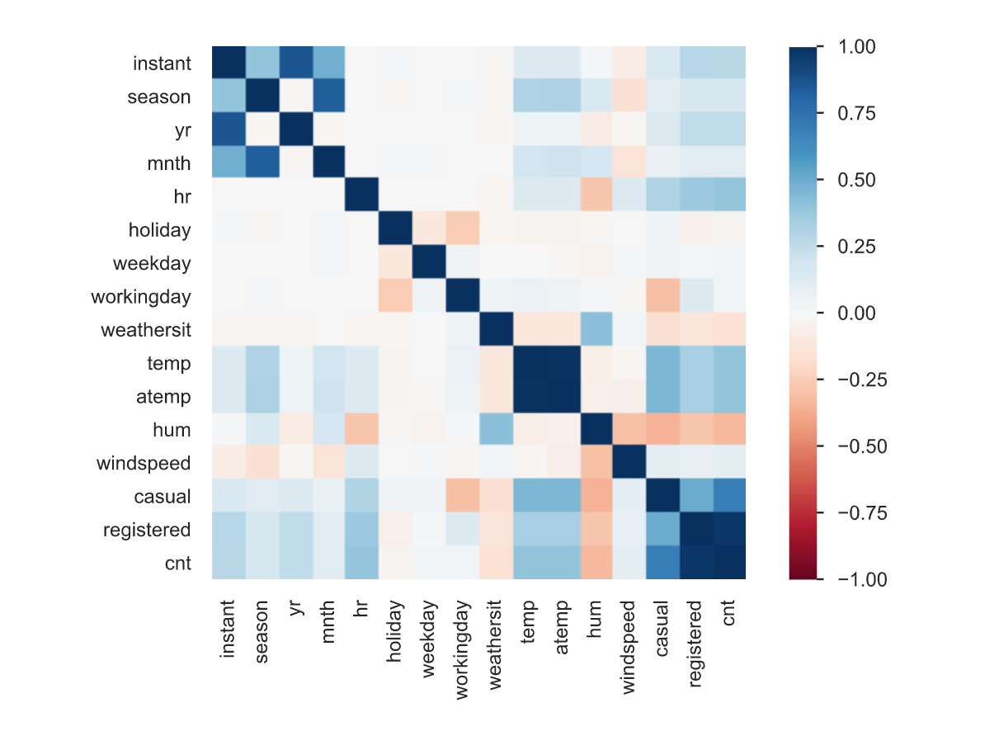

    • Исследование распределения целевой переменной: Анализ распределения целевой переменной может помочь в определении ее характеристик и выборе соответствующей метрики оценки качества модели.

4) **Трансформация данных**: В зависимости от типа задачи и модели машинного обучения, данные могут потребовать различных преобразований.

    • Нормализация данных: Если признаки в данных имеют различные шкалы или единицы измерения, то может быть полезно привести их к общей шкале, например, от 0 до 1 или -1 до 1. Нормализация данных помогает алгоритмам классификации работать более эффективно и предотвращает преувеличение влияния признаков с большими значениями.
    
    • Дискретизация: При наличии непрерывных признаков можно разбить их на несколько дискретных интервалов. Это может быть полезно, если модель классификации лучше работает с категориями или интервалами, чем с непрерывными значениями.
    
    • Преобразование категориальных признаков: Если данные содержат категориальные признаки, можно применить преобразования, такие как one-hot encoding или ordinal encoding, чтобы превратить категориальные переменные в числовые.
   
    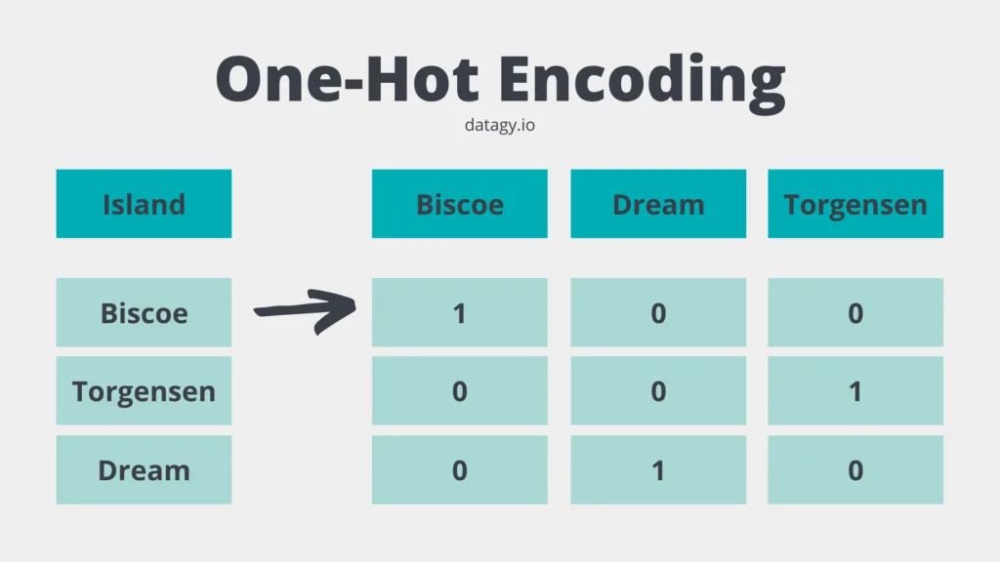

5) **Преобразование данных**: В случае необходимости можно создавать новые признаки путем комбинирования или изменения существующих признаков. 

    • Интеракции между признаками: Создание новых признаков путем комбинирования или умножения двух или более признаков может помочь уловить более сложные взаимосвязи между ними. Например, если у вас есть признаки "возраст" и "доход", можно создать новый признак, умножив эти два значения, чтобы увидеть, как сочетание возраста и дохода связано с целевой переменной.

## Предобработка в NLP.

В процессе машинного обучения предобработка данных в сфере обработки естественного языка (NLP) является критически важной стадией, которая напрямую влияет на эффективность работы модели. Процесс включает в себя несколько методов, правильное использование которых может существенно повысить качество модели.

Процесс перевода текста в формат пригодный для модели можно представить в виде следующих шагов:

• Токенизация

• Удаление стоп-слов

• Лемматизация и стемминг

• Представление текста в виде вектора 

### Классические методы.

#### Токенизация.
Это первый и самый базовый шаг в процессе обработки текста, его целью является разбить вводные данные (текст) на отдельные единицы (токены). Cамым простым и распространенным примером токенизации является разделение текста по пробелам и знакам препинания:

Текст: "I am learning." -> Токены: ["I", "am", "learning"]

#### Удаление стоп-слов.
Стоп-слова - это наиболее распространенные слова в языке (предлоги, союзы, и другие), которые обычно не несут смысловой нагрузки и могут быть исключены из текста:

Текст: ["I", "am", "learning"] -> Токены: ["learning"]

#### Лемматизация и стемминг.
Лемматизация приводит слова к их начальной форме (лемме). Например, слова "бегает", "бежал", "бежит" преобразуются к лемме "бегать".
Стемминг - это процесс сокращения слова до его основы. 

Например, "fishes" и "fishing" после стемминга станут "fish".

#### Представление текста в виде вектора.
**Мешок слов (Bag of Words)**: Мешок слов - это простой способ представления текста в виде вектора, где каждому уникальному слову в корпусе присваивается индекс, а каждому документу - вектор, содержащий количество вхождений каждого слова. Мешок слов не учитывает порядок слов в тексте и не учитывает контекст, но прост в реализации и понимании.

Пример текста: 

Мешок слов для данного текста:

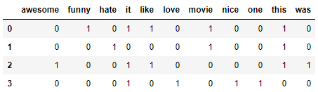

**TF-IDF (Term Frequency-Inverse Document Frequency)**: 
TF-IDF - это способ представления текста, который учитывает как частоту встречаемости слова в документе (term frequency), так и обратную частоту встречаемости слова во всех документах (inverse document frequency). TF-IDF помогает выделить более информативные, редко встречающиеся слова, но также не учитывает порядок слов и контекст.

Term frequency:

где n_t - число вхождений слова t в документ, а в знаменателе общее число слов в данном документе.

Inverse document frequency:

где |D| - число документов в коллекции; а знаменатель - число документов из коллекции D, в которых встречается t.

Тогда:

Пример применения:

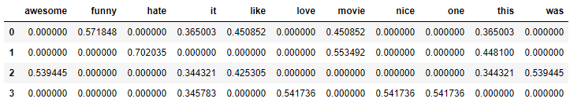

### Современные методы.

**Byte Pair Encoding (BPE).** Идея похожа на [коды Хафмана](https://ru.wikipedia.org/wiki/%D0%9A%D0%BE%D0%B4_%D0%A5%D0%B0%D1%84%D1%84%D0%BC%D0%B0%D0%BD%D0%B0), 
собственно сам термин пошёл из работы по кодированию [[Philip Gage, 1994]](https://dl.acm.org/doi/10.5555/177910.177914).

Обучение BPE:
1. Слово = последовательность токенов (пока символов, изначально использовались unicode-символы)
2. Словарь = все токены (на нулевой итерации — символы)
3. Повторять пока не достигли ограничения на размер словаря

    • Назначаем новым токеном объединение двух существующих токенов, которое встречается чаще других пар в корпусе (имеется в виду: встречаются вместе).

В применении BPE возможны разные варианты, один из естественных – идём по всем токенам по убыванию частоты, находим соответствующую последовательность символов в корпусе, заменяем на токен.

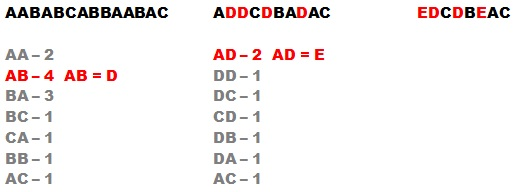

Упрощённая иллюстрация BPE показана на рисунке: здесь нет слов, просто цепочка символов. Мы выписываем частоты (на рис. — числа вхождений) пар символов, которые встречаются в тексте, заменяем самую частую пару на новый символ (вне словаря), и продолжаем этот процесс. Словарь у нас увеличивается в объёме, а цепочка сокращается в длине. Когда нам покажется, что словарь достаточно большой (ну или частоты очень маленькие), мы становимся.

На практике:

• К словам добавляется спецсимвол «конец слова».

• Различают изолированные токены (слова) и токены-подслова. Например,

    «I</w> like</w> ke</w>» → «I</w>», «li», «##ke</w>», «ke</w>»

здесь «ke» кодируется по-разному, в зависимости от того, изолированное это слово или часть слова «like».

• В [GPT2](https://github.com/openai/gpt-2) этот метод использован над байтами!

• В [GPT2](https://github.com/openai/gpt-2) запрещалось склеивание пар токенов разных типов (изначально каждому токену приписывался тип), например, нельзя склеивать букву и знак препинания, т.е. токен «a?» мы никогда не получим.

Метод описан в статье: Rico Sennrich, Barry Haddow, Alexandra Birch Neural Machine Translation of Rare Words with Subword Units https://arxiv.org/abs/1508.07909

#### Эмбеддинги.

**Эмбеддинг токенов**. Эмбеддинги представляют собой более сложный способ представления слов, используя векторные пространства, где каждое слово представлено как плотный числовой вектор. Наиболее известными моделями для создания эмбеддингов являются Word2Vec, GloVe и FastText. Эмбеддинги учитывают семантическое значение слов и сохраняют некоторую степень смысловой близости между словами.

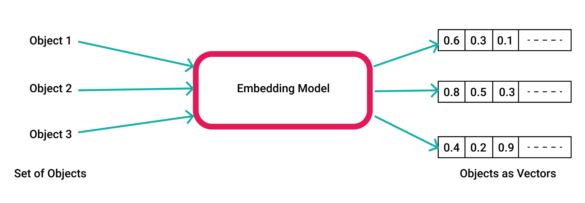

**Эмбеддинг предложений и текстов**. Один из методов создания эмбеддингов предложений - использование нейронных сетей для обработки текста. Например, рекуррентная нейронная сеть (RNN) может быть использована для преобразования предложений в векторные представления. RNN обрабатывает входной текст по одному слову за раз, учитывая контекст предложения. Пример такого подхода - модель InferSent, которая обучается на размеченных данных для создания эмбеддингов предложений.

Другой метод - использование архитектуры Transformer, которая позволяет сделать долгосрочные зависимости более доступными для модели. Примером такого подхода может быть модель BERT (Bidirectional Encoder Representations from Transformers), которая обучается на больших объемах текста и способна создавать эмбеддинги для предложений с учетом их контекста.

Также существуют подходы, основанные на комбинации эмбеддингов слов для создания эмбеддингов предложений. Например, модель Universal Sentence Encoder (USE) от Google использует комбинацию сверточных и рекуррентных сетей для создания эмбеддингов предложений на основе эмбеддингов слов. Такой подход позволяет учитывать смысл предложения в целом, а не только его отдельных слов.

# Выбор модели

Современные фреймворки, библиотеки и хранилища моделей (по типу hugging face) позволяют обучать большое количество моделей на исходных данных для решения поставленной задачи. 

Таким образом, трудность прикладного машинного обучения заключается в том, как выбрать из множества различных моделей, пригодных для решения исходной задачи.

Можно полагать наивно, что качество выбранной модели достаточно для решения задачи, но следует учитывать и другие проблемы, например, сколько времени занимает обучение модели или насколько легко интерпретировать результаты её работы. Сомнения при выборе модели растут, если выбранная модель будет использоваться в рабочем режиме в течение нескольких месяцев или лет.

Кроме того, не всегда понятно что именно надо выбрать: только алгоритм, используемый для подгонки модели, или весь пайплайн подготовки и обработки данных?

## Что такое выбор модели

**Выбор модели** – это процесс выбора одной окончательной модели машинного обучения из набора моделей-кандидатов машинного обучения для обучающего набора данных.

Выбор модели может применяться как к различным типам моделей (например, логистическая регрессия, KNN, ResNet, LLama и т.д.), так и к моделям одного типа, сконфигурированным с разными гиперпараметрами модели (например, количество пулингов и сверточных слоев, параметры регуляризации и прочее).

Когда у нас есть множество моделей различной сложности (например, модели линейной или логистической регрессии с полиномами разной степени или классификаторы KNN с разными значениями K), как мы должны выбрать правильную?

Например, у нас может быть набор данных для классификации или для регрессионного прогнозирования. Мы заранее не знаем, какая модель лучше всего справится с этой задачей. Поэтому мы подбираем и оцениваем набор различных моделей для решения задачи.
Обычно нам нужно выбрать одну или несколько лучших моделей из сотен, а иногда и тысяч вариантов. 

Выбор модели это не то же, что и оценка качества модели. Оценка качества модели(model asessment) – это процесс оценки производительности модели на исходных данных, в то время как выбор модели(model selection) подбирает необходимый уровень гибкости для модели.

## Определение подходящей модели

Обучить конкретную модель на данных достаточно просто, однако выбрать модель для обучения является настоящей задачей со звёздочкой. Во-первых, нам нужно избавиться от идеи “лучшей” модели. Все модели имеют некоторую прогностическую ошибку, учитывая статистический шум в данных, неполноту выборки данных и ограничения каждого отдельного типа модели. Следовательно, понятие совершенной или наилучшей модели бесполезно. Вместо этого мы должны искать модель, которая “достаточно хороша”.

На что мы обращаем внимание при выборе окончательной модели?

У заинтересованных сторон(стейкхолдеров) проекта могут быть особые требования, например ремонтопригодность или ограниченный размер модели. Таким образом, модель, которая хуже справляется с задачей, но является более простой и понятной, может быть предпочтительнее.

С другой стороны, если умение моделировать ценится превыше всего остального, то предпочтение будет отдаваться способности модели хорошо работать с данными, не входящими в выборку, независимо от сложности вычислений.

Таким образом, “достаточно хорошая” модель может быть разной в зависимости от проекта, например таковой может являться:

• Модель, отвечающая требованиям и ограничениям стейкхолдеров.

• Модель, которая достаточно хорошо справляется с задачей, в условиях ограниченного времени и ресурсов.

• Модель, которая показывает результаты лучше наивных моделей.

• Модель, которая показывает результаты лучше современных state-of-the-art моделей (например если это модель для научных исследований).

Для каждой модели может понадобиться уникальный процесс подготовки и обработки данных. Поэтому фактически выбирается не только модель, но и весь пайплайн разработки, который может включать в себя такие шаги, как: 

• Фильтрация данных.

• Преобразование данных.

• Выбор параметров.

• Создание новых параметров.

• Аугментация для улучшения обобщающей способности модели.

• И многое другое…

Теперь, когда мы описали основные трудности выбора модели, можно переходить к основным подходам в этой области.

## Методы выбора модели

Наилучший подход к выбору модели требует “достаточного” количества данных, что может быть практически неограниченным в зависимости от сложности задачи.

При “достаточным” количестве данных, лучший подход заключается в том, чтобы случайным образом разделить набор данных на три части: обучающий, валидационный и тестовый наборы. Обучающий набор используется для обучения моделей; валидационный набор используется для оценки ошибки прогнозирования при выборе модели; тестовый набор используется для оценки ошибки обобщения окончательно выбранной модели.

Однако в общем случае данных не достаточно, более того, часто даже не предоставляется возможным оценить сколько данных будет достаточно.
В случае ограниченного количества данных хочется использовать как можно большее данных для обучения для наилучшего качество моделей. Однако если валидационный набор мал, то получится относительно зашумленная оценка эффективности прогнозирования. 

Вместо этого существуют два основных подхода для приближения к идеальному случаю выбора модели:

• Вероятностные критерии выбора статистической модели.

• Методы сэмплирования.

### Вероятностные критерии выбора статистической модели

Вероятностные критерии включают аналитическую оценку модели-кандидата, используя как ее производительность на обучающем наборе данных, так и сложность модели.

Очевидно, что ошибка на обучающем наборе является смещенной оценкой, следовательно, не является хорошей основой для выбора модели. Производительность может быть оценена в зависимости от того, насколько оптимистична ошибка обучения. Обычно это достигается с помощью методов, которые оценивают оценку в зависимости от сложности модели.
Модель с меньшим количеством параметров менее сложна и из-за этого более предпочтительна, поскольку в среднем она лучше обобщает.

Наиболее популярные вероятностные критерии:

• Информационный критерий Акаике (AIC)

AIC=2k-2Ln(L)

где  — l число параметров в статистической модели, L — максимум функции правдоподобия модели.

• Байесовский информационный критерий (BIC).

k*ln(n) - 2Ln(L)

где n – размер обучающей выборки

• Минимальная длина описания (MDL).

• Минимизация структурного риска (SRM).

Вероятностные критерии уместны при использовании простых моделей, таких как линейная регрессия или логистическая регрессия, где расчет штрафа за сложность модели (например, при смещении выборки) известен и поддается обработке. Однако если приходится работать с сложными моделями, например, с нейронными сетями, такой подход работать не будет.

## Методы сэмплирования

Методы сэмплирования направлены на оценку производительности модели (или, точнее, процесса разработки модели) на основе данных, не входящих в выборку.
Это достигается за счет множественных разделения на обучающие и тестовые подвыборки. Результатом может быть как более точная оценка параметра (например, взятие среднего значения оценок), так и количественная оценка неопределенности оценки (например, добавление доверительного интервала).

Получается разновидность оценки производительности модели методом Монте-Карло на основе данных вне выборки, хотя каждое испытание не является строго независимым, поскольку в зависимости от выбранного метода повторной выборки одни и те же данные могут появляться несколько раз в разных обучающих или тестовых наборах.

Каждая новая подвыборка из исходной выборки данных используется для оценки параметра совокупности. Затем выборка оцененных параметров совокупности может быть рассмотрена с помощью статистических инструментов для количественной оценки ожидаемого значения и дисперсии, обеспечивая меры неопределенности оценки.

Два популярных метода выбора модели с помощью сэмплирования:

• Кросс-валидация (k-fold cross validation)

• Бутстрап (bootstrap)

### Cross Validation

Набор данных разбивается на k групп, где каждой группе предоставляется возможность использоваться в качестве тестового набора, оставляя остальные группы в качестве обучающего набора. Пример кросс-валидации с 5 группами:

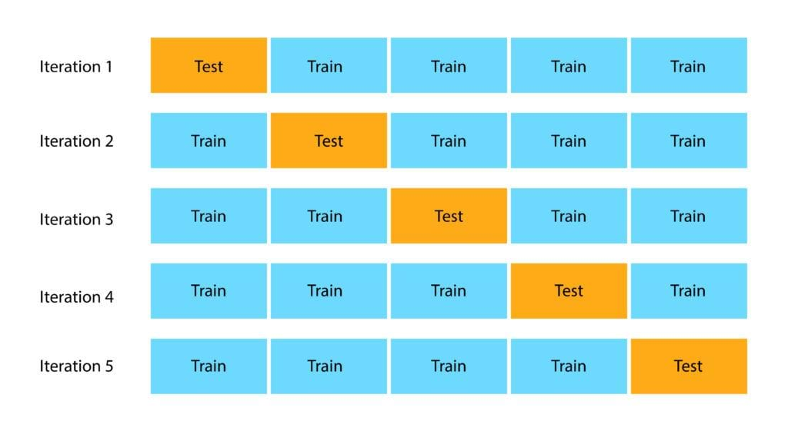

Итоговая оценка считается средней оценкой по всем k группам.

### Bootstrap

Бутстреп – практический компьютерный метод исследования распределения статистик вероятностных распределений, основанный на многократной генерации выборок методом Монте-Карло на базе имеющейся выборки. Позволяет просто и быстро оценивать самые разные статистики (доверительные интервалы, дисперсию, корреляцию и так далее) для сложных моделей.

Суть метода состоит в том, чтобы по имеющейся выборке построить эмпирическое распределение. Используя это распределение как теоретическое распределение вероятностей, можно с помощью генератора псевдослучайных чисел сгенерировать практически неограниченное количество псевдовыборок произвольного размера, например, того же, как у исходной. На множестве псевдовыборок можно оценить не только анализируемые статистические характеристики, но и изучить их вероятностные распределения. Таким образом, например, оказывается возможным оценить дисперсию или квантили любой статистики независимо от её сложности, что делает этот метод крайне полезным при работе с нейронными сетями.

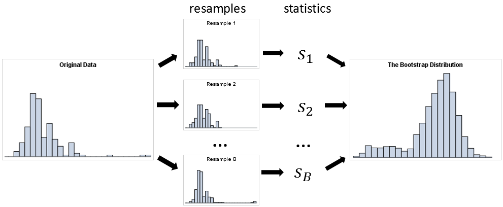

На основе бутстрепа легко построить доверительный интервал для оцениваемого параметра. Для этого надо построить  псевдовыборок и для каждой посчитать бутстреповскую статистику. Полученные статистики сортируются от большего к меньшему.

# Обучение модели

1) Типы обучения

После сбора и предобработки данных происходит обучение модели. В зависимости от формата обучающих данных и способа обучения, оно делится на следующие основные категории:

• Обучение с учителем

• Обучение без учителя

• Обучение с подкреплением

Обучение с учителем (supervised learning) --- это метод машинного обучения, который использует набор данных, включающий входные данные и соответствующие правильные ответы или метки. Модель учится на основе этих данных для предсказания правильного ответа при поступлении новых входных данных. Примеры алгоритмов обучения с учителем включают методы, такие как линейная регрессия, классификация и нейронные сети.

В отличие от обучения с учителем, обучение без учителя (unsupervised learning) не требует наличия правильных ответов или меток в наборе данных. Вместо этого, алгоритмы обучения без учителя сосредотачиваются на выявлении скрытых структур или закономерностей в данных. Они позволяют группировать данные, определять аномалии или выполнять сокращение размерности. Примерами методов обучения без учителя являются кластеризация, снижение размерности с помощью метода главных компонент и ассоциативные правила.

Обучение с подкреплением (reinforcement learning) --- это метод обучения, в котором агент (например, компьютерная программа или робот) обучается взаимодействуя с окружающей средой. Агент принимает определенные действия, чтобы максимизировать получаемый награды, из окружающей среды, и на основе этой обратной связи алгоритм обучается, чтобы принимать лучшие решения в будущем. Обучение с подкреплением широко применяется в игровых средах, управлении роботами и других задачах, где решения должны приниматься в среде с наградами и штрафами.

2) Методы оптимизации

В процессе обучения подбираются параметры модели, оптимизирующие какую-либо функцию. Например, зачастую обучение заключается в поиске весов, минимизирующих функцию ошибки.

Есть различные способы оптимизации. Один из самых базовых способов - градиентный спуск. Разберём, как происходит градиентный спуск.

Пусть есть функция $F(x)$, у которой необходимо найти минимум. В точке $x_0$ значение $F$ убывает в сторону вектора антиградиента ( $-\triangledown F(x_0)$ ). Идея градиентного спуска в том, чтобы двигаться в этом направлении. Более формально:

• Выберем начальную точку $x_0$

• На шаге $i$ перемещаемся в точку $x_{i+1} = x_{i} - \lambda_i \triangledown F(x_i)$, где $\lambda_i$ --- коэффициенты, задающие скорость градиентного спуска.

Использование градиентного спуска сопряжено с рядом проблем:

• Если $\lambda_i$ убывает слишком медленно, алгоритм может не остановиться

• Если $\lambda_i$ убывает слишком быстро, алгоритм может не дойти до минимума

• Алгоритм ищет локальный, а не глобальный минимум

• При движении по оврагу траектория спуска может весьма сильно колебаться, что замедляет работу алгоритма.

Для решения этой проблемы необходимо добавить спуску некоторую инерцию. Таким образом, траектория сгладится и алгоритм ускорится.

Переходы в методе моментов, который использует эту идею, выполняются с помощью следующих формул:
$u_t = \alpha u_{t-1} + \lambda \triangledown F(x_i)$
$x_{i+1} = x_{i} - u_t$

Если данных слишком много, каждая итерация градиентного спуска будет выполняться довольно долго. эту проблему решает стохастический градиентный спуск. Суть этого метода в том, что на каждом шаге градиент вычисляется не для средней по всем данным функции ошибки, а для функции ошибки для одного элемента.

Помимо этого существует множество других методов оптимизации.

3) Переобучение

Если тренировочных данных мало или модель слишком выразительная может произойти переобучение - модель будет очень хорошо работать на тренировочных данных, но не будет нормально работать на произвольных данных.

Существуют различные способы борьбы с переобучением. Один из простейших методов эт регуляризация. Смысл регуляризации в том, чтобы добавить к оптимизируемой функции некоторый штраф за переусложнение модели или добавить модели некоторые ограничения. Разберём несколько примеров регуляризации.

L2-регуляризация (ridge) - в качестве штрафа используется сумма квадратов весов с некоторым коэффициентом.

L1-регуляризация (lasso) - в качестве штрафа используется сумма модулей весов с некоторым коэффициентом. Довольно полезна, если хочется занулить некоторые коэффициенты (например, чтобы убрать лишние признаки)

# Оценка обученной модели

Источник — вот эта статья [Machine Learning Testing: Survey, Landscapes and Horizons](https://ieeexplore.ieee.org/abstract/document/9000651)

К текущему моменту мы уже собрали и обработали данные, выбрали и обучили модель, и остается только оценить насколько же хорошо она работает. Оценить модель можно двумя способами: на основе заранее подготовленных данных, до того как модель выкатят пользователям, или и непосредственно по пользовательскому опыту.  Начнем с первого способа. 

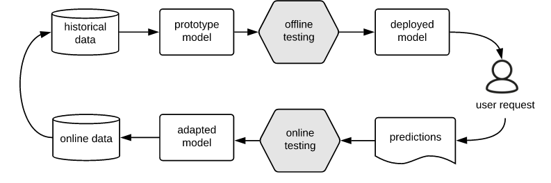

## Оффлайн тестирование

Оффлайн тестирование — это тестирование в “обычном” его понимании: выбирается некоторая метрика качества, собираются или генерируются данные для тестов, на них запускается модель и вычисляется выбранная метрика. Такое тестирование используют как для поиска багов (отметим, что баги могут быть не только в модели, но и в данных), так и для того, чтобы сравнить обученную модель с аналогами или принять решение о внедрении модели в production.

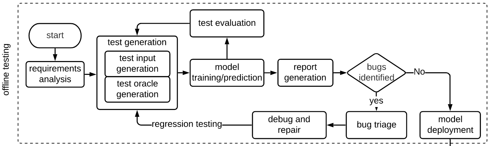

Остановимся чуть подробнее на двух аспектах такого тестирования: данных для тестов и метрике качества. 

### Данные для тестирования.

Процесс сбора данных уже был освещен в разделе ???, так что не будем на нем останавливаться, и поговорим вместо этого о том, как можно сгенерировать данные для тестов.  Зачастую сгенерировать данные с нуля оказывается сложно: картинку с котиком не нарисуешь классическими методами компьютерного зрения. Поэтому под генерацией в данном случае понимается модификация уже имеющихся данных так, чтобы предсказываемое значение изменилось предсказуемым образом. 

Приведем несколько примеров таких модификаций: 

• Локальные изменения. Изменили цвет одного пикселя — котик остался котиком. 

• Преобразования из предметной области. Повернули или отразили картинку — котик остался котиком.

• Преобразования, сделанные другой нейросетью. Изменили стиль картинки — котик остался котиком. 

Любопытен последний пункт; известные обученные нейросети можно использовать для модификации данных, расширяя тем самым имеющийся корпус.

### Метрики оценки качества. 

Метрика качества показывает насколько точно модель работает на определенном наборе данных. В отличие от loss-функции, использующейся в обучении, метрика качества не делает никаких предположений о внутреннем устройстве модели, она зачастую не дифференцируема, так что ее затруднительно оптимизировать во время обучения модели. Так что метрика качества используется именно для того, чтобы численно посмотреть как хороши ответы модели.

Для задачи бинарной классификации простейшими метриками являются:

• Accuracy — доля правильных ответов.

• Precision — доля правильных среди найденных.

• Recall — доля найденных среди правильных.

При этом у каждой из этих метрик есть свои особенности, и ни одна из них не подойдет на все случаи жизни. Accuracy не делает отличия между ложно-позитивными и ложно-негативными срабатываниями, кроме того эта метрика плохо подходит для случая сильного дисбаланса между классами. Precision используется когда важно не допускать ложно-положительных срабатываний, а recall — ложно-отрицательных. Разумеется, этим метрики качества бинарной классификации не ограничиваются, подробности см в разделе ???. Таким образом, даже для задачи бинарной классификации метрик много, и выбирать подходящую надо с учетом специфики конкретной задачи.

Для задач NLP можно выделить следующие метрики:

• BLEU — сравниваем перевод с эталоном исходя из того, сколько n-грамм перевода входит в эталон.

• Модификации BLEU: NIST, ROGUE, METEOR, etc.

• Близость эмбеддингов машинного и эталонного переводов: WMD (на основе Word2Vec), BERTScore, etc.

• ML модели, сравнивающие машинный перевод и первоисточник (reference-free metrics).

## Онлайн тестирование.

Переходим теперь к другой большой разновидности тестирования — оценке качества модели на основе взаимодействия с пользователем. Оно применяется после внедрения модели, то есть после оффлайн тестирования, и используется для того, чтобы оценить работу модели на реальных данных. Это может быть важно, поскольку данные, собранные для тестов, могут не вполне соответствовать действительности, то есть модель с лучшими результатами на оффлайн тестах может проигрывать на запросах реальных пользователей.

### A/B тестирование.

A/B тестирование проводится чтобы сравнить модель А с моделью В и статистическими методами выявить какая из них лучше. Оно состоит из следующих этапов:
1. Выбирается целевая метрика качества.
2. Пользователи делятся на две группы: первым дается модель А, вторым модель В.
3. Накапливается статистика из пользовательских запросов и ответов модели, по которым вычисляется целевая метрика.   
4. Проверяется статистическая гипотеза “для модели В метрика лучше, чем для модели А”.

Таким образом, A/B тестирование позволяет сравнивать модели в “боевых” условиях, но у него есть один существенный недостаток. Представим, что модель В оказалась существенно хуже модели А, тогда в процессе A/B тестирования плохой моделью В пользовалась некоторая заметная доля клиентов, хотя им можно было бы дать хорошую модель А. Это не очень хорошо с точки зрения прибыли. 

### Многорукие бандиты. 

Данный набор стратегий решает описанную выше проблему A/B тестирования: предлагается динамически выбирать давать ли очередному пользователю модель А или В так, чтобы, с одной стороны, выяснить какая модель лучше и насколько, а с другой стороны, использовать худшую модель так мало, как возможно. 

В общем виде задача формулируется следующим образом. Есть несколько ручек, каждую из которых можно дернуть и получить некоторую прибыль. У каждой ручки есть свое, неизвестное, вероятностное распределение прибыли. Необходимо придумать стратегию дергания за ручки, которая максимизировала бы мат. ожидание прибыли. 

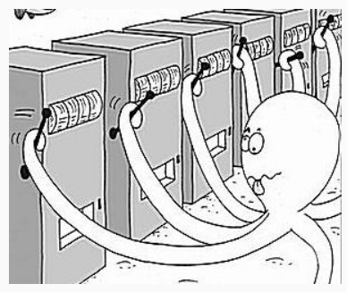

Некоторые известные стратегии:

• Жадность. Несколько раз дергаем за каждую ручку, считаем из какой получили наибольшую прибыль, потом дергаем только за нее. Несложно понять, что это не оптимальная стратегия.

• Эпсилон-жадность. С вероятностью эпсилон дергаем за случайную ручку, а с вероятностью 1-эпсилон за текущую лучшую. Постоянно пересчитываем, какая ручка лучшая на основе предыдущих бросков.

• Сэмплирование по Томпсону. Распределение для каждой ручки аппроксимируется исходя из результатов предыдущих дерганий. На каждом ходу сэмплируются значения из этих распределений и дергается та ручка, у которой оказалось наибольшее среднее.  

В заключение отметим, что кроме качества можно оценивать и другие характеристики модели, если того требует предметная область. Ниже представлены некоторые из таких характеристик:

• Робастность. Ответ модели мало меняется при малом изменении входных данных.

• Надежность, приватность данных. Модель сложно сломать, и по запросам к модели не извлечь  информацию о данных, на которых модель тренировалась.

• Эффективность. Модель быстро обучается и/или быстро работает.

• Интерпретируемость. Принцип работы понятен человеку. 

